# 第一章 逻辑基础

1. 命题是确定性的陈述
2. Conjunction 代表and；Disjunction 代表or
3. Exclusive OR 只有一个是真的，但是不能同时为真
4. if-then条件：只有为真->假的时候命题是假的
5. converse 逆命题 inverse 否命题 contrapositive 逆否命题 biconditional 等价命题
6. 逻辑连接词优先级：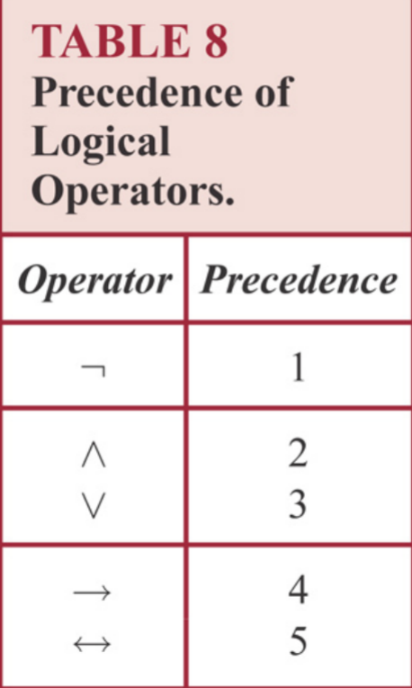
7. 可以使用真值表和位串表示命题
8. 系统完备性：如果存在一种方式分配真值使得对于系统的论述都是正确的，那么系统是完备的。
9. 注意吸收律：$p \vee(p \wedge q) \equiv p \quad p \wedge(p \vee q) \equiv p$ 。**内外形式一样，但是符号相反**。
10. 证明两个命题是等价的，可以使用逻辑推导或者是真值表。证明两个命题不是等价的，举出反例即可。
11. nor符号$\downarrow$ 表示或的否定 因此$p\downarrow p=\neg p$     $(\mathrm{p} \downarrow \mathrm{q}) \downarrow(\mathrm{p} \downarrow \mathrm{q}) = \boldsymbol{p} \vee \mathbf{q}$ 
12. 命题完备性：如果存在一组赋值 ，使得命题为真，那么命题是完备的。注意和系统完备性做区分
13. 全称量词：
    1. Universal Quantification 任意。要证伪只需要举出一个反例
    2. Existential Quantification 存在，要证明只需要举出一个例子。$\exists x P(x) \equiv P\left(x_{1}\right) \vee P\left(x_{2}\right) \vee \cdots \vee P\left(x_{n}\right)$
14. $\exists \text { or } \exists_{1}$ 代表符合条件的元素存在并且是唯一的。
15. 量词和其他逻辑链接符相比，有更高的优先级。
16. 存在量词的命题的等价性：存在量词的两个命题是等价的，当且仅当他们有相同的真值
17. **存在和任意两种量词不一定能互换！**
18. 注意，对于量词的否定，不会改变量词内部的逻辑关系，比如$\forall x>3 有{G(x)}$其否定为$\exists x>3 \neg G(x)$ 
19. Functionally Complete 逻辑完备性，代表一个逻辑操作符集合，其中的所有操作符能够表示所有的逻辑关系。
20. minterm:包含所有变量的一个复合合取命题
21. maxterm:包含所有变量的一个复合析取命题
22. Prenex Normal Form 将所有量词放在命题的前面，命题中一般只含有或，且，非三种操作符。注意在确定量词的选择之前先将所有的箭头去掉
23. 在推理中的吸收律：$(p \or q)\and(\neg q \or r) \rightarrow (p \or r)$
24. $p_{1} \wedge p_{2} \wedge \cdots \wedge p_{n} \rightarrow(p \rightarrow q)$ = $p_{1} \wedge p_{2} \wedge \cdots \wedge p_{n} \wedge p \rightarrow q$ 
25. 其余证明方法：反证法，穷举法，构造法, 分析法
26. 求完全合取范式的时候，可以先求完全析取范式（真值表），之后取否定

# 二、集合论

1. proper subset 真子集
2. 集合等价证明方法：
   1. 互为子集
   2. 使用逻辑推理过程
   3. 使用成员表
3. $\begin{aligned}
   &\mathrm{f}(\mathrm{A} \cup \mathrm{B})=\mathrm{f}(\mathrm{A}) \mathrm{U} \mathrm{f}(\mathrm{B}) \\
   &\mathrm{f}(\mathrm{A} \cap \mathrm{B}) \subseteq \mathrm{f}(\mathrm{A}) \cap \mathrm{f}(\mathrm{B})
   \end{aligned}$
4. injective(one-to-one) function definition:$\forall a \forall b(f(a)=f(b) \rightarrow a=b)$
5. surjective(onto) function $\forall b \in B \exists a \in A(f(a)=b)$
6. 单调函数$\text { monotonic function }$
7. 复合函数 Compositions of Functions $$f^{\circ} g(a)=f(g(a))$$,所以g在f的左边
8. 集合相等的证明注意要双向证明，不要只证明一边。
9. floor/ceiling function的一些性质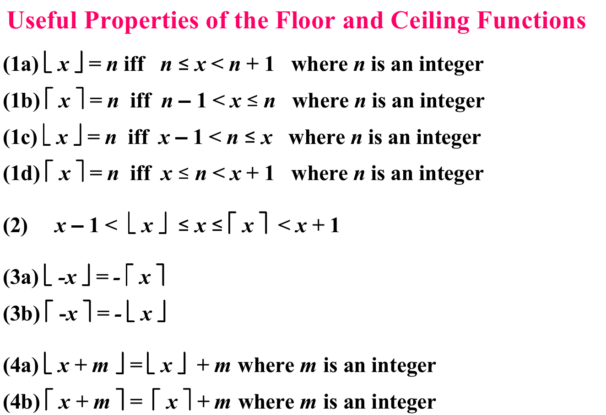
10. 几何级数 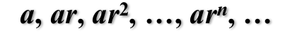
11. 等差级数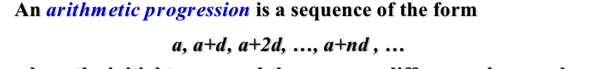

# 三、归纳和递归

1. 数学归纳法

# 四、计数方法

1. **遇到难以解决的问题的时候，考虑鸽笼原理**。
2. 帕斯卡定理$\left(\begin{array}{c}
   n+1 \\
   k
   \end{array}\right)=\left(\begin{array}{c}
   n \\
   k-1
   \end{array}\right)+\left(\begin{array}{l}
   n \\
   k
   \end{array}\right)$ 
3. 范德蒙德定理$\left(\begin{array}{c}
   m+n \\
   r
   \end{array}\right)=\sum_{k=0}^{r}\left(\begin{array}{c}
   m \\
   r-k
   \end{array}\right)\left(\begin{array}{l}
   n \\
   k
   \end{array}\right)$ 
4. 范德蒙德定理的特殊形式：$\left(\begin{array}{c}
   2 n \\
   n
   \end{array}\right)=\sum_{k=0}^{n}\left(\begin{array}{l}
   n \\
   k
   \end{array}\right)^{2}$ 
5. 无名定理$\left(\begin{array}{l}
   n+1 \\
   r+1
   \end{array}\right)=\sum_{j=r}^{n}\left(\begin{array}{l}
   j \\
   r
   \end{array}\right)$
6.  **计数方式（重要）**
   1. 排列类
      1. 允许重复的n个元素的r排列的个数是$n^r$，如长度为10的字母串$26^{10}$
      2. 如果在n个元素中存在相同的元素，那么要除以他们的阶乘
      3. 圆排列：除以位置的个数
      
   2. 组合类
      1. 允许元素重复的n的元素的r组合：隔板法
      
   3. 元素和箱子
      1. 二者均不同：
         1. 允许箱子为空：那么就是排列数除以盒子容积的阶乘的乘积
         2. 箱子不可为空：那么就是onto函数的个数
      2. 元素不同，箱子相同：斯特林数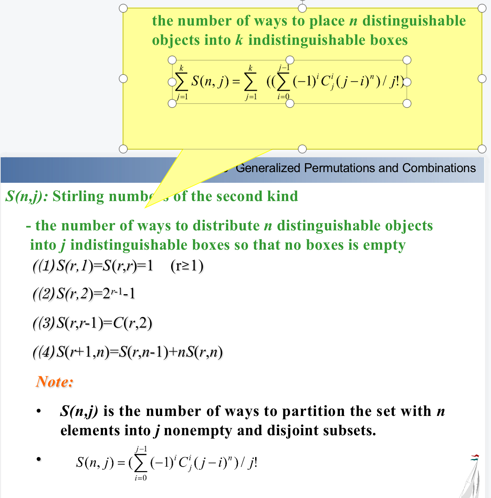
      3. 元素相同，箱子不同：隔板法
      4. 都相同：穷举
      
   4. onto函数，就是吧不同的元素放到不同的盒子中，每个盒子都非空。
   
   5. 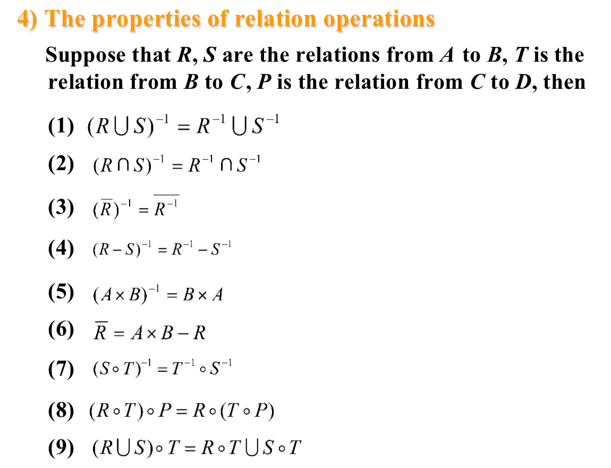
   
   6. 在一个关系内部，如果两个元素是有关系的，那么他们的等价类是同一个等价类，交集非空
   
   7. 对于一个等价关系而言，他的所有划分就是他的等价类。
   
   8. 对于一个集合，形成的所有等价关系，那么等价类划分的个数就是等价关系的总数。
   
   9. 完全偏序：任意的两个元素都可以比大小
   
   10. 注意偏序比大小的方式不一定是绝对大小，要看题目自己定义的大小方式。 
   
      此处定义的比大小方式就是看能否整除
   
   11. 完全偏序集：链，完全不偏序集（任意两个元素都不能比较大小）：反链
   
       

# 图

1. 有向图的分类：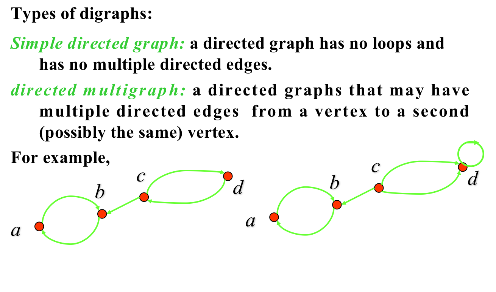

2. 握手定理：所有的节点的度的和是边个数的两倍
   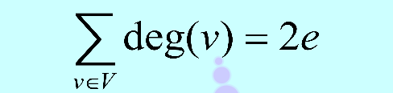
   
3. 根据握手定理：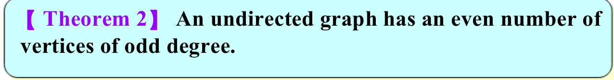

4. 有向图的入度和出度应该是相等的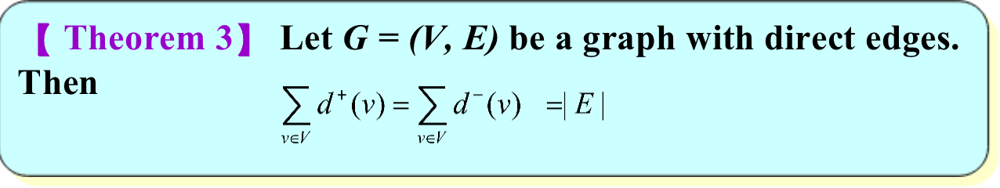

5. 判断二分图的方法：染色法。

6. regular graph 所有的点都有相同的度

7. proper subgraph 真子图

8. spanning subgraph 生成树 代表点相同的子图

9. 无向图邻接矩阵的一行的和是点的度减去循环的个数（邻接矩阵中的数字代表存在几条边，不代表度）

10. $A^r$ 中(i,j)位置的数字代表长度为r的路径的个数

11. 强连通：如果存在从a到b的道路，就一定存在从b到a的道路，那么图是强连通的。

12. 弱连通：有向图对应的简单图是联通的

13.  寻找强连通组件算法： 随机选取一个顶点进行dfs，当递归返回的时候对每一个顶点编号，随后对于图的反图进行dfs，起始的顶点按照对于上述编号列表进行拓扑排序得到，能够到达并且还没有到达的顶点视为在同一个连通块内部  

    >
    >
    >

# 欧拉图

1. 欧拉路径：包含所有边的路径
2. 欧拉循环：遍历所有的边之后回到最初的点
3. 无向图
   1. 欧拉循环存在的条件：每一个节点的度都是偶数
   2. 欧拉通路存在但是欧拉循环不存在的条件：只有两个节点的度是奇数
4. 有向图
   1. 欧拉循环存在的条件：图是弱连接的；每一个节点的出度和入度相等
   2. 欧拉路径存在的条件：图是弱连接的；除了两个节点之外所有节点的出度和入度相等
   3. 

# 哈密顿图

1. 需要遍历所有的节点
2. 哈密顿循环充分条件：
   1. 图是简单图，每一个节点的度都不小于n/2（狄拉克判据）
   2. 图是简单图，任意非邻接的节点的度的和不小于n（ORE判据）
3. 必要条件：
   1. 哈密顿路径：图是连通的，至多有两个点的度为1
   2. 哈密顿循环：每一个点的度都大于1
4. 一些性质
   1. 如果存在哈密顿回路，且有顶点的度为2，那么这个顶点的两条边都在回路中
   2. 图中除了哈密顿回路之外的边都可以移除
   3. 哈密顿循环：S为V的子图，那么G-S中的组件个数不超过S的大小(重要)
5. 已知V中存在哈密顿回路，S为V的子图，那么G-S中的组件个数不超过S的大小

# 平面图

1. 所有的映射都是平面图

2. 欧拉公式：对于简单连通平面图，有r=e-v+2;如果是不连通的，那么r=e-v+c+1 c代表连通块的个数（数学归纳法）

3. 区域的度（Degree of region），边界边缘的边贡献为1，内部的边贡献为2

4. 那么，所有区域的度的和为边的两倍，并且每一个封闭区域的度至少为3

5. 平面图的必要条件：

   1. $e\leq 3v-6$

      证明方法：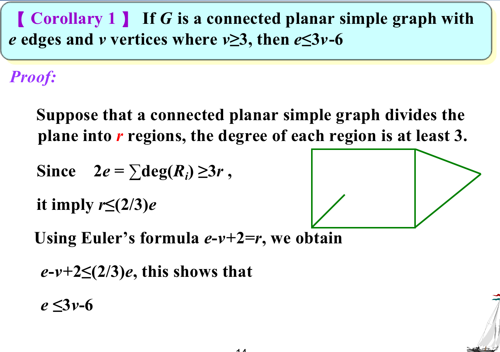

   2. 连通的简单平面图，那么至少有一个节点的度不超过5

   3. 连通的简单平面图，如果没有长度为3的循环，那么$e\leq 2v-4$ 

   4. 一般的，如果每一个连通的区域至少有k条边，那么有$e\leq \frac{(v-2)k}{k-2}$ 

6. 充要条件：如果一个图的子图和$K_{3,3}$或者是$K_5$同构，那么他不能转换成平面图

# 图的染色

1. dual graph将原来的图转换成图模型
2. chromatic number of a graph 代表将图完全染色至少需要的颜色的种类个数
3. 证明chromatic number 是 n：证明n可以，n-1不可以

# 树

1. 树是连通的，无循环的无向简单图
2. 充要条件：图是树，当且仅当任意两个点之间都存在路径，并且所有的路径都是简单的
3. 术语：父母，孩子
4. siblings 兄弟，代表深度相同的节点
5. internal vertex 代表书中非叶子的节点
6. **重要题型**，解法是按照路径的最大长度分类
   1. 具有5个节点的无向树的种类（不同构）：如果最长的长度是4，那么只有一个；如果最长的长度是3，那么只有一个；如果最长的长度是2，那么只有1种，因此只有3种
   2. 具有5个节点的有向图的种类（不同构）：如果最长的长度是4，那么只有一种；如果最长的长度是3，那么有3种；如果最长的长度是2，那么有4种，因此有8种
7. 树的性质：有n个节点的树有n-1条边
8. 有i个内部节点的完全m-ary树有mi+1个总节点，有(m-1)i+1个叶子节点（数学归纳法）
9. 平衡树：所有节点的高度差不超过1
10. 高度为h的m-ary树叶子节点最多有$m^h$ 
11. 对于有l个叶子节点的m-ary树，有$h \geq\left\lceil\log _{m} l\right\rceil$ ，如果树是平衡的，那么$h =\left\lceil\log _{m} l\right\rceil$ 

# 二叉树

1. 如果树是一个平衡树，那么添加或者定位一个元素的比较次数最多是$\left\lceil\log _{m} l\right\rceil$

# 决策树

1. 节点代表决策，子节点代表决策的结果的树

# 字典树

1. 进行数据压缩（大概）
2. 编码方式：霍夫曼树
3. 霍夫曼树生成方式：对于一个森林，每一次都从森林中选择两个权重和最小的树节点，将权重更大的树节点放在左侧，并编码为0，将权重更小的树节点放在右侧，编码为1.重复上述过程直到整个森林转换成一个二叉树，这时候所有原先的树节点都在霍夫曼树的叶子节点处，从树的根节点到叶子结点的路径上的标记就是相应的霍夫曼编码。
4. 图示：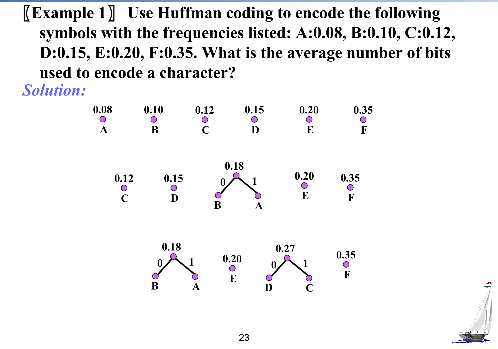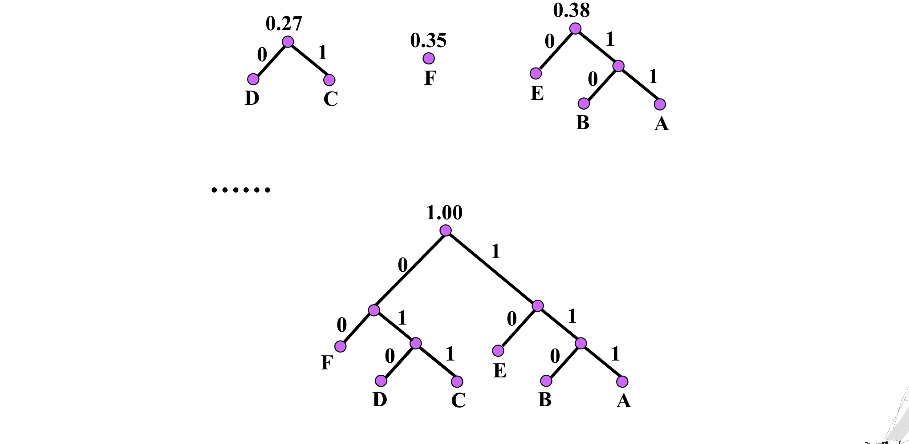

# 树的遍历

1. 方式：前序/中序/后序遍历（前/中/后指的是中间节点在左右子树遍历顺序的位置）
2. 前序遍历：中->左->右
3. 中序遍历：左->中->右
4. 后序遍历：左->右->中
5. 例子：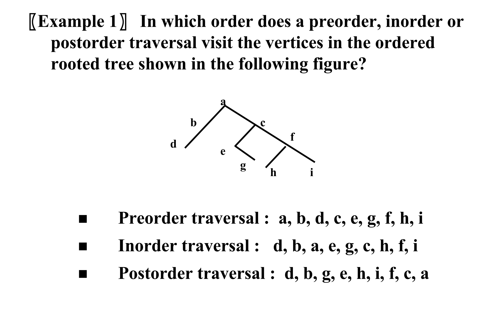
6. 

