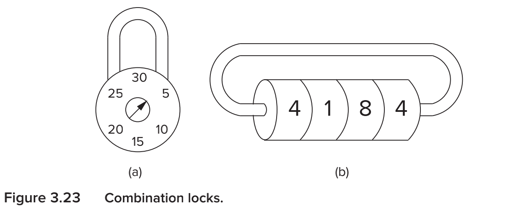

## 计算机系统概论

### chapter 1 课程简介

#### 1.1 介绍

- 计算机是电子白痴(bushi)，只会做我们告诉它去做的事情
- 学习目标：位，门电路，处理器，手册，C语言(haipa
- 学习的时候会从底层逐渐向上

#### 1.2 通用计算机
- 任何计算机，只要给予足够的时间和内存，能够完成的工作是一样的。
- 图灵机：一种状态机，能够读写某种介质上的数据，本质上是一种数学模型
  - 任何的计算过程都可以由图灵机完成
- 广义图灵机：一种实现了所有图灵机接口(计算，读写....)的图灵机
- 计算机就是一种广义图灵机
- disk: peripheral device; IO device.通过计算，向外界输出结果，形式可以是数字，纸质或者是邮件等。在计算机中 结果一般是输出到内存中

#### 1.3 计算机各层级之间的转换
- 
- 我们解决问题的方式：问题->算法->编程->机器执行命令
- 层次逐层深入
    - 问题：进行抽象(transformation)
    - 算法：
      - definite(no abiguity. so usually we don't use natrunal language)
      - efficitive
      - finite
    - language
    - ISA instructions: the interface between software and hardware (在本课程中 就是LC3计算机)。
      - need to be translated if it's a higher level language. usually use complier
      - or assembly language
      - Apple: arm. intel: x86. IBM: powerPC (which is called Z series), pentium, pentium pro, Zion,
    - the hardware that implement the ISA instructions $\rightarrow$ MCROAR architecture
      - consists of circuits and those cirsuits established the voltage that they will move to which will end up solving the problem。 
    - electrons: 最底层结构
- 一个微架构只能够实现一种ISA（指令集），但是一种ISA能够由多种微架构实现。

#### 1.4 课程中计划解决的问题
- 如何使用数字信号表示位和字节
- 如何建立电路处理信息
- 如何建立不依赖于实际运行方式的抽象结构
- 汇编语言
- 信息如何传递
- C语言

### chapter2 位,数据结构和操作
####2.1 计算机中数据的表示方式
- Binary digit: use 0 and 1. for we can represent them using absense or existence of voltage.  just tell it's high or low voltage. no need to tell it's explicit level.
- 控制和检测电路十分复杂
- 计算机的基本数据单元是二进制数，也叫做位(bit)
- 超过两种状态的数据需要多余一位的空间(有点像霍夫曼树)，比如`00,01,10,11`
- 如果一个数据使用n位来表示，那么它最多可以有$2^n$种状态
- 在计算机中，我们需要表示的数据：
  - 数字(有符号，无符号，整数，浮点数，复数，有理数，无理数..)
  - 文本(字符，字符串...)
  - 图片(像素，颜色，形状)
  - 音频
  - 逻辑
  - .....
- 数据结构：计算机中数据的表示(存储)和操作方式
####2.2 有符号整数的表示方法
- 正数和0:直接按照二进制的表示方法表示
- 负数：先写出对应的正数的表达方式，之后**取反加1**
- 扩展：我们可以使用十六进制表示二进制的四位，节省表示空间（但实际占据的空间不变），提高可读性
- 要表示$-2^n$ 至少需要$n+1$位；要表示$2^n-1$，至少需要$n+1$位，换句话说，如果要表示$2^n$，至少需要n+2位
- n位二进制有符号整数的范围是$-2^{n-1}$ \~ $2^{n-1}-1$
####2.2.1 有符号整数的操作

- **before operation we can get rid of all pre0s of the positive integer, all pre1s   of negative number(signed extension)**
- **when two number have different number of bits, we need to add 0 or 1 based on the number is whether positive or negative**

- （两个数字同号）加法：直接将二进制的各个位相加（符号位不想买），溢出的部分舍弃
- （两个数字异号）减法：将负数转换成补码和正数相加即可
-  溢出：如果数字过大，那么相加结果可能超出存储的空间
  - 有符号出现的条件：
    - 两个数字是同号的（原先异号的数字相加不可能溢出）
    - 结果的符号和原先的符号都不同
  - 无符号出现的条件：
    - 第一位溢出
####2.3 逻辑操作运算
- 与运算（AND），使用&表示，常用的掩码方式
- 或运算（INCLUSIVE OR），使用｜表示
- 否定（NOT），使用^表示
  - 性质：
####2.4  含小数的数字的表示方法
- 小数的表示方法：乘二取整，顺序排列
- 定点数：在固定的地方安放小数点,这样的表示方法会造成空间的浪费，而且数字的表示范围也不大
- 浮点数：小数点的位置浮动，也就是不按照固定的位置划分整个数字，而是按照特定的方法表示数字
  - 具体方法（以IEEE 754 浮点数标准中的32位浮点数为例，32位浮点数也叫做单精度浮点数）
    
    以这样的表示方法，我们可以表示数据范围比较大的数字
  - 中间的数字是<font color="red">无符号整数(重要)</font>,是原来的次数加上127的结果，所以<font color="red">拿出来用的时候需要减去127</font>
  - 浮点数的exponent部分本身有0～255一共256种取值，但是全0（也就是0），用来表示真的0，全1（也就是255）用来表示无穷大。所以最大的浮点数就是$1.111111111111.....1*2^{254-127}$,最小的浮点数（正数）是：$1.00000000000...0 *(2^{1-127})$,所以<font color="red">实际上指数的有效范围是1～254</font>
  - 如果指数位是00000000，那么实际的表示形式是0.xxxxxxxx * $2^{-126}$ ,因此<font color="red">所有的位都是0的时候就表示0</font>
  - <font color="red">如果指数位是11111111，那么如果后面都是0的话，就是inf，如果后面不是0的话，就是NAN</font>
#####2.4.1 浮点数四则运算
- 加法（同号）：
	 
  - 具体操作就是将两个数字从科学记数法还原成原先的形势(也就是都是$2^0$,注意小数点对齐)，直接相加，之后还原成二进制下的科学记数法形式就好了。
- 乘法
  
  - 具体操作就是将两个数字还原成科学记数法，然后将指数相加，将前面的部分相乘（由于进制是2，所以一旦有一位达到2就要进位），然后还原成科学记数法形式就可以了。
- 减法
  
  - 具体操作就是比较两个数字的次数，将次数较低的数字的常数部分右移后进行运算，最后取次数高的数字的次数为结果的次数，符号的话就是次数高的数字。
####2.5 文本表示方法
- 使用ascii码，一共有128个符号
####2.6其他数据（不重要）
- 文本串(Text Strings)，以NULL（0）结束。通常没有硬件支持
- 图片：
  - 使用像素的数组：
    - monochrome：基本单元是一位，表示黑（1）白（0）
    - color：rgb表示，由红蓝绿决定，每一种原色需8位
    - 其他表示：透明度（rgba）
  - 硬件支持：MMX.....
- 声音：音频的数组


###chap3 数字逻辑结构 (Digital Logic Structures)

#### 3.1 晶体管：

​	略

#### 3.2 逻辑门:
  - p门：低电位的时候导通，高电位的时候视为开路,只能接高电压，有个圈
  - n门：低电位的时候视为开路，在高电位的时候视为导通
  - 在p门，n门的基础上，可以实现非门，或非门，在这两种门的基础上我们可以建立或门，与门，与非门等
  - <font color="red">AND门和OR门的上方都是p门，下方都是n门，不同的是AND门的上方是并联的，下方是串联的，OR门上方是串联的，下方是并联的。</font>
  - 德摩根律
  - 多输入门：将以上的门扩展到可以接收多个数值
#### 3.3 组合逻辑（Combinational Logic Circuits）：
#####3.3.1 Decoder（解码器）
- every decoder has a property that exactly one of its output is 1 and all the rest are 0s。（给定一个输入，只有一个输出是1，其余输出都是0）
- 图示
    
    
    
- mainly used to determining how to interpret a bit pattern. In LC-3 each instruction is determined by a four-bit pattern and this time it'll be useful.
#####3.3.2Multiplexer(MUX, 多路复用器)
- 从多个输入中选择一个，将其和输出相连，<font color="red">连接线的选择的个数至少是log2(n)向上取整</font>
- [1:0]表示一个二维向量，取值是0或者1，S箭头上的2表示它是一个二元向量
- 图示：
     
#####3.3.3 全加器
- 进行加法
- 图示：
  
#####3.3.4 可编程逻辑阵列（ the programming logic array）
- <font color="green">需要$2^n$个与门，或门的个数取决于真值表的输出个数</font>，就像全加器需要两个或门表示进位和当前的计算结果。
#####3.3.5 Logical completeness
  - 逻辑完备性，一个系统只要有足够的非门和或门（与门）就是逻辑完备的
####3.4基本存储单元
- 逻辑电路有可存储信息和不可存储信息两类，上述的解码器，多路复用器和全加器都不能存储信息。
#####3.4.1  R-S锁存器（R-S Latch）
- 能够存储一位的信息
- 最简单的实现方式就是使用两个与非门
- 图示：	
  
- 原理：
  - a中存储的就是存储的信息
  - 存储：在保证S和R都是1的情况下，如果a是0，那么得到b为1，进一步推出a是0，也就是说这样的状态能够长久维持，能够‘记忆’信息
  - 清除： 在保持R和S中一个值始终为1的情况下更改一个变量的值，比如，将S改为0，不论原先的状态是什么，输出a都会变成1；将R改为0，无论原先的状态是什么，输出a都会变成0.
  - 注意不要把R和S同时改为0，否则锁存器的状态是不确定的
  - <font color="red">R代表reset，R=0能够将输出的a重置为0，S代表set，s=0能够将输出的a改变为1</font>
##### 3.4.2 门控D锁存器（The Gated D Latch）
- 就是简单地把R-S锁存器和一个门电路结合在一起
- 图示：
  
- WE代表可写，当WE为1的时候，R-S锁存器中将会存储D输入的值，此后将WE修改回0，代表不可写，则D中的值将会存储在锁存器中
#####3.4.3
- <font color="red">计算机中的数据大多需要多个bit来表示，因此我们可以把多一个门空锁存器结合在一起，使用同一条线控制是否可写，这样就得到了寄存器。</font>

####3.5 内存
- 概念：内存有一定数目的‘位置组成’，每一个位置都可以被单独的识别并存放一个数据，通常，我们把每一个位置唯一的识别符号定义为地址“address”，将每一个位置存储的<font color="red">位数定义为寻址能力（addressability）</font>
- 
##### 3.5.1 寻址空间
- 可以单独识别的<font color="red">位置的总数叫做寻址空间。</font>
##### 3.5.2 寻址能力
- 指每一个位置能够存储的位的数目
- 大多数内存是字节寻址的（让每一个ascii码占用一个空间），是一个历史问题，但是科学计算机大多数是64位寻址的
##### 3.5.3 举例
如图是一个$2^2*3$的内存示例

####3.6 时序电路
概念：既能够处理数据也能够处理数据的存储单元，它与当前输入的数据有关，也和之前存储的数据有关，能够实现有限状态机
##### 3.6.1 组合密码锁
示例：
- 左侧的密码锁就是一个典型的时序电路，比方说它的解锁方式是R13-L22-R3，也就是右转到13，左转到22，再右转到3的解锁方法，他会记忆之前的旋转顺序，但是右边的就是一个典型的组合逻辑电路，只判断当前的状态是否是预设的状态，不会记忆之前的数据。
##### 3.6.2 状态
- 定义:状态表示一个系统的所有要素在某一个特定时刻的快照
##### 3.6.3 有限状态机
- 有限状态机有五个组成部分：
    1. 所有状态（有限数目）
    2. 外部输入（有限数目）
    3. 对外输出（有限数目）
    4. 任意状态之间的迁移（必须显式注明）
    5. 对外输出的操作（必须显式注明）
- 	同步状态机：各个状态之间的切换依靠时间的流逝，在计算机中依靠的就是电压的变化
-   异步状态机：各个状态之间的切换依靠的是外界的输入
- 状态图
    - 常用表示方法是状态图。
    - 
    - 系统的输出实际上是由当前的状态和输入的量共同决定的，在这里我们认为只和当前状态有关。
  - 状态机的真值表中列出的状态和对应的输出之间插入的是当前的状态，也就是状态还未切换之前系统的状态
  
  - 时钟：完成两次状态图所需的时间曲线,在有限状态机中就是控制Master Slave Flip Flop(主从触发器)的存储信息（不能使用锁存器,否则会在一个周期内持续读写，造成状态不断切换，而另外半个周期内部不能读写，状态不能改变）
  - 在一个时钟周期内可以执行多个行为，并不是一个行为就要占据周期，比如fetch指令需要取pc到mar，pc++，这两个行为实际上是在一个时钟周期内完成的，因为可以并行。所以才说fetch至少需要3个时钟周期，而不是4个
  - 主从锁存器：其实就是两个D锁存器的串联，使用相反的wa信号,这样就能保证经过半个周期主锁存器的信息才会输入奴隶锁存器，再经过半个周期努力锁存器的信息才会输出
  - 图示
    
  - ....暂时暂停


###chap 4 冯诺依曼模型
#### 4.1 基本部件
- 内存
- 输入
- 输出
- 控制单元
- 处理单元
#### 4.3 指令处理
##### 4.3.1 指令示例
- add 
- ldr(load)
- ....
##### 4.3.2指令周期
- 定义：一个完整的指令周期由6个部分组成
  1. 取指令 
    1. 从PC寄存器中取地址，加载到MAR寄存器中，同时pc++
    2. 将该地址对应的指令装入MDR
    3. 将MDR中的内容装到IR寄存器中
  2. 译码
    - 使用一个decoder， 判断操作的类型，并确定操作的细节。
  3. 地址计算
    - 如果指令的执行需要用到地址的计算，那么就在这一步完成，比如立即数寻址，相对PC寻址等
  4. 取操作数
    - 从内存中取操作数到寄存器中
  5. 执行（字面意思）
  6. 存放结果：
    - 将执行的结果存储到寄存器中
#### 4.4 改变执行顺序
- 通常是使用JMP指令

#### Extra
- 洗衣机比喻：单周期，多周期和流水线
- 

### chap5 LC-3 结构
#### 5.1 ISA
#####5.1.1 内存组织
- 在LC-3中，内存默认按照一个字（16位）的方式存储
##### 5.1.3 指令集
- 一个ISA，包括操作码的集合，数据类型和寻址模式，寻址模式决定了操作数的存放位置
##### 5.1.4 操作码
- 以下是LC-3计算机的所有操作码
  
- 所有操作可以分成三类：
  1. 运算
  2. 数据搬动
  3. 控制
##### 5.1.6 寻址模式
- 相对寻址
- 间接寻址
- 基址偏移
##### 5.1.7 条件码
- 如果发生了写操作，就会在处理单元中特殊的寄存器中存储相应的值， 如果写入的是负数，那么N就是1，如果写入的是0，那么Z就是1，如果写入的是正数，那么p就是1。使用N，Z，P三个值可以实现条件流程，循环流程。

#### 5.2 操作指令（重要）
LC-3只支持3种指令：ADD，AND和NOT

1. NOT
   - 唯一的单操作数指令
   - 采用寄存器寻址方式
   - 语法： NOT R2 R1 
2. AND & ADD
  - 双操作数指令
  - 既可以使用寄存器相对模式，也可以是立即数模式
  - 语法ADD R1 R4 R5

#### 5.3 数据搬移指令
在寄存器和内存之间，寄存器和IO设备之间搬动数据的指令。LC-3支持7种搬移指令：LD，LDR，LDI，LEA，ST，STR，STI
##### 5.3.1 PC相对寻址
- LD和ST使用PC相对寻址方式
- 语法: LD R2 xxxx
- 功能：将xxxx的数值和当前PC值相加，得到目的地址，将目的地址中的数据装载到R2中
- 限制：在LC-3中，xxxx最多只有8位，这就意味着目的地址最多相对于PC地址只能<font color="red">负向差255，正向差256。(不是-256～255的原因是执行指令的时候PC已经+1了)</font>
##### 5.3.2 间接寻址
- LDI和STI使用间接寻址
- 语法：LDI R2 xxxx
- 功能：将xxxx的数值和当前PC值相加，得到存放目的地址的位置数据的地址，然后利用该地址得到目的地址，相当于中间跳了一层。
- 优点：寻址空间大，不受相对寻址的限制
##### 5.3.3 基址偏移寻址
- LDR和STR使用基址偏移寻址
- 语法：LDR R1 R2 xxxx
- 功能：将R2中的**内容**和xxxx相加，得到目的数据的地址，然后将地址装载到R1中
- 这样的寻址方式的可寻址范围也是任意的
##### 5.3.4 立即数寻址
- LEA使用立即数寻址
- 语法：LEA R2 xxxx
- 功能：将PC值和xxx相加，直接写入R2中
- 优点：无需访问内存

#### 5.4 控制指令
##### 5.4.1 条件跳转指令	
- 使用前面所说的条件码进行判断
- 如果N，Z，P中有任意一个位置是1，且指令中其对应的位置也是1，那么就将PC值进行调整，具体就是PC相对寻址

#####5.4.5 JMP指令
- PC值直接跳转到寄存器中存储的指定地址
- 和条件跳转指令相比，能够跳转到任意位置

##### 5.4.5 TRAP指令
- 也是使PC值跳转，但是跳转到系统内部函数区
- 也就是说，可以通过TRAP指令调用系统内部服务

##### EXTRA
- 取指令（fetch）
- 三态门：如果是1，那么把数据写到总线上，如果是0，那么不能把数据放到总线上
- 流程：
  - 进入fetch，将pc寄存器对应的三态门的信号修改成1，将pc数据写到总线上，同时将pc对应的ld值修改成1，将pc+1写入pc；将mar的ld信号修改成1，表示mar可写，将pc的值加入到mar中，将mem的R修改为1，表示可读，然后读取数据，等到ready为1的时候，将得到的数据写入mdr，然后将mdr对应的门的信号修改成1，将mdr得到的数据写到总线上，将ir对应的三态门的信号修改成1，将总线上的数据写入ir寄存器
  
  - decode：将ir中的数据写入控制器中，进行decode。
  
  - NOT L将
  
    

#### chap7 汇编语言


##### EXTRA
- 汇编语言第一次扫描生成的符号表，<font color="red">在第二次扫描的时候对应的offset是和pc+1做对比得到的，也就是说自我引用应该是-1</font>
	例子：
    

    这一行对应的机器码是E1FF,执行完之后R0中存储的是0xA400
    在这样的条件下计算时使用的pc也要加一

    
    比如这张图，当第一行执行完的时候R2中存储的是300a(3006 + 4)
  
- 汇编中使用的.fill会在程序载入内存的时候直接修改内存

- eot对应的ascii码是x4，所以判断是否是eot的时候要-4


#### chap 8 数据结构
- 栈：向0增长


#### chap 9 I/O
###### 9.4.5.1 处理中断前执行的命令
- KBSR，DSR的第15位表示当前是否可用，为1表示存在需要被处理的请求，为0表示可用
- KBSR的第14位表示是否具有中断的权限，为1表示具有权限，能够暂停当前项目的执行，为0表示不具有权限。
- 中断执行的条件：
  - 具有中断码（也就是第14位是1），同时当前正在运行的指令的第14位必须也是1
  - 请求服务
  - 优先级比当前项目更高（[10:8]）
- 在INT信号（就是[15]&[14]）为真的时候，处理器会执行
  - 保存当前执行的程序的状态
    - 处理器需要保存当前的PC值和PSR值到栈中
    - 保存PC值，在执行外部的程序之后回到当前的状态
    - 保存PSR值，以便于执行完外部的程序之后回到当前的用户状态模式（也就是PSR[15]的值，1代表root，0代表普通用户），[10:8]保存的是当前程序的优先级，以便处理下一次中断，psr[2:0]存储的是条件码
    - 当然，还要保存当前的寄存器的值
    - 如果之前的模式是用户模式，那么R6会加载管理员栈指针，PSR和PC会被保存到管理员所属的栈中
  - 将具有更高优先级的程序载入到PC寄存器中
    - 向量化中断信号：请求中断的设备寄存器会向处理器传递它的8位向量化信号，并将自己的优先级和请求信号传递到处理器中，具有最高优先级（比当前的程序更高）的程序会被选择，处理器会把8位的信号扩展到16位
    - 所有trap指令的地址都存储在x0000到x00FF中
    - 执行对应指令
- 如果使用的是trap x22那么 会输出到0的位置，也就是说是和输出string，但是使用trap x21的话只会输出一个字符
- 
- 事实上acl(Address Control Logic Block)是基于三个输入控制io的：
  1. MIO.EN 信号，如果信号是0，那么在这个时钟周期内什么也不会发生，如果信号是1，表示在此周期内需要进行数据搬移
  2. R,W信号（或者是LD，ST信号等），表示该周期内需要进行数据的读或者写操作，避免数据被非法更改，同时会给对应的单元做好准备（比如向内存输入写信号等）
  3. **从MAR中读取到的地址信号**，acl会通过一个decoder来进行解码（其实就是四个与门，注意KBDR和ACL不相连），如果地址信号是存在memory-device map的，那么就会在一个mux中选择对应的位置进行输出，否则就从内存中选择对应的部分输出。
- 对应的结构(重点)
  
##### 助教extra（lcgg）
- 注意区分优先级（priority/urgency）和权限(privilege)
- 具有更高的权限不一定有更高的优先级，不能混。
- 用户权限信息(15)，中断权限(14)，优先级(10\~8)，条件码(2~0)，都存储在一个psr寄存器中：
  - pc和psr显式定义一个正在运行的项目的状态
- 如果是用户权限（0），表示只能访问`x3000~xFFDF`之间的内存，对这部分内存之外的部分进行访问会引发access voilation
- lc3中的权限一般是写的权限
- I/O
  - 涉及部分
    - special instruction
    - memory mapped device
  - 同步\异步
    - 同步：略
    - 异步：一般有两种方法（视tradeoff而定）
      - polling: 轮询，每隔一段时间就查询寄存器的状态，速度比较慢，但是可靠性比较高。
      - interrupt-driven：中断。速度比较快，但是由于信号来自device，而外部设备不具有内部设备一样高的可靠性，所以可靠性比较低。
  - IO涉及的硬件：
  上图：
   - 实际上cpu和设备打交道，但是可以理解成和内存打交道？
  - xSR的首位如果是1，表示cpu可以读取当前的信息（外界的信息此时不可写入），读取之后会置0，表示此时可以输入信息
- trap 
  - 中断向量对应的地址中存储着对应的指令的首地址
  - 执行过程：
    1. 将PC，PSR压栈
    2. 将对应的trap指令的地址（也就是trap向量对应的地址中的值写入pc），同时将PSR置为0，使用超级权限
    $PC \leftarrow MEM[{x0025}]$    $PSR[{15}] = 0$
    3. 执行对应的指令
    4. 最后RTI。执行的时候会将原pc和PSR值从栈中pop出来，存入pc和PSR中，保证条件码，权限，优先级等不变
  - trap中可以嵌套trap，trap指令不会更改优先级（从上述过程中也可以看出来）
  - 区别
    ```
      RET和RTI的区别：RET实际上就是JMP R7,但是RTI表示的就是system pop两次
    ```
- 中断信号的产生(PSR[15] && PSR[14])
- 如果在polling的过程中发生了中断，可能导致部分字符不能输出（比如显示器仍然被占用）。解决方法在书第351页（0d和0e，在每次轮询开始之前开关中断代码）（注意要在压栈之前处理psr）


#### chap15 C
- \*指针作为左值的时候，相当于str，作为右值的时候，需要两次ldr，第一次是取地址，第二次是利用第一次取得地址去取值


1. 使用八进制或者是十六进制描述数字的时候，注意符号可能需要扩展

2. 不同位数的浮点数的指数减去的数字是$2^{n-1}-1$

3. 六个阶段：fetch->decode->evaluate address->fetch data->execute->store

4. 注意相对寻址方式中比对的是pc+1

5. <font color="blue" size=14px>注意看状态图</font>

6. 注意jsr/jsrr中存储的pc值是自增后的

7. 系统栈从0x2fff开始，如果是空的，那么栈指针在0x3000，也就是说如果sp在0x2fff,表示栈中已经有一个值了

8. 中断访问的检查只发生在下一个周期的fetch阶段中，为了方便

9. 中断向量表在0x0100\~0x01ff

10. 递归存储顺序:args->return  value->return address->dynamic link(frame pointer)->local variable

    ```assembly
    ;模版
    add r6,r6, #-2
    str r7,r6,#0
    add r6,r6, #-1
    str r5,r6,#0
    add r5,r6,#-1
    add r6,r6, x ;x代表的是本地变量的数量
    ;.....中间的具体逻辑省略
    str r0,r5,#3
    add r6,r5,#1
    ldr r5,r6,#0
    add r6,r6,#1
    ldr r7,r6,#0
    add r6,r6, #1
    ret
    
    ```

11. 浮点数

12. 702 713 状态机 704 数据通路（714 is not required）

13. 设计一个新指令

14. 在异常中一般不会更改程序的优先级，但是中断会将优先级修改成造成中断的程序的优先级

15. trap表从x0000开始

16. 0100->01ff的内存布局：

    0100->017f 用来处理程序自身引起的异常（比如acv，illgical code）

    0180->01ff用来处理外部程序引起的中断。比如x0180存储的是键盘中断事件的起始地址

17. 注意RTI执行的时候是先pop PC后pop PSR，所以在压栈的时候是先压入PSR（当然之前要检查psr第15位），再压入PC。
18. 三种运行时异常
    - privileged exception: try to exec rti when in user mode. entry in 0x0100
    - illegal code: try to exec 1101 or wrong format of other codes. entry in 0x0101
    - acv: try to access 0x0000->0x2fff or 0xffd0 -> 0xffff when in user mode. entry in 0x0102
    - 注意：运行时异常不会更改PSR的优先级，这一点和trap不同
19. nor,nand,not三种门上方都是p门，下方都是n门，然后nor上方是串联，nand上方是并联
