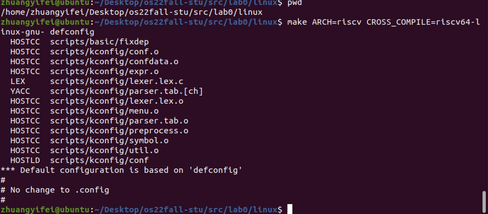
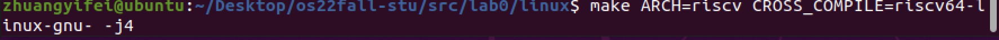
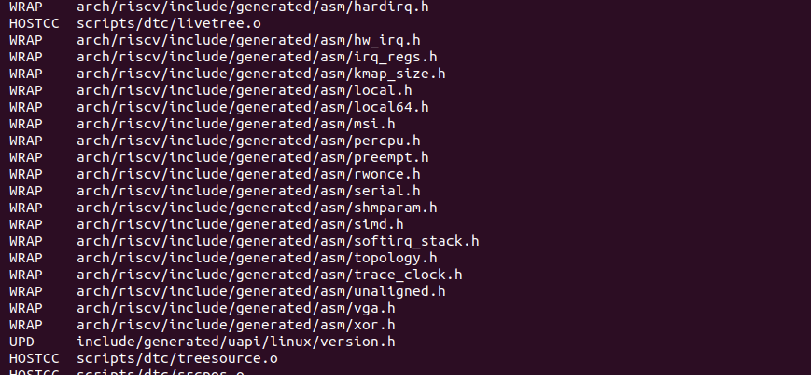
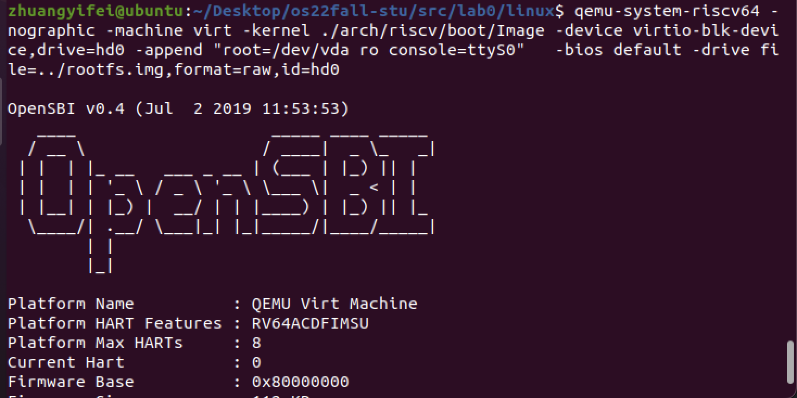
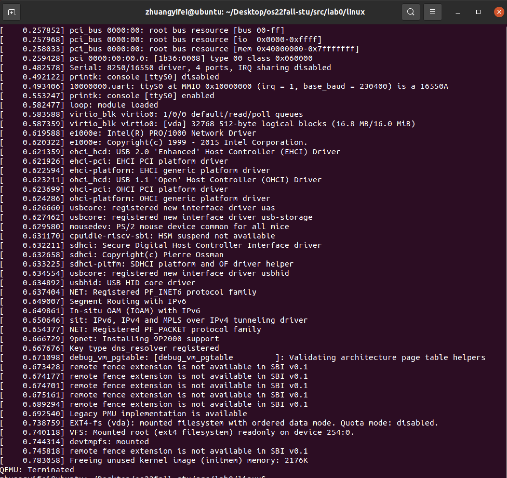
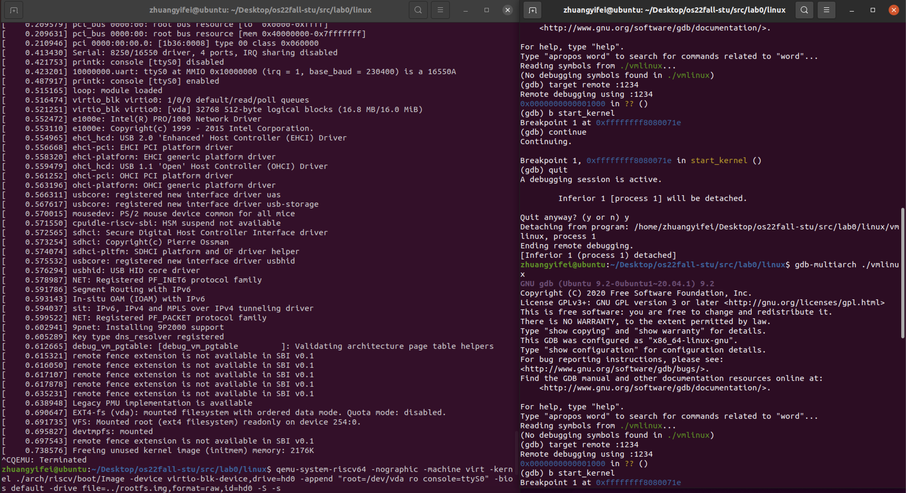
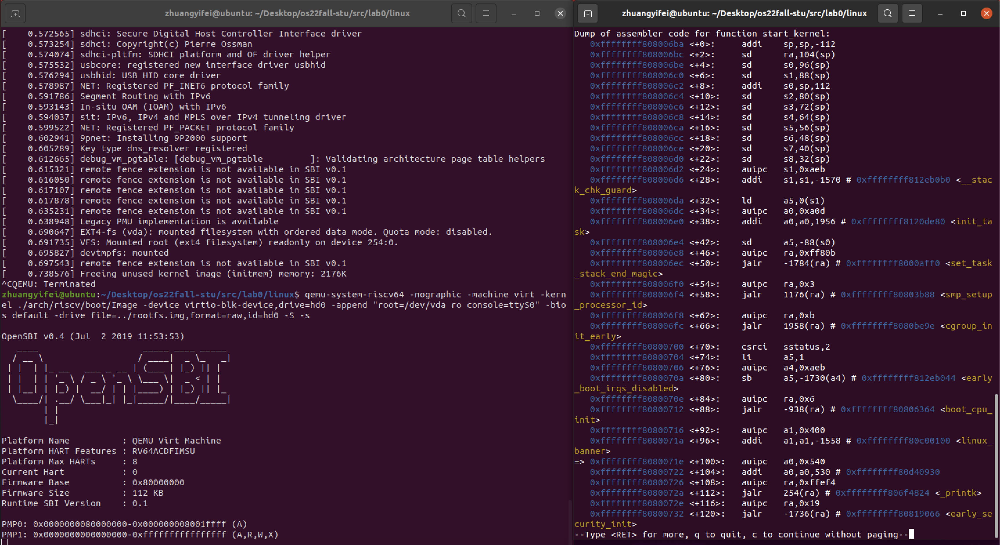

# 操作系统 实验0

## 一、实验目的

- 使用交叉编译工具, 完成Linux内核代码编译
- 使用QEMU运行内核
- 熟悉GDB和QEMU联合调试


## 二、实验环境

- Ubuntu 20.04


## 三、实验步骤

## 

1.  编译linux内核

   

   

   

   编译结束忘记截图了qwq

2. 使用qemu运行内核

   

   退出qemu

   

3. 使用gdb进行调试

   - 使用gdb连接本地1234端口，设置断点并退出

     

   - 重新运行qemu，使用gdb连接

     - 在start_kernel设置断点

       

     - 使用disassemble查看汇编

       


```
make CROSS_COMPILE=riscv64-linux-gnu-  ARCH=riscv CONFIG_DEBUG_INFO=y  defconfig all -j4
```

