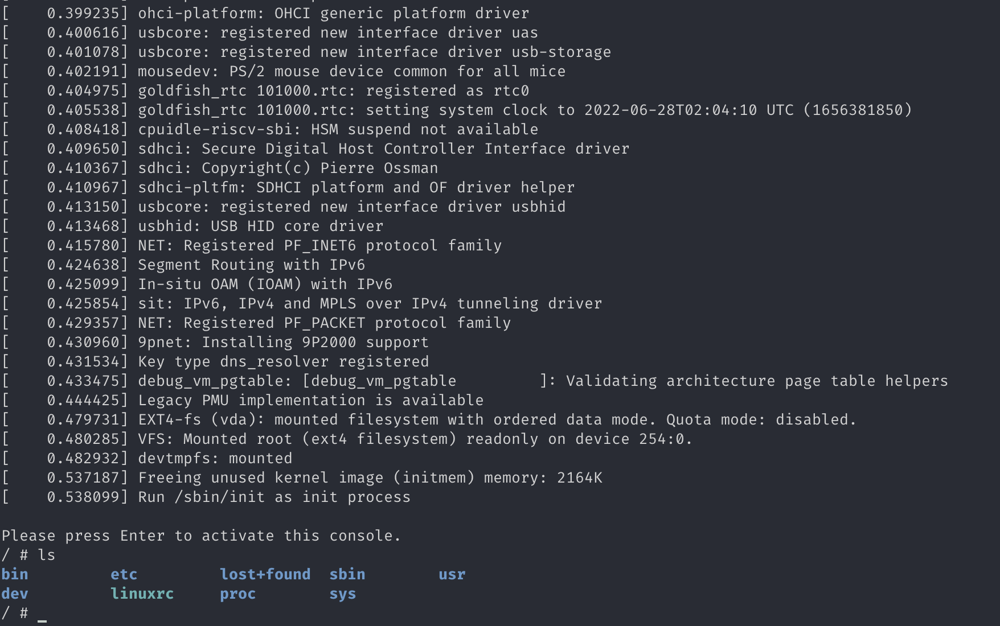

# [Lab 0: RV64 内核调试](https://stackoverflow.com/questions/33521602/cygwin-linux-kernel-make-clean-not-working)

软工2002 庄毅非 3200105872

## 1 实验目的

​	安装虚拟机及Docker，通过在QEMU模拟器上运行Linux来熟悉如何从源代码开始将内核运行在QEMU模拟器上，学习使用GDB跟QEMU对代码进行联合调试，为后续实验打下基础。

​	编译内核并用 gdb + QEMU 调试，在内核初始化过程中（用户登录之前）设置断点，对内核的启 动过程进行跟踪，并尝试使用gdb的各项命令（如backtrace、nish、frame、info、break、 display、next等）。

​	在学在浙大中提交pdf格式的实验报告，记录实验过程并截图（4.1 - 4.4），对每一步的命令以及结 果进行必要的解释，记录遇到的问题和心得体会。

## 2 实验内容及要求

- 安装虚拟机软件、Ubuntu镜像，自行学习Linux基础命令。
- 安装Docker，下载并导入Docker镜像，创建并运行容器。
- 编译内核并用 gdb + QEMU 调试，在内核初始化过程中设置断点，对内核的启动过程进行跟踪，并尝试使用gdb的各项命令。


## 3 操作方法和实验步骤

### 3.1 安装docker，并创建容器

#### 3.1.1 安装docker

​	由于我使用的系统为macos，所以这一步是直接使用`brew install --cask docker`命令进行docker图形界面的安装，安装完之后docker运行截图如下。

​	

#### 3.1.2 下载并导入docker镜像

```bash
# 进入oslab.tar所在的文件夹，使用文档中给出的命令导入docker
$ cat oslab.tar | docker import - oslab:2022
$ docker image ls
```


#### 3.1.3 从镜像中创建一个容器，并进入该容器

```bash
# 创建docker容器，并将本地目录docker_volumn挂载到docker虚拟容器中的/have-fun-debugging目录下
$ docker run --name oslab -it -v "/Users/zhuangyifei/Desktop/tech_Learning/myhomework/third up/os/docker_volumn":/have-fun-debugging oslab:2022 /bin/bash
```


```bash
# 查看当前运行的容器
$ docker ps
# 查看当前存在的所有容器
$ docker ps -a
```


```bash
# 启动处于停止状态的容器
$ docker start 8d874363
```


```bash
# 进入已经运行的容器
$ docker exec -it 8d874363e19de3840a7a60d0a0d2c2cb75aa95fada6d1bfb8f3932316a075c08 /bin/bash
```


### 3.2 编译linux内核

```bash
$ pwd
/home/zhuangyifei/Desktop/os22fall-stu/src/lab0/linux
$ mkdir -p build/linux
# 设定内核携带debug info编译
$ make CROSS_COMPILE=riscv64-linux-gnu- ARCH=riscv  menuconfig 
$ make CROSS_COMPILE=riscv64-linux-gnu- ARCH=riscv  -j4

```


### 3.3 使用qemu运行内核

```bash
$ qemu-system-riscv64 -nographic -machine virt -kernel ./arch/riscv/boot/Image -device virtio-blk-device,drive=hd0 -append "root=/dev/vda ro console=ttyS0" -bios default -drive file=rootfs.img,format=raw,id=hd0
```




### 3.4 使用 GDB 对内核进行调试

 这里原来的容器crash了，终端连接出现卡死，所以将原来的容器删除，创建了一个新的容器执行了上述步骤，以下步骤在新的容器中执行。

 使用tmux多窗口终端实现。

```bash
# 在窗口1中运行，这里的-s是-gdb tcp:1234的缩写，-S表示在启动的时候停止cpu，所以在窗口一中我们看不到任何输出
qemu-system-riscv64 -nographic -machine virt -kernel ./arch/riscv/boot/Image -device virtio-blk-device,drive=hd0 -append "root=/dev/vda ro console=ttyS0" -bios default -drive file=./rootfs.img,format=raw,id=hd0 -S -s
# 在窗口2中运行
gdb-multiarch ./vmlinux

# 连接到本地1234端口（默认用来调试链接的端口号）
(gdb) target remote :1234
# 设置gdb参数
(gdb) set riscv use-compressed-breakpoints on
# 在内核启动函数处建立断点
(gdb) b start_kernel
# 在0x80000000创建断点
(gdb) b *0x80000000
# 在0x80200000创建断点
(gdb) b *0x80200000
# 查看断点列表
(gdb) info br
```


```bash
# 删除断点2
(gdb) delete 2
# 查看断点列表
(gdb) info br
# 运行程序，遇到断点0x80000000
(gdb) continue
(gdb) delete 3
# 运行程序，遇到断点start_kernel
(gdb) continue
(gdb) delete 1
(gdb) s
(gdb) # 直接回车
(gdb) n
(gdb) # 直接回车
```


```bash
# 查看调用栈
(gdb) backtrace
# 查看上一个调用栈
(gdb) up 1
# 查看栈信息
(gdb) i frame
```


```bash
# 单步调试
(gdb) next
# 结束当前栈帧
(gdb) finish
# 退出gdb
(gdb) quit
```


## 4. 思考题

1. 使用 `riscv64-linux-gnu-gcc` 编译单个 `.c` 文件

   编译如下C文件

```c
int main() {
  int sum = 0;
  for (int i = 0; i < 100; i++) {
    sum += i;
  }
  return 0;
}
```

​	

2. 使用 riscv64-linux-gnu-objdump 反汇编 1 中得到的编译产物


3. 使用 `make` 工具清除 Linux 的构建产物

   

   运行之后无法正常完成中间产物的清理，上google查资料说是因为docker主系统为macos或者windows[会导致这个问题](https://stackoverflow.com/questions/33521602/cygwin-linux-kernel-make-clean-not-working)。

   之后在虚拟机中执行make clean成功。

   

4. vmlinux和Image之间的区别

​	Image是linux内核镜像文件，没有经过压缩，可以直接引导linux启动；vmlinux是未压缩的，编译出来的原始内核文件，含有elf符号表，但是不能直接引导内核启动。

​	使用make --just-print可以发现，Image就是将vmlinux用objcopy去掉一些多余信息，比如符号表。

​	以下是在docker中执行file查看文件类型的输出。

​	


## 5. 实验心得

- 通过这次lab,我初步了解了docker和ubuntu中使用qemu和gdb对于linux-kernel的调试方式，也了解了gdb中一些基础的命令。
- 在创建容器并挂载本地文件夹的时候，在创建成功之后总是无法在docker容器中找到对应的本地文件夹，后来发现需要在创建容器的时候加上-v参数
- 在gdb调试的时候总是提示无法连接到1234端口，后来发现是在另一个终端使用qemu运行linux的时候参数忘记加上-S -s了，修改之后gdb连接成功。
