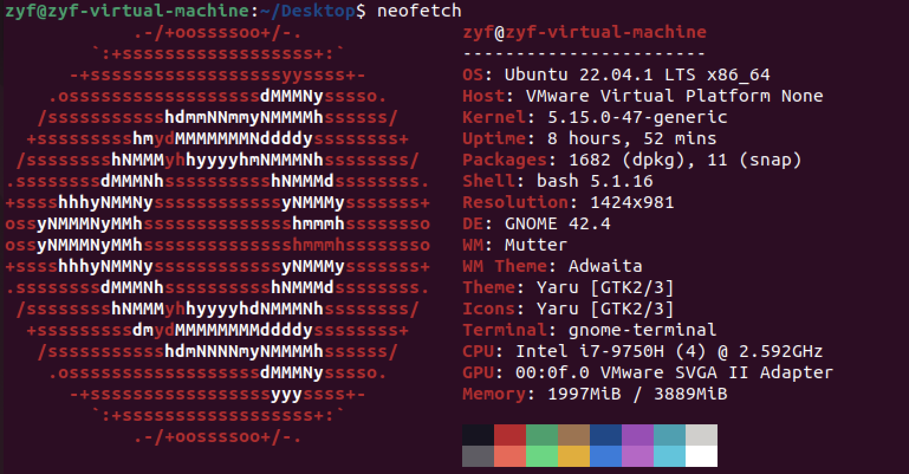
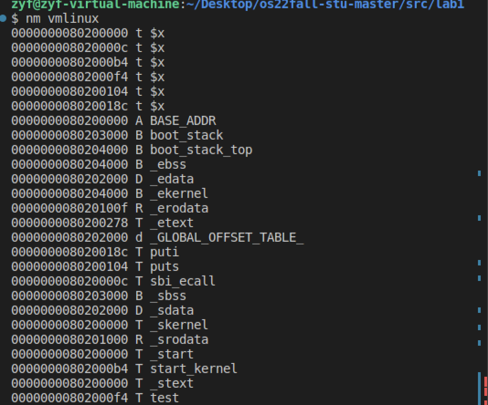
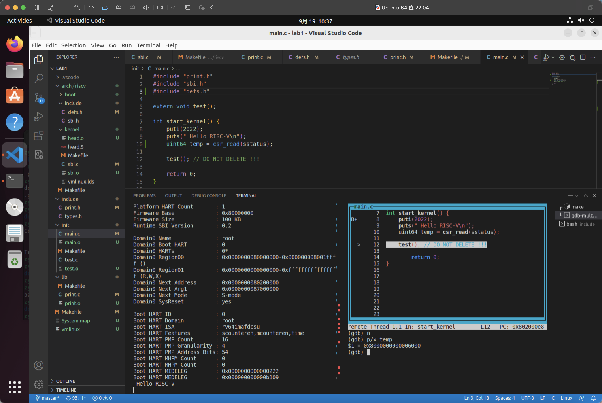
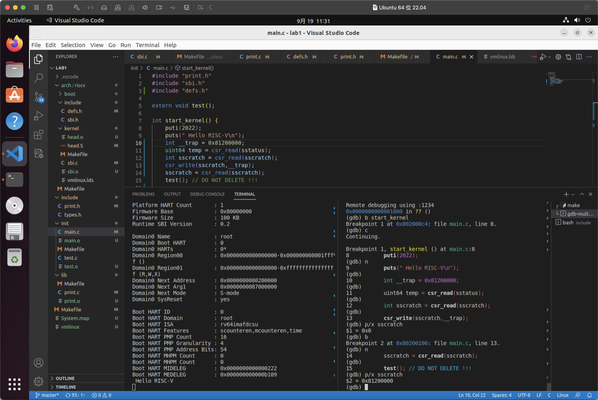

# Lab 1: RV64 内核引导

## 1 实验目的

- 学习 RISC-V 汇编， 编写 head.S 实现跳转到内核运行的第一个 C 函数。
- 学习 OpenSBI，理解 OpenSBI 在实验中所起到的作用，并调用 OpenSBI 提供的接口完成字符的输出。
- 学习 Makefile 相关知识， 补充项目中的 Makefile 文件， 来完成对整个工程的管理。


## 2 实验环境

- 使用vmware运行ubuntu 22.04发行版虚拟机

​	

## 3. 实验步骤

### 3.1 环境准备

​	由于我在lab0中使用docker进行linux kernel的编译，后来发现无法正常运行`make clean`功能，在询问同学之后决定使用vmware中的ubuntu虚拟机完成本实验。在安装了ubuntu虚拟机之后，我将实验文件夹clone到本地，重新编译了linux内核。

### 3.2 编写head.S

​	在head.S中，我们需要为即将运行的start_kernel函数预留一部分栈空间（我预留了4k空间），首先将系统boot栈头地址用la指令加载到sp寄存器中，之后使用`call start_kernel`指令跳转到main.c中的start_kernel函数中。

```asm
.extern start_kernel

    .section .text.entry
    .globl _start
_start:
	# 将boot_stack_top地址加载到sp寄存器中
    la sp,boot_stack_top
    call start_kernel
    .section .bss.stack
    .globl boot_stack
boot_stack:
    .space 0x1000 # <-- change to your stack size

    .globl boot_stack_top
boot_stack_top:
```

### 3.3 完善 Makefile 脚本

​	参考init文件夹中的makefile，以及主文件夹中的makefile文件，能够编写lib文件夹中的makefile文件。这里遇到了一个小坑，在`遇到的问题`中说明。

```makefile
C_SRC       = $(sort $(wildcard *.c))
OBJ		    = $(patsubst %.c,%.o,$(C_SRC))
# 修改文件名为print.o，虽然没用上
file = print.o
all:$(OBJ)
	
%.o:%.c
	${GCC} ${CFLAG} -c $<
clean:
	$(shell rm *.o 2>/dev/null)

```


### 4.4 补充 sbi.c

​	这一步参考gcc内联汇编的格式即可实现。

```c++
struct sbiret sbi_ecall(int ext, int fid, uint64 arg0, uint64 arg1, uint64 arg2,
                        uint64 arg3, uint64 arg4, uint64 arg5) {
  struct sbiret r;
  __asm__ volatile(
      "mv x17, %[ext]\n"
      "mv x16, %[fid]\n"
      "mv x10, %[arg0]\n"
      "mv x11, %[arg1]\n"
      "mv x12, %[arg2]\n"
      "mv x13, %[arg3]\n"
      "mv x14, %[arg4]\n"
      "mv x15, %[arg5]\n"
      "ecall\n"
      "mv %[sbi_ret],a1\n"
      "mv %[sbi_err],a0\n"
      : [sbi_ret] "=r"(r.value), [sbi_err] "=r"(r.error)
      : [ext] "r"(ext), [fid] "r"(fid), [arg0] "r"(arg0), [arg1] "r"(arg1),
        [arg2] "r"(arg2), [arg3] "r"(arg3), [arg4] "r"(arg4), [arg5] "r"(arg5)
      : "memory");
    return r;
}
```


### 4.5 `puts()` 和 `puti()`

​	puts实现：遍历字符串，如果当前字符不是'\0',那么调用sbi_ecall将对应的字符输出。

​	puti实现：首先遍历字符，将对应的数字从后往前的每一位对应的ascii码存储在char数组中，之后倒序输出所有的数字位。参考转转转群中郭助教的一件，将puti的参数修改为uint64

```c++
#include "print.h"
#include "sbi.h"


void puts(char *s) {
    int move = 0;
    while(s[move] != '\0'){
        sbi_ecall(0x1, 0x0, s[move++], 0, 0, 0, 0, 0);
    }
}

void puti(uint64 x) {  
    if(x == 0){
	    return; 
    }
    puti(x / 10);
    sbi_ecall(0x1,0x0,'0' + (x % 10),0,0,0,0,0);
}

```

### 4.6 修改 defs

​	宏函数csr_read的实现如下。

```c
#define csr_read(csr)                                                          \
  ({                                                                           \
    register uint64 __v;                                                       \
    __asm__ volatile("csrr "                                                   \
                     "%[value], " #csr                                         \
                     : [value] "=r"(__v)::"memory");                           \
    __v;                                                                       \
  })

```


## 5. 遇到的问题

- 在编写玩lib文件夹中的makefile文件后，尝试运行make命令编译print.c文件，但是总是提示找不到print.h头文件，按理来说在riscv64-linux-gnu-gcc后使用-I参数添加头文件检索文件夹之后，编译器应该能够找到对应的头文件。于是重新检查了对应的命令，发现由于我在路径中的一个父文件夹名中含有一个空格，导致文件夹路径错误，编译器找不到对应的头文件，将其两侧使用双引号进行包裹之后问题解决。
- 在一开始没有正确编写head.S文件，导致sp寄存器中没有存储boot_stack_top的地址，导致在调用puti的时候，函数接收到的参数总是-1（main.c中实际传送的是2022），在使用gdb调试的时候发现变量的地址不正确，于是在head.S中的`call start_kernel`指令前先使用`la sp boot_stack_top`存储对应的栈顶值，修改之后，puti函数成功接收到正确的值。


## 6. 思考题

1. 请总结一下 RISC-V 的 calling convention，并解释 Caller / Callee Saved Register 有什么区别？

   - 对C语言数据类型的实现（以riscv64为例）

     >​	在riscv64中，int是32位宽的，long和指针类型都是64位宽的，riscv64采用LP64整数模型，long long是64位的，float是32位的，double是64位的，long double是128位的。
     >
     >​	在对齐的时候，char和unsigned char，unsigned short，是0扩展的，signed char和short，int使用符号扩展。

   - 寄存器调用约定

     >​	在riscv64中，x1、x5-7、x10-x11、x12-x17、x28-x31、f0-7、f10-f11、f12-f17、f28-31约定为caller-saved。x2、x8、x9、x18-27、f8-9、f18-27约定为callee-saved
     >
     
   - caller-saved: 对于汇编函数调用者，其自己在调用子函数之前应该讲所有可能被修改的该种寄存器进行保存。
   
   - callee-saved: 调用者不需要在调用前保存该类型寄存器，而是被调用的子函数需要保证callee-saved寄存器在函数调用前后的值是一致的。
   
     
   
2. 编译之后，通过 System.map 查看 vmlinux.lds 中自定义符号的值。

   

3. 用 `read_csr` 宏读取 `sstatus` 寄存器的值，对照 RISC-V 手册解释其含义。

   在start_kernel函数中使用上述宏，并使用gdb查看，得到如下结果。

   

   可知sstatus寄存器当前的值为0x8000000000006000，表示其第64位，第14位和第15位为1，其余位均为0。即其SD bit为1，XS bit为2，FS bit为1。查询手册可知当前SPP位为0，表示执行SRET指令之后，执行模式会切换到用户态；SIE位为0，表示当前禁止中断发生。

4. 用 `write_csr` 宏向 `sscratch` 寄存器写入数据，并验证是否写入成功。

​	查询文档得知，`sscratch`寄存器存储的是中断向量表的首地址。这里尝试向其写入0x81200000，之后将其读取以验证写入成功。

​	

5. Detail your steps about how to get `arch/arm64/kernel/sys.i`

​	在linux kernel源代码文件夹中，运行`make ARCH=arm64 CROSS_COMPILE=aarch64-linux-gnu- defconfig`，生成arm64对应的配置文件，之后运行`make ARCH=arm64 CROSS_COMPILE=aarch64-linux-gnu- ./arch/arm64/kernel/sys.i`生成sys.i文件


6. Find system call table of Linux v6.0 for `ARM32`, `RISC-V(32 bit)`, `RISC-V(64 bit)`, `x86(32 bit)`, `x86_64` List source code file, the whole system call table with macro expanded, screenshot every step.

- ==x86_32==

​	x86_32内核的syscall table在arch/x86/entry/syscalls/syscall_32.tbl中可以找到。

​	

  另外，也可以先在主目录下执行`make ARCH=x86 CROSS_COMPILE=x86_64-linux-gnu- defconfig`，再执行`make ARCH=x86 CROSS_COMPILE=x86_64-linux-gnu- ./arch/x86/entry/syscall_32.i`，之后查看`syscall_32.i`文件，也可以得到syscall table和对应的函数定义。


- x86_64

  x86_64内核的syscall table在arch/x86/entry/syscalls/syscall_64.tbl中可以找到


​	另外，也可以先在主目录下执行`make ARCH=x86_64 CROSS_COMPILE=x86_64-linux-gnu- defconfig`，再执行`make ARCH=x86_64 CROSS_COMPILE=x86_64-linux-gnu- ./arch/x86/entry/syscall_64.i`，之后查看`syscall_64.i`文件，也可以得到syscall table和对应的函数定义。


- arm32 

  arm32内核的syscall table在arch/arm/tools/syscall.tbl中可以找到。

  

  或者在linux目录下执行`make ARCH=arm CROSS_COMPILE=arm-linux-gnueabihf- defconfig`,`arm-linux-gnueabihf-gcc`是arm32交叉编译套件，之后在该目录下执行`make ARCH=arm CROSS_COMPILE=arm-linux-gnueabihf- ./arch/arm/kernel/sys_arm.i`，该文件的52640行开始即为arm32对应的syscall table。

  

- riscv32

  通过运行`make ARCH=riscv CROSS_COMPILE=riscv32-unknown-elf- defconfig` 以及 `make ARCH=riscv CROSS_COMPILE=riscv32-unknown-elf- ./arch/riscv/kernel/syscall_table.i` 通过vim查看对应的syscall_table.i文件，可以在文件末尾找到所有riscv32架构的syscall_table以及对应的函数定义。

  

  syscall表。

  

  对应的函数定义。

  

- riscv64

通过运行`make ARCH=riscv CROSS_COMPILE=riscv64-linux-gnu- defconfig` 以及 `make ARCH=riscv CROSS_COMPILE=riscv64-linux-gnu- ./arch/riscv/kernel/syscall_table.i` 通过vim查看对应的syscall_table.i文件，可以在文件末尾找到所有riscv64架构的syscall_table以及对应的函数定义。


7. Explain what is ELF file? Try readelf and objdump command on an ELF file, give screenshot of the output. Run an ELF file and cat `/proc/PID /maps` to give its memory layout.

​	elf文件是为目标文件，共享链接库和内核转储(core dumps)准备的标准文件格式，全称为Executable and Linkable Format。其由elf头，程序头表和节头表组成。

​	elf头包含了elf文件的基本信息，包括elf文件magic number、文件类型、文件格式版本等，也包含能够用来定位其他部分的程序偏移量，比如程序头表偏移，节头表偏移，是对文件的主要特性：类型、CPU架构、入口地址、现有部分的大小和偏移等等关键值的描述。

​	在elf.h中可以看到elf头结构。

```c
typedef struct elf64_hdr {
    unsigned char    e_ident[EI_NIDENT];
    Elf64_Half e_type;
    Elf64_Half e_machine;
    Elf64_Word e_version;
    Elf64_Addr e_entry;
    Elf64_Off e_phoff;
    Elf64_Off e_shoff;
    Elf64_Word e_flags;
    Elf64_Half e_ehsize;
    Elf64_Half e_phentsize;
    Elf64_Half e_phnum;
    Elf64_Half e_shentsize;
    Elf64_Half e_shnum;
    Elf64_Half e_shstrndx;
} Elf64_Ehdr;
```

​	elf文件中所有的数据都存储在许多section中，节头表中含有这些section的头的索引，我们能够便捷的通过这些索引找到对应的section的位置。

​	在elf文件中的节又被分为段，程序头表中的每一个对象都是一个含有众多段的结构，它枚举了所有有效的段以及他们的属性，程序头表需要加载器将文件中的section加载到内存中。

​	vmlinux就是一个典型的elf文件，我们对它运行readelf命令。


	能够看到，文件头中包含了elf文件必要的描述信息，之后是程序头表，包含了所有有效的段的信息，最后是节头表（符号表)，包含了所有的节的地址以及各种符号的地址。

​	elf文件的执行：

>​	创建文件a.c，内容如下
>
>```c
>int main(){
>	int sum = 0;
>	for(int i = 0; i< 100;i++){
>		sum += i;
>	}
>    // 防止进程退出，导致看不到内存存储形式
>	while(1){
>	}
>}
>```
>
>​	执行`gcc -o elf_example a.c`得到可执行文件elf_example，使用file检查，发现其确实为elf文件。
>
>
>
>​	在命令行执行`elf_example &`，执行`ps -aux | grep elf_example`查看其pid为408873，随后执行`cat /proc/408873/maps`查看其内存布局。
>
>
>
>

