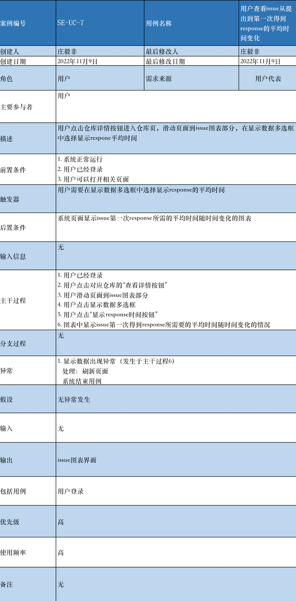
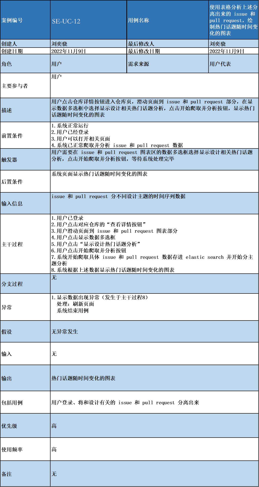
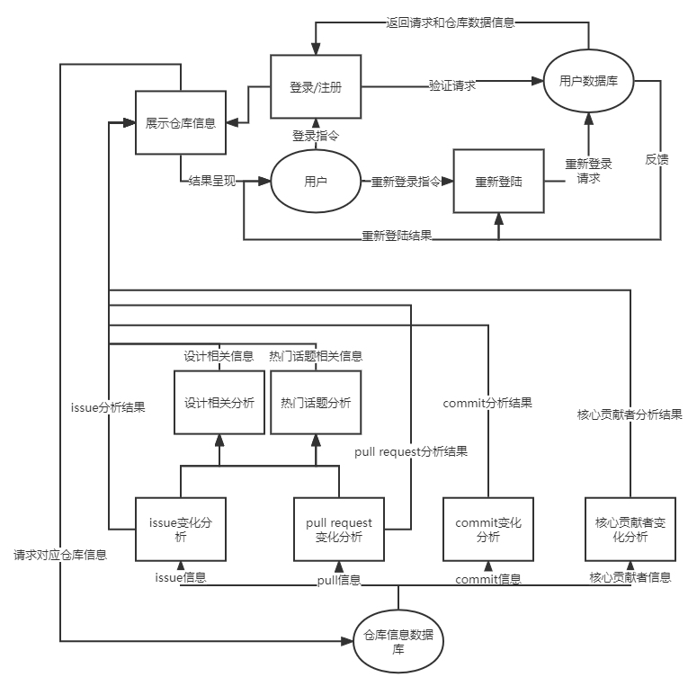

# 	软件规格说明书

##### 小组成员：庄毅非、刘奕骁、李予谦、应凌凯、何迪

## 一、引言

### 1.1 需求规格说明书编写目的

​	本软件需求规格说明书对软件需求工程的课程项目《DoubleC 开源项目分析平台》的实现做了充分用户需求分析，针对产品经理、开发者、游客以及管理员等多个不同的用户群体，清晰地描述了开源项目分析平台的各项需求，包括功能性需求和非功能性需求。**需要注意的是，由于篇幅有限，这里省略了一些标准中有的部分（比如软件背景、前景等在前一个milestone已经提到，这里不在重复书写）**。

### 1.2目标读者和阅读建议

#### 1.2.1软件需求规格说明书的组成部分

​	本软件需求规格说明书主要由如下几个部分构成:总体描述、系统需求分析概述、功能需求、数据流图、外部接口需求、非功能性需求、数据字典、业务规则和业务算法以及附录这些部分。

- 总体描述部分对开源项目分析平台的基本信息、前景和用户类特征、设计和实现上的各项约束、假设和依赖、以及项目组的开发测试和运行环境等做了详细的介绍。
- 系统需求分析概述这一部分对系统的主要用例进行了需求优先级的分析并给出了整个系统的模块架构图，功能需求部分根据不同的用户类型对需求做了详细的分析，并给出了用例的时序图，是本软件需求规格说明书的主要部分。
- 数据库ER图给出了最基本的数据库中各项数据表的设计
- 数据流图部分对每个子系统的逻辑流动方向做了图形化的表达。
- 外部接口需求部分对硬件接口、软件接口和通信接口等等进行了描述。
- 非功能性的需求部分对该系统的需求进行了详细的描述。
- 数据字典部分对于系统的数据流定义、数据元素定义和数据精度做了详细的描述。
- 业务规则与业务算法部分详细列举了系统的操作规则和算法。

#### 1.2.2软件需求规格说明书面向的读者对象:

- 项目经理:项目经理可以根据本文档了解预期产品的功能，并据此进行了系统设计和项目管理
- 设计人员:系统的设计人员可以根据本文档对需求进行分析，并设计出系统，包含系统架构的设计和数据库表的设计
- 程序开发人员:程序开发人员可以根据该需求规格说明书配合《系统总体设计计划》，了解系统功能，并进行系统的开发和《用户手册》的编写
- 销售人员:销售热源可以根据本文档了解目标产品的各项功能和性能

- 测试人员:测试人员可以根据本文档编写测试用例，并对软件产品进行功能性的测试和非功能性的测试
- 用户:用户可以根据本文档了解本产品的功能和性质，并和分析人员进行需求的讨论和协商
- 其他人员:其他人员比如部门领导、公司领导、政府机关领导等领导可以根据本文档了解产品的功能和性能在阅读本软件需求规格说明书的时候，首先要了解产品的功能概貌，然后可以根据自身的需要对每一功能进行实当的了解。

### 1.3 参考文献与资料

- 《软件设计文档国家标准》
- 《软件工程项目开发文档范例》
- 《软件需求》刘伟琴、刘洪涛译
- 《“软件需求工程”课程案例高校教学系统20200921》刑卫
- 《软件工程——实践者的研究方法》`
- fiSSure “开源项目分析平台”项目总体计划
- fiSSure “开源项目分析平台”前景和范围

## 二、总体描述

### 2.1 产品基本信息

- 产品名称：doublec 开源项目分析平台
- 任务提出者：浙江大学软件需求工程课程任课老师:万志远
- 开发团队：软件需求工程 fiSSure
- 用户类型：产品经理、开发者、游客以及管理员
- 系统基本功能：doublec 开源项目分析平台能够允许多个用户分别登陆，保证存储数据隔离。用户可以从代码托管平台 github 获取开源项目的 commit、star、issue、contributor 等信息，并进行开发时间线分析、issue 和 pull request 热门话题分析、核心贡献者公司分布分析、两个项目横向对比等处理，深入了解开源项目的历史、热点和现状
- 性能：根据项目的基本要求，本项目要求提供对外服务的能力，确保同时给 100 名开发者、开源社区管理人士、软件工程师同时使用
- 完成期限：本学期期末验收之前，严格按照老师的规划进行

### 2.2 用户类别与特征

本项目的用户群体主要为开发者、开源社区管理人士、软件工程师等。用户总体有如下特征：有代码编写经验，对开源社区了解或感兴趣，需要对开源项目的状况进行分析辅助决策。

### 2.3 产品开发项目设计人员

图一：项目人员表

### 2.4 开发、测试和运行环境

- 开发环境:Windows 10 发行版，Ubuntu 18.04+版本，MacOS 最新版
- 开发框架:前端 React+JavaScript，后端 nodejs 16.0+版本
- 测试环境:可以联网的电脑，阿里云服务器，相关的开源测试工具，如 Junit • 运行环境:可以联网的电脑，浏览器(尽量适配 IE 浏览器)

### 2.5 用户文档

​	本产品交付时将为用户提供三类文档，分别是描述类文档、过程类文档、参考类文档，主要帮助用户可以快速入门开源软件分析系统的使用，并在遇到实际问题时可以通过文档查阅快速解决所遇到的问题。

- 描述类文档提供对于开源软件分析系统的基本组成、属性、功能、特性、接口、应用

  的描述信息，用于帮助用户概开源软件分析系统所具备的所有功能以及各个功能的

  具体使用方式。

- 过程类文档实际上通过用户在第一次登录系统时以及第一次使用某种功能时进行

  引导式教学使用。

- 参考类文档按照专题提供信息，用于为用户提供在进行开源软件分析系统中某种操作，以及理解其中某项功能时所需要的详细记录以及解释，同时为用户提供问题的快速解决方案，以便于用户进行操作。

## 三、 系统需求分析概述

#### 3.1 需求优先级分析

​	根据产品功能概述，我们划分了系统的模块，并从每个模块中挑选出了必要的需求作为用例进行分析。本部分我们将对这些需求进行优先级分析。

​	本需求优先级分析模块依据紧急程度-重要性四象限矩阵进行评级，即按照下表所示四象限对需求进行优先级分类。

表 1 需求优先级风险-价值矩阵

|            | 高重要性 | 低重要性 |
| ---------- | -------- | -------- |
| 高紧急程度 | 首先处理 | 其次处理 |
| 低紧急程度 | 再次处理 | 最后处理 |

​	考虑到实际情况的限制，以下估算仅作为策略性指导，随着项目的进行可能会进行调整。

图1 用例的需求优先级分析

	

图2 系统用例图

## 

## 四、功能需求

### 4.1 需求说明

#### 4.1.1 用户查看不同时期issue相关活动的频率变化

图3 SE-UC-01 用例挂图

请老师注意，我们的程序逻辑是: 1. 前端先启动，用户一点击进入页面，页面就会从服务器请求所有所需的渲染数据，2. 之后在用户滑动到对应位置的时候，图表会首先将所有数据都渲染出来，3. 然后用户可以选择自己想要查看的时间段，前端在进行重渲染，输出结果，所以uml时序图中是前端先请求数据，之后用户滑动到指定位置的时候图表渲染两次，第一次是全数据渲染，第二次是指定区间数据渲染，本文档中的14个用例都是这样的执行过程。（这里是为了避免老师对UML图感到疑惑，所以加上的一段解释的话。）

图4 SE_UC_01 时序图

图5 SE_UC_01 状态图

#### 4.1.2 用户查看不同时期pull相关活动的频率变化

图6 SE-UC-02 用例挂图

图7 SE_UC_02 时序图

图8 SE_UC_03状态图

#### 4.1.3 用户查看不同时期commit相关活动的频率变化

图9 SE-UC-03 用例挂图

图10 SE_UC_03 时序图

图11 SE_UC_03状态图

#### 4.1.4 用户查看不同时期issuer相关活动的频率变化

图12 SE-UC-04 用例挂图

图13 SE_UC_04 时序图

图14 SE_UC_04状态图

#### 4.1.5 用户查看不同时期puller相关活动的频率变化

图15 SE-UC-05 用例挂图

图16 SE_UC_05 时序图

图17 SE_UC_05状态图

#### 4.1.6 用户查看不同时期commiter相关活动的频率变化

图18 SE-UC-06 用例挂图

图19 SE_UC_06 时序图

图20 SE_UC_06状态图

#### 4.1.7 用户查看issue从提出到第一次得到response的平均时间变化图表

图21 SE-UC-07 用例挂图

图22 SE_UC_07 时序图

图23 SE_UC_07状态图

#### 4.1.8 用户查看issue从提出到closed所需要的平均时间变化图表

图24 SE-UC-08 用例挂图

图25 SE_UC_08 时序图

图26 SE_UC_08状态图

#### 4.1.9 用户查看项目核心贡献者

图27 SE-UC-09 用例挂图

图28 SE_UC_09 时序图

图29 SE_UC_09状态图

#### 4.1.10 用户查看核心贡献者背后的公司比例图表

图30 SE-UC-10 用例挂图

图31 SE_UC_10 时序图

图32 SE_UC-10状态图

#### 4.1.11 用户查看分离出来的和设计相关的issue和pull

图33 SE-UC-11 用力挂图

图34 SE-UC-11 时序图

图35 SE-UC-11 状态图

#### 4.1.12 用户查看设计相关的issue和pull绘制得到的热门设计话题随时间变化的图表

图36 SE-UC-12 用力挂图

图34 SE-UC-12 时序图

图35 SE-UC-12 状态图

### 4.1.13 用户比较两个项目

图36 SE-UC-13 用例挂图

图37 SE-UC-13 用例挂图

图38 SE-UC-13 用例挂图

## 五、附录

### 5.1 数据流图

### 5.2 上下文图

### 5.3 ER图

### 5.4 数据词典

### 5.4.1 数据元素定义表

| 编号 | 数据元素名                  | 类型   | 值域             | 说明                         |
| ---- | --------------------------- | ------ | ---------------- | ---------------------------- |
| E1   | 用户编号                    | 数字   | 0 ~ $2^{31}$ - 1 | 指明用户的唯一标识，自增     |
| E2   | 用户昵称                    | 字符   | 6~100个字符      |                              |
| E3   | 用户手机号                  | 字符   | 11个字符         | 11位字符                     |
| E4   | 用户密码                    | 字符   | 输入至少6位      | 存储hash结果                 |
| E5   | 仓库名                      | 字符   | 非空             | 仓库名                       |
| E6   | 仓库拥有者名                | 字符   | 非空             | 仓库的owner名称              |
| E7   | 仓库fork数量                | 数字   | 不小于0          | fork仓库的数量               |
| E8   | 仓库star数量                | 数字   | 不小于0          | 仓库的star数量               |
| E9   | 仓库open的issue数量         | 数字   | 不小于0          | 仓库处于open状态的issue数量  |
| E10  | 仓库最后更新时间            | 时间   | 不大于当前时间   |                              |
| E11  | 仓库贡献者名称              | 字符   | 非空             |                              |
| E12  | 核心贡献者标识              | 布尔值 |                  | 表示是否是核心贡献者         |
| E13  | 公司名称                    | 字符   | 可为空           |                              |
| E14  | 作为核心贡献者的时间段      | 时间   | 不大于当前时间   |                              |
| E15  | 仓库的核心贡献者数量        | 数字   | 数字             |                              |
| E16  | issue open和close时间       | 时间   | 不大于当前时间   | issue被open和close对应的时间 |
| E17  | issue首次得到响应经过的时间 | 时间   |                  |                              |
| E18  | pull id                     | 字符   |                  |                              |
| E19  | pull 频率                   | 数字   |                  | 每周的pull频率               |
| E20  | commit id                   | 字符   | 非空             | commit对应的sha值            |
| E21  | commit 频率                 | 数字   | 非空             |                              |

### 5.4.2 数据精度表

| 编号 | 数据元素名                  | 类型   | 精度             | 说明                         | 示例                                  |
| ---- | --------------------------- | ------ | ---------------- | ---------------------------- | ------------------------------------- |
| E1   | 用户编号                    | 数字   | 0 ~ $2^{31}$ - 1 | 指明用户的唯一标识，自增     | 1                                     |
| E2   | 用户昵称                    | 字符   | 6~100个字符      |                              | 小花菇                                |
| E3   | 用户手机号                  | 字符   | 11个字符         | 11位字符                     | 17346399235                           |
| E4   | 用户密码                    | 字符   | 输入至少6位      | 存储hash结果                 | sha256(123123)                        |
| E5   | 仓库名                      | 字符   | 非空             | 仓库名                       | pytorch                               |
| E6   | 仓库拥有者名                | 字符   | 非空             | 仓库的owner名称              | pytorch                               |
| E7   | 仓库fork数量                | 数字   | 不小于0          | fork仓库的数量               | 123                                   |
| E8   | 仓库star数量                | 数字   | 不小于0          | 仓库的star数量               | 233                                   |
| E9   | 仓库open的issue数量         | 数字   | 不小于0          | 仓库处于open状态的issue数量  | 333                                   |
| E10  | 仓库最后更新时间            | 时间   | 不大于当前时间   |                              | 2022年11月8日 星期三 16时33分20秒 CST |
| E11  | 仓库贡献者名称              | 字符   | 非空             |                              | tomis                                 |
| E12  | 核心贡献者标识              | 布尔值 |                  | 表示是否是核心贡献者         | `true`                                |
| E13  | 公司名称                    | 字符   | 可为空           |                              | microsoft                             |
| E14  | 作为核心贡献者的时间段      | 时间   | 不大于当前时间   |                              | 2022年3月~2022年11月                  |
| E15  | 仓库的核心贡献者数量        | 数字   | 数字             |                              | 132                                   |
| E16  | issue open和close时间       | 时间   | 不大于当前时间   | issue被open和close对应的时间 | 2022年11月8日 星期三 16时33分20秒 CST |
| E17  | issue首次得到响应经过的时间 | 时间   |                  |                              | 20min                                 |
| E18  | pull id                     | 字符   |                  |                              | 12                                    |
| E19  | pull 频率                   | 数字   |                  | 每周的pull频率               | 5/天                                  |
| E20  | commit id                   | 字符   | 非空             | commit对应的sha值            |                                       |
| E21  | commit 频率                 | 数字   | 非空             |                              | 4/天                                  |

### 5.5 业务规则与算法

### 5.5.1 业务规则

| 标识符 | 规则定义                                                     | 规则类型      | 静态或动态 | 来源     |
| ------ | ------------------------------------------------------------ | ------------- | ---------- | -------- |
| BR-01  | 游客不能查看仓库信息                                         | 约束          | 静态       | 安全策略 |
| BR-02  | 对每一个用户，其只能够导入一个仓库一次                       | 约束          | 静态       | 存储要求 |
| BR-03  | 图表可选择的时间范围不能够超过存储的数据的时间范围           | 约束          | 动态       | 数据     |
| BR-04  | 数据获取失败时，应该显示错误信息而不是无限期等待下去         | 动作出发规则  | 动态       | 用户5    |
| BR-05  | 用户不能够导入不存在的仓库信息                               | 约束          | 动态       | 数据来源 |
| BR-06  | 游客不能够进入需要鉴权的页面                                 | 约束          | 动态       | 安全策略 |
| BR-07  | 用户注册的用户名应该唯一                                     | 约束          | 动态       | 数据存储 |

### 5.5.2 业务算法

​	界定核心贡献者的算法是在最近的一段时期（比如一个月内），贡献的频率在所有贡献者中排名前10%，以及贡献的代码行数10%，缺少一个条件都不能成为项目在此时期内的核心贡献者。

​	使用ppt中的表格对设计相关的issue以及pull request进行分析，提取出一段时间内的热门讨论主题。

### 5.6 非功能性需求

#### 5.6.1 性能需求

- 系统应保证运行稳定，避免出现崩溃;
- 主流浏览器均能正常访问本系统;
- 能够对github数据进行高效快速的爬取和存储
- 响应时间在3s以内
- 初次导入一个仓库在10min以内
- 初次计算一个仓库的信息在2min以内
- 系统应该能及时检测出各种非正常情况，如与设备的通信中断断开，无法连接数据库服务器等情况，避免用户长时间等待;

#### 5.6.2 数据传输和并发要求

- 用户输入账号密码点击登录后，对登录的相应时间不能超过 1 秒，在此时间内将登录结果显示在屏幕上;
- 系统能支持 2 名用户同时进行仓库的导入
- 系统能支持 10 名用户同时查看仓信息

#### 5.6.3 数据管理要求

​	系统既要与其他系统有接口，又必须保证本系统的独立性与完整性。即应防止未经授权的各类人员对本系统进行设置和修改或访问系统内部数据。 

​	系统服务器软件必须提供可靠的数据备份和恢复手段，在服务器软件或硬件出现严重故障时，能够根据备份的数据和账户信息迅速恢复正常运行环境。同时，软件开发者不得在系统中预留任何特殊账户和密码，保证其安全性。 

​	除此之外，系统应具备加密登录、数据加密传输等安全方面的保障，保证数据在不用系统间传输过程中的保密性与安全性。以下为具体细则:

- 当系统崩溃后，系统应能在 24 小时内恢复运行;
- 本系统用于日志等记录的数据增长约为 20MB/月，具体增长速度由用户的使用频率及所发生业务的数据量决定
- 当出现重大事故造成数据丢失后，系统应能在 48 小时内恢复数据;
- 系统管理员每两个月应至少维护备份一次数据;
- 系统服务器应具备至少 20GB 的存储空间;

#### 5.6.4 权限与安全需求

在我们的系统中，对于安全与权限进行了如下设计:

- 所有涉及功能信息或个人信息的网络事务，都应进行加密操作;
- 未登录的用户，即游客不能进行仓库的导入和分析操作
- 系统要求用户密码强度不能少于 6 个字符
- 用户登录时，密码要进行加密，用户修改密码时需要进行安全性认证;
- 只有系统管理员有权查看及修改底层数据库数据，且行为应被系统日志记录，用户无法非法修改数据库;
- 当流量过大时，优先限制游客流量防止恶意访问。
- 对可能造成等待时间较长的操作应该提供取消功能;
- 对错误操作支持可逆性处理，如取消系列操作。

#### 5.6.5 输入要求

- 在用户输入账号密码时，应对数据输入进行数据有效性检查，同时应该确保其安全性;
- 此外，系统应通过程序控制出错几率，减少系统因用户人为的错误引起的破坏，开发者应当尽量周全地考虑到各种可能发生的问题，使出错的可能降至最小。
- 如果一个仓库已经导入，系统拒绝新的全库导入操作，防止冗余输出存储过多导致系统崩溃。

#### 5.6.6 可视化需求

- 用户在注册之后，可以看到成功或失败的提示。
- 用户在登录的时候，可以看到成功或失败的提示。
- 用户进行仓库导入的时候，可以查看估计的剩余导入时间，同时页面显示loading标志。导入成功之后，页面给出提示。
- 用户进行仓库对比的时候，显示对比中图标，在对比结束之后可以看到图表。

#### 5.6.7 防护性需求

- 数据库误删除时，可以使用撤销删除修复;
- 系统应该保护未开放下载权限的资料不被下载;
- 重复操作导致卡死时，系统提出警告;
- 系统应该提供验证码防止恶意登录;
- 系统应该及时信息备份防止病毒攻击;
- 系统应该能检测到恶意操作，提出警告并在一段时间内不允许操作。 7. 访问无权限时，系统发出提示并禁止用户访问;

#### 5.6.8 软件质量属性

- 兼容性:系统只需要保证在主流浏览器(Chrome、IE)上正常浏览和使用即可
- 易用性:系统界面应该简洁明了、操作简单，功能按钮的位置符合用户的日常习惯。此外，系统应该要有导航和清晰简短的用户使用手册;
- 可用性:系统保证早上 6 点到晚上 24 点之间可用，但在发生紧急情况时允许维护一段时间;
- 可维护性:系统运行时要保存运行日志，用来维护分析。每两周的维护日凌晨 1 点到 5 点为维护时间，在此期间用户不能使用系统。
- 可扩充性:系统在设计上考虑到了网站可能的后续发展，在后端设计和前端设计上尽可能地在满足所有需求的同时，增强了网站的可扩充性。一旦有扩展需要，客户可以联系系统维护人员，维护人员需要在 1-4 个工作日内完成客户的内容扩充需求，主要包括增加新的功能、增加新的模块、界面优化、系统性能提升等。

#### 5.6.9 其他需求

- 当用户进行误操作或不合法操作，软件能给出提示信息。
- 软件对用户的使用应该有较为清晰的引导。

