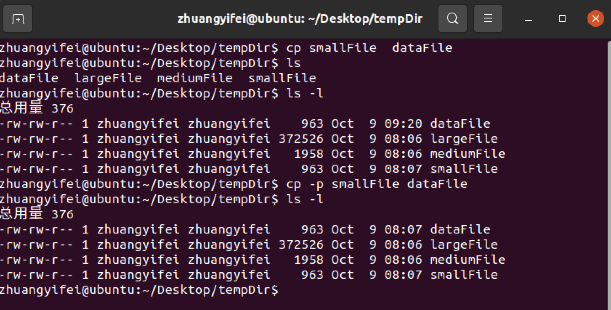
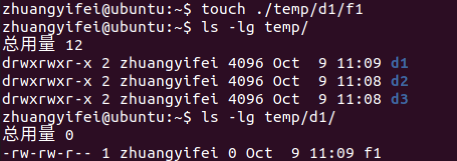
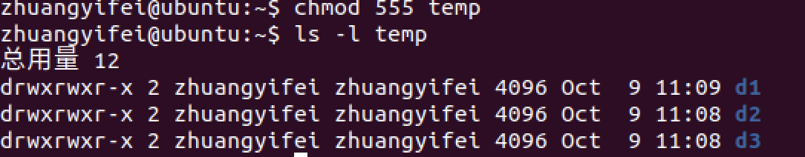
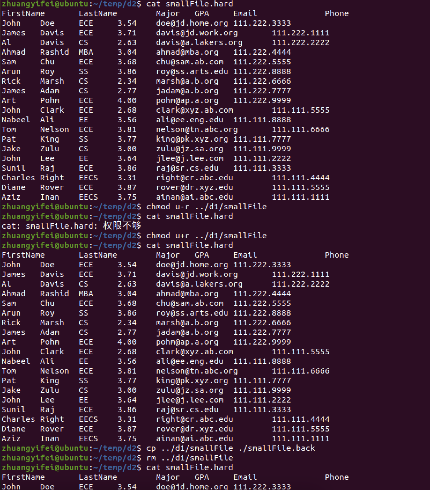

# 										浙江大学实验报告


课程名称:   <u>Linux应用技术基础</u>                   实验类型： <u>验证型</u>

实验项目名称：   <u>Linux基本命令</u>

学生姓名： <u>庄毅非</u>    专业：<u>软件工程</u>      学号：  <u>3200105872</u>        

电子邮件地址：<u>1099665018@qq.com</u>             手机（可选）： <u>17346399235</u>         

实验日期： <u>2021年 10 月8 日</u>

 

 

## 一、 实验环境

###### \#  填写您的计算机配置，操作系统环境，Linux版本

实验中使用的是在Mac vmware fusion环境中安装的虚拟机

计算机配置：

​	CPU:两个虚拟 intel-i7-9750H @2.6GHz CPU

​    GPU: VMware SVGA II Adapter

​    Memory: 总计3.8G内存，缓存为750MB，交换文件为2G

操作系统环境：

​	Ubuntu(Linux 5.22.0-37-generic Ubuntu 20.04.3 LTS)

Linux版本：

​	内核：Linux 5.22.0-37-generic x86_64

​    发行版：Ubuntu 20.04.3 LTS


## 二、 实验内容和结果及分析

###### 实验过程中命令输入、输出显示的结果截图，及解释


1. <font color="red">查阅资料，回答问题：什么是软件许可证（Software License）？通过互联网收集国际上常用的各种软件许可证，并作简单的讨论和分析？重点研究Linux的软件许可存在哪些法律风险和应用风险？</font>

   软件许可证就是软件作者和用户之间签订的一种格式合同，用来规范和限制用户的使用权力，以保护作者的合法权利（A software license is a legal instrument (usually by way of contract law, with or without printed material) governing the use or redistribution of software.  ）。

   常用的软件许可证：有MIT许可证，BSD许可证，Apache许可证，GPL许可证，LGPL许可证，AGPL许可证，MPL许可证等等

   讨论及分析：

   | 许可证 | 主要内容以及和其他许可证的区别                               |
   | ------ | ------------------------------------------------------------ |
   | MIT    | 相当宽松，只要保留版权声明就基本上可以随意用                 |
   | BSD    | 无许可的时候，作者不能用自己的名义推广产品，同时必须携带伯克利的版权声明 |
   | Apache | 必须注明自己做出的修改                                       |
   | GPL    | 对于GPL软件做出的修改也必须在GPL许可证的条件下发表，同时必须开源，具有“传染性” |
   | LGPL   | 和GPL相似，但是允许程序调用非自由软件模块                    |
   | AGPL   | 和GPL类似，但是要求通过网络使用程序（比如云服务）的用户也能够取得源代码 |
   Linux的许可证存在的法律风险和应用风险：

   Linux风险：如果一个公司在无意中将以GPL2.0为软件许可证的Linux系统作为开发基础开发出了一个全新的软件，却没有根据GPL许可证的要求公开所有的源代码，就有可能收到开源软件社区或者是Linux社区人士的诉讼，给公司带来巨大的道义以及经济损失。但是公开所有源代码这样的行为本身和公司的利益是相悖的，可能导致公司竞争对手掌握核心技术或者是使公司软件更容易被黑客攻破，同样造成巨大损失。

   

2. <font color="red"> 通过对HarmonyOS或OpenHarmony与当前操作系统（Windows、Linux、i_OS、Android）的比较分析，如何构建鸿蒙的技术和生态，请你支招？</font>

   >(1):首先，也是最重要的一点，就是鸿蒙系统必须具有一个完整而丰富的生态，并且要拥有足够多的应用开发者。这一点在Windows，Linux，IOS，Android四个系统上都体现的很明显，特别是IOS和Android，他们都吸引了世界上众多的开发者，这也是他们拥有坚实的应用程序商店以及功能集的主要原因之一。如果一个操作系统没有第三方开发者的支持以及持续的应用上架、更新，那么靠热情带起来的消费力也会被消耗完。因此如果华为公司希望鸿蒙系统能够取得成功，我认为他们需要撰写足够完整的应用开发教程，以及帮助安卓开发者快速将安卓app转换成鸿蒙app，成为鸿蒙开发者。
   >
   >(2):万物互联：这一点上华为作为5G技术的领跑者是领先其他厂商的，华为可以将鸿蒙系统开发出一个能够在电视，手表，平板等多种设备上运行的一个物联网时代的操作系统，降低开发者的负担，同时提高用户体验。Apple和Google公司也都在积极推进自己在这方面的优势，华为可以借鉴他们已经推出的产品来趋利避害，加速产品开发，开拓市场。
   >
   >(3):需要有独家功能。拿ios和andriod来说，ios上apple公司推出的各种功能，比如icloud,faceid,隔空投送等，大多数都是在其他的手机上无法得到的，或者说即使有体验也不如ios上好；在Android平台上更是有巨无霸的googlePlay服务（虽然这项服务在国内无法享受到）几乎垄断了用户的手机使用的每一个过程。鸿蒙系统如果希望能够牢牢的吸引用户，提高忠诚度的话，也需要推出一系列革命性的提升用户体验的功能。
   >
   >(4):虽然很难，但是我认为鸿蒙还是需要开拓海外市场。这样才能吸引大量海外开发者参与到鸿蒙app的开发上，快速构筑鸿蒙生态系统。并且他们做出的反馈也有助于鸿蒙系统的持续优化更新。

   

3. 可以使用man和info命令来获得每个Linux命令的帮助手册，用man ls，man passwd，info pwd命令得到ls、passwd、pwd三个命令的帮助手册。也可以使用：命令名 --help格式来显示该命令的帮助信息，如who --help，试一下这些命令。（实验报告中获取部分截图）

   >
   >(1) man ls
   >
   >
   >
   >(2) man passwd 
   >
   >
   >
   >(3) info  pwd
   >
   >
   >
   >(4) who --help
   >
   >

4. 使用whoami命令找到用户名。使用下面的命令显示有关你计算机系统信息：uname（显示操作系统的名称），uname -n（显示系统域名），uname -p（显示系统的CPU名称）

   (1)您的用户名是什么？

   (2) 你的操作系统名字是什么？

   (3) 你计算机系统的域名是什么？

   (4) 你计算机系统的CPU名字是什么？

   > 从下图可以看出，用户名为zhuangyifei,操作系统名为Linux，域名为ubuntu，cpu名字为x86_64
   >
   > 
   >
   > 

5. 简述Unix epoch（Unix纪元）？用cal命令显示下列年份的日历：4、1752、2012年7月。

   Unix epoch指的是1970年一月一日00:00

   (1) 给出你显示以上年份年历的命令

   >```bash
   >#公元4年
   >cal 4
   >#1752年
   >cal 1752
   >#2012年7月
   >cal 2012 -m 7
   >```

   (2)1752年有几天，为什么？ 

   >有355天，可以使用`cal 1752 -m 12 -j`查看
   >
   >

6. 使用uptime命令判断系统已启动运行的时间和当前系统中有多少登录用户，给出显示的结果。

   >结果：
   >
   >
   >
   >可以发现，系统启动时间为1分钟，当前系统中只有一个用户

7. 通过Linux的man、info命令或互联网得到下面的shell命令、系统调用和库函数功能描述及每个命令使用例子：


  <table  style="border-collapse: collapse;font-family: helvetica, arial, sans-serif" data-eth-ms="1" border="1" data-eth-date="2021/10/8 22:36:49"><tr>
<td style="text-align:Center;color:#000000;font-weight:bold;font-size:12px;width:164px;white-space:no-wrap" eth-cell="A1"  >命令</td>
<td style="text-align:Center;color:#000000;font-weight:bold;font-size:12px;width:91px;white-space:no-wrap" eth-cell="B1" colspan="4"  >命令功能的简要描述</td>
<td style="text-align:Center;color:#000000;font-weight:bold;font-size:12px;width:260px" eth-cell="F1"  >实例</td>
</tr>
<tr>
<td style="color:#000000;font-size:12px;width:164px;white-space:no-wrap" eth-cell="A2"  >touch</td>
<td style="text-align:Left;color:#000000;font-size:12px;width:91px" eth-cell="B2" colspan="4"  >如果文件不存在，就创建文件，否则修改文件的访问时间，修改时间</td>
<td style="color:#000000;font-size:12px;width:260px" eth-cell="F2"  >在当前目录下创建a.c
touch a.c</td>
</tr>
<tr>
<td style="color:#000000;font-size:12px;width:164px;white-space:no-wrap" eth-cell="A3"  >cp</td>
<td style="text-align:Left;color:#000000;font-size:12px;width:91px;white-space:no-wrap" eth-cell="B3" colspan="4"  >将一个或多个文件复制到指定目录</td>
<td style="color:#000000;font-size:12px;width:260px" eth-cell="F3"  >将a.c文件复制到～目录中cp a.c ~</td>
</tr>
<tr>
<td style="color:#000000;font-size:12px;width:164px;white-space:no-wrap" eth-cell="A4"  >mv</td>
<td style="text-align:Left;color:#000000;font-size:12px;width:91px;white-space:no-wrap" eth-cell="B4" colspan="4"  >移动文件或重命名文件</td>
<td style="color:#000000;font-size:12px;width:260px" eth-cell="F4"  >将a.c文件重命名为b.c
mv a.c b.c
将a.c文件移动到上级目录mv a.c ..</td>
</tr>
<tr>
<td style="color:#000000;font-size:12px;width:164px;white-space:no-wrap" eth-cell="A5"  >rm</td>
<td style="text-align:Left;color:#000000;font-size:12px;width:91px;white-space:no-wrap" eth-cell="B5" colspan="4"  >删除文件或目录</td>
<td style="color:#000000;font-size:12px;width:260px" eth-cell="F5"  >删除当前目录
rm -rf .</td>
</tr>
<tr>
<td style="color:#333333;font-size:12px;width:164px;white-space:no-wrap" eth-cell="A6"  >mkdir</td>
<td style="text-align:Left;color:#000000;font-size:12px;width:91px;white-space:no-wrap" eth-cell="B6" colspan="4"  >创建文件夹</td>
<td style="color:#000000;font-size:12px;width:260px" eth-cell="F6"  >mkdir codeDir</td>
</tr>
<tr>
<td style="color:#333333;font-size:12px;width:164px;white-space:no-wrap" eth-cell="A7"  >who</td>
<td style="text-align:Left;color:#000000;font-size:12px;width:91px;white-space:no-wrap" eth-cell="B7" colspan="4"  >显示当前登录的用户信息</td>
<td style="color:#333333;font-size:12px;width:260px;white-space:no-wrap" eth-cell="F7"  >who -a</td>
</tr>
<tr>
<td style="color:#333333;font-size:12px;width:164px;white-space:no-wrap" eth-cell="A8"  >ls</td>
<td style="text-align:Left;color:#000000;font-size:12px;width:91px;white-space:no-wrap" eth-cell="B8" colspan="4"  >显示目录中的文件等</td>
<td style="color:#333333;font-size:12px;width:260px;white-space:no-wrap" eth-cell="F8"  >ls -lh</td>
</tr>
<tr>
<td style="color:#333333;font-size:12px;width:164px;white-space:no-wrap" eth-cell="A9"  >cd</td>
<td style="text-align:Left;color:#000000;font-size:12px;width:91px;white-space:no-wrap" eth-cell="B9" colspan="4"  >切换工作目录</td>
<td style="color:#333333;font-size:12px;width:260px;white-space:no-wrap" eth-cell="F9"  >cd /</td>
</tr>
<tr>
<td style="color:#333333;font-size:12px;width:164px;white-space:no-wrap" eth-cell="A10"  >pwd</td>
<td style="text-align:Left;color:#000000;font-size:12px;width:91px;white-space:no-wrap" eth-cell="B10" colspan="4"  >显示当前目录</td>
<td style="color:#333333;font-size:12px;width:260px;white-space:no-wrap" eth-cell="F10"  >pwd</td>
</tr>
<tr>
<td style="color:#000000;font-size:12px;width:164px;white-space:no-wrap" eth-cell="A11"  >open</td>
<td style="text-align:Left;color:#000000;font-size:12px;width:91px" eth-cell="B11" colspan="5"  > 系统调用：打开或者创建一个文件或设备 </td>
</tr>
<tr>
<td style="color:#000000;font-size:12px;width:164px;white-space:no-wrap" eth-cell="A12"  >read</td>
<td style="text-align:Left;color:#000000;font-size:12px;width:91px" eth-cell="B12" colspan="5"  >1. shell命令：读入一个值到变量中 例子：read variable
2. 系统调用：从文件描述符中读取指定字节写入缓冲区</td>
</tr>
<tr>
<td style="color:#000000;font-size:12px;width:164px;white-space:no-wrap" eth-cell="A13"  >write</td>
<td style="text-align:Left;color:#000000;font-size:12px;width:91px" eth-cell="B13" colspan="5"  >系统调用：在文件描述符中执行写操作</td>
</tr>
<tr>
<td style="color:#000000;font-size:12px;width:164px;white-space:no-wrap" eth-cell="A14"  >close</td>
<td style="text-align:Left;color:#000000;font-size:12px;width:91px" eth-cell="B14" colspan="5"  >关闭一个已经打开的管道</td>
</tr>
<tr>
<td style="color:#000000;font-size:12px;width:164px;white-space:no-wrap" eth-cell="A15"  >pipe</td>
<td style="text-align:Left;color:#000000;font-size:12px;width:91px" eth-cell="B15" colspan="5"  >创建进程间通信的管道</td>
</tr>
<tr>
<td style="color:#000000;font-size:12px;width:164px;white-space:no-wrap" eth-cell="A16"  >socket</td>
<td style="text-align:Left;color:#000000;font-size:12px;width:91px" eth-cell="B16" colspan="5"  >在库函数中，是介于用户进程以及内核网络协议之间的统一接口</td>
</tr>
<tr>
<td style="color:#000000;font-size:12px;width:164px;white-space:no-wrap" eth-cell="A17"  >mkfiko</td>
<td style="text-align:Left;color:#000000;font-size:12px;width:91px" eth-cell="B17" colspan="5"  >创建管道</td>
</tr>
<tr>
<td style="color:#000000;font-size:12px;width:164px;white-space:no-wrap" eth-cell="A18"  >system</td>
<td style="text-align:Left;color:#000000;font-size:12px;width:91px" eth-cell="B18" colspan="5"  >调用fork产生子进程，在其中运行命令</td>
</tr>
<tr>
<td style="color:#000000;font-size:12px;width:164px;white-space:no-wrap" eth-cell="A19"  >printf</td>
<td style="text-align:Left;color:#000000;font-size:12px;width:91px" eth-cell="B19" colspan="5"  >库函数，输出格式化文本</td>
</tr>
</table>
8. vi/vim编辑器使用

   (1) 在shell提示符下，输入vim firscrip并按Enter键。vim的界面将出现在显示屏上；

   (2) 按\<A\>健，输入`ls -la`，并按\<Enter\>键；

   (3) 输入who，并按\<Enter\>键；

   (4) 输入pwd，再按\<Enter\>键。这时屏幕将如下图所示：

   >

   (5) 在按\<Esc\>键；

   (6) 再输入:wq，并按\<Enter\>键；

   (7) 在shell提示符下，输入bash  ./firscrip并按\<Enter\>键；

   (8) 观察结果。当前的工作目录中有多少个文件？他们的名称和大小？还有谁在使用你的计算机系统？当前的工作目录是什么？

   >
   >
   >当前目录中有1个文件（不算.以及..目录），名称为firscrip 大小为15字节
   >
   >没有其他人使用我的计算机
   >
   >工作目录为/home/zhuangyifei/Desktop

9. 在你的主目录下建立如下图所示的目录树。“Your Home Directory”表示你的主目录，不需要再建立。给出完成这项工作的所有会话。（会话是指你命令的输入和结果的输出，你提交的作业应包含这些内容）

   >
   >
   >
   >
   >结果：
   >
   >

10.  在系统中，执行cd professional/courses 命令，回答下列问题：

    (1) 你的主目录的绝对路径是什么？给出获得该绝对路径的命令及命令输出。

    >命令：`pwd`
    >
    >

    (2) acm目录的绝对路径是什么？

    >

    (3) 给出acm目录的两个相对路径。

    >../societies/acm
    >
    >../../professional/societies/acm

    (4) 执行cd major/cs381/labs命令。然后执行一个命令显示当前目录的绝对路径，给出这个会话过程。

    >

    (5) 给出获得你的主目录三个不同的命令。

    >1. cd ~ ; pwd
    >2. echo ~
    >3. echo $HOME
    
11. Linux系统规定，隐含文件是首字符为“.”的文件，如.profile。在你的系统中的主目录下查找隐含文件，它们分别是哪些？

    >
    >
    >可以看出有16个隐藏文件，分别是
    >
    >	1. .bash_history
    > 	2. .bash_logout
    > 	3. .bashrc
    > 	4. .cache
    > 	5. .config
    > 	6. .dbus
    > 	7. .gnupg
    > 	8. .lesshst
    > 	9. .local
    > 	10. .pam_environment
    > 	11. .presage
    > 	12. .profile
    > 	13. .ssh
    > 	14. .sudo_as_admin_successful
    > 	15. .viminfo
    > 	16. .xinputrc

12. 下面这些目录的inode号是多少：/、你的主目录（home directory）、~/temp、 \~/professional、和~/personal? 写出会话过程。

    >
    >
    >

13. 在labs目录下，用文本编辑器创建一个名字为lab1的文件，文件的内容为：“Use a text editor to create a file called lab1 under the labs directory in your directory hierarchy. The file should contain the text of this problem. ”。回答下列问题：

    (1)lab1文件的类型，用Linux命令回答这个问题，给出会话过程

    >
    >
    >第一个位置是'-',可以看出是普通文件类型

    (2) lab1文件内容的类型，用Linux命令回答这个问题，给出会话过程。

    >
    >
    >是UTF-8 Unicode文本

14.  在linux系统中，头文件以.h为扩展名。在/usr/include目录中，显示所有以t字母开头的头文件的名字。给出会话过程。

    >

15. 创建几个大小不等的文本文件，供本实验和后面几个实验用：用man cat > mediumFile 命令创建中等大小的文件；用man bash >largeFile 命令创建一个大文件；再创建一个名字为smallFile关于学生数据的小文件，文件每行内容如下，第一行为各自段的含义，注意字段之间用tab符隔开：

    >

16. 显示largeFile文件的开始12行内容，显示smallFile文件的最后5行内容，要用什么命令？使用命令 tail –n +6 smallFile显示smallFile文件从第6行开始到结束全部行？给出你的会话。

    >分别使用的是head -n 12 largeFile 以及 tail -n 5 smallFile
    >
    >截图如下：
    >
    >

17. 复制smallFile文件的拷贝，文件名为dataFile。用ls –l命令观察这两个文件的修改时间是否一样。它们是不同的，dataFile文件的修改时间应该是这个文件的创建时间。什么命令能够保留这个修改时间不变呢？这两个文件的inode号是多少？

    再把文件名dataFile 改成（移动）newDataFile，文件newDataFile的inode多少？与dataFile文件的inode号是否相同，若相同，为什么？

    然后再把文件newDataFile移动到/tmp目录下，文件/tmp/newDataFile的inode号是多少？比较结果如何，为什么？

    >拷贝文件
    >
    >
    >
    >从上图可以发现，能够保留修改时间不变的命令是cp -p smallFile dataFile
    >
    >
    >
    >
    >
    >
    >两者的Inode分别为：smallFile->4330313, dataFile->4330303
    >
    >
    >
    >
    >
    >可以看出，两者的Inode号是相同的。不变的原因是Inode中存储的是文件的元信息，包括文件大小，拥有者，权限，时间戳链接数，block位置等，而重命名文件并没有改变上述信息，所以使用mv前后文件的Inode号并没有改变
    >
    >
    >
    >
    >
    >Inode号仍然没有改变，因为上述信息没有改变
    
18. 在屏幕上显示文件smallFile、mediumFile、largeFile和/tmp/newDataFile的字节数、字数和行数。smallFile和/tmp/newDataFile文件应该是相同的。你能用其它命令给出这些文件的字节数的大小吗？什么命令。给出会话过程。

    >
    >
    >从图中得到的信息总结成下表
    >
    >| 字节数      | 字节数 | 字数  | 行数 |
    >| ----------- | ------ | ----- | ---- |
    >| smallFile   | 963    | 120   | 20   |
    >| newDataFile | 963    | 120   | 20   |
    >| mediumFile  | 1958   | 215   | 71   |
    >| largeFile   | 372526 | 48797 | 6246 |
    >
    >得到文件大小的命令还有:
    >
    >1. stat
    >
    >   
    >
    >2. ls -l
    >
    >   
    >
    >3. du -h
    >
    >   

19. 搜索你的主目录，找到所有的HTML和C程序文件（文件有.html、.htm或.c扩展名。如果没有这类文件，可以用touch等命令生成一些这样的文件），显示符合要求的文件路径和文件名。给出你的会话。

    >

20. 给出一条命令，在主目录下显示所有文件内容中包含字符串“Linux”的文件名。

    >`find . -name "*Linux*"`

21. 在你的系统中有文件或目录分别是：/ 、 /etc/passwd 、/bin/df 、~ 。用长列表格式显示这些文件或目录，并填写下列表格。

    | 文件        | 文件类型                  | 存取权限  | 链接数 | 所有者      | 组          | 文件大小  |
    | ----------- | ------------------------- | --------- | ------ | ----------- | ----------- | --------- |
    | /           | 目录                      | rwxr-xr-x | 20     | root        | root        | 4096字节  |
    | /etc/passwd | UTF-8 Unicode普通文本文件 | rw-r-r    | 1      | root        | root        | 2754字节  |
    | /bin/df     | 二进制文件                | rwxr-xr-x | 1      | root        | root        | 93128字节 |
    | ~           | 目录                      | rwxr-xr-x | 20     | zhuangyifei | zhuangyifei | 4096字节  |

    >

22. 在你的主目录中的temp、professional和personal三个子目录，设置使自己（owner）拥有读、写、执行3种访问权限，设置其它用户只有读和执行权限。在~/temp目录下创建名为d1、d2和d3的目录。在d1目录下，用touch命令创建一个名为f1的空文件。给出d1、d2、d3和f1的访问权限。给出完成这些工作的会话。
    >
    >
    >
    >
    >从图中可以看出，d1~d3的访问权限均为rwxrwxr-x,f1的访问权限为rw-rw-r--
    
23. 设置当前目录为你的主目录， 设置文件~/temp仅为执行权限， 然后执行ls -ld temp，再执行ls -l temp命令。结果如何？成功执行ls -l temp命令需要的最小权限是什么？请设置temp目录的最小权限，然后再一次执行ls -l temp命令。给出这个过程的会话。注意：做这个实验不能使用root用户登录系统。

    >结果1:
    >
    >
    >
    >最小权限是5，也就是r-x
    >
    >
    >
    >

24. 用umask命令显示当前的掩码。把你的主目录设置为当前目录，然后在~/temp/d1目录下，创建d11目录，用touch命令创建f2空文件。在temp目录下用编辑器创建hello.c文件，该文件的内容如下：

    \#include <stdio.h>

    main(void)

    {

    printf (“Hello, world!\n”);

    }

    再运行命令gcc –o greeting hello.c ，生成了可执行文件greeting。长列表显示f2、 hello.c、greeting和d1文件访问权限。

    把掩码（mask）设置为077，在目录~/temp/d2下，创建d21目录，用touch命令创建f2空文件。长列表显示f2、 hello.c、greeting和d21文件访问权限。最后根据掩码的不同填写下列表格。

    >解答：
    ><table  style="border-collapse: collapse;font-family: helvetica, arial, sans-serif" data-eth-ms="82" border="1" data-eth-date="2021/10/9 11:50:25"><tr>
    ><td style="text-align:Center;color:#000000;font-size:12px;width:91px;white-space:no-wrap" eth-cell="A1" colspan="2" rowspan="2"  >umask值</td>
    ><td style="text-align:Center;color:#000000;font-size:12px;width:91px;white-space:no-wrap" eth-cell="C1" colspan="8"  >文件权限</td>
    ></tr>
    ><tr>
    ><td style="text-align:Center;color:#000000;font-size:12px;width:91px;white-space:no-wrap" eth-cell="C3" colspan="2"  >f2</td>
    ><td style="text-align:Center;color:#000000;font-size:12px;width:91px;white-space:no-wrap" eth-cell="E3" colspan="2"  >hello.c</td>
    ><td style="text-align:Center;color:#000000;font-size:12px;width:91px;white-space:no-wrap" eth-cell="G3" colspan="2"  >greeting</td>
    ><td style="text-align:Center;color:#000000;font-size:12px;width:91px;white-space:no-wrap" eth-cell="I3" colspan="2"  >d11/d21</td>
    ></tr>
    ><tr>
    ><td style="text-align:Center;color:#000000;font-size:12px;width:91px;white-space:no-wrap" eth-cell="A4" colspan="2"  >0002</td>
    ><td style="text-align:Center;color:#000000;font-size:12px;width:91px;white-space:no-wrap" eth-cell="C4" colspan="2"  >rw-rw-r--</td>
    ><td style="text-align:Center;color:#000000;font-size:12px;width:91px;white-space:no-wrap" eth-cell="E4" colspan="2"  >rw-rw-r--</td>
    ><td style="text-align:Center;color:#000000;font-size:12px;width:91px;white-space:no-wrap" eth-cell="G4" colspan="2"  >rwxrwxr-x</td>
    ><td style="text-align:Center;color:#000000;font-size:12px;width:91px;white-space:no-wrap" eth-cell="I4" colspan="2"  >rwxrwxr-x</td>
    ></tr>
    ><tr>
    ><td style="text-align:Center;color:#000000;font-size:12px;width:91px;white-space:no-wrap" eth-cell="A6" colspan="2"  >0077</td>
    ><td style="text-align:Center;color:#000000;font-size:12px;width:91px;white-space:no-wrap" eth-cell="C6" colspan="2"  >rw---------</td>
    ><td style="text-align:Center;color:#000000;font-size:12px;width:91px;white-space:no-wrap" eth-cell="E6" colspan="2"  >rw--------</td>
    ><td style="text-align:Center;color:#000000;font-size:12px;width:91px;white-space:no-wrap" eth-cell="G6" colspan="2"  >rwx--------</td>
    ><td style="text-align:Center;color:#000000;font-size:12px;width:91px;white-space:no-wrap" eth-cell="I6" colspan="2"  >rwx-------</td>
    ></tr>
    ></table>
    
25. 在~/temp目录下创建名为d1、d2和d3的目录。把文件smallFile拷贝到d1目录下，长列表格式显示文件smallFile，显示的内容包括inode号、访问权限、硬链接数、文件大小。给出完成这些工作的会话。

    >
    >
    >
    >
    >
    >
    >可以看出，文件的inode号为3935782，访问权限为rw-rw-r--,硬链接数为1，文件大小为963字节

26. 在~/temp目录下，把当前目录改变成d2。创建一个名字为smallFile.hard硬链接到d1目录下的smallFile文件。长列表格式显示smallFile.hard文件，与smallFile文件的属性进行比较。你如何确定smallFile和smallFile.hard是同一文件的两个名字，是链接数吗？给出你的会话过程。

    >
    >
    >
    >
    >判断是同一文件的依据是两者的inode号相同，表示的是同一个磁盘上的文件

27. 使用硬链接文件smallFile.hard显示smallFile文件的内容。然后取消你本人对smallFile文件读（r）权限，再显示文件的内容，发生了什么？根据以上练习，你能推断出什么？对smallFile文件增加读权限，再一次显示文件内容，发生了什么？最后作一个smallFile文件的备份，并删除smallFile文件，用smallFile.hard显示smallFile文件内容，又发生了什么？请你解释一下练习过程中的现象。

    >
    >
    >
    >
    >
    >
    >可以推断出，两个文件事实上是一个文件。
    >
    >smallFile.hard是smallFile的一个硬链接，事实上他们其实就是一个文件（从inode号相同可以看出）。更改了smallFile的读权限，事实上是改变了其对应的inode中存储的文件的存取权限，因此同样指向该地址的smallFile.hard文件的存取权限也被更改，无法执行cat命令。删除了smallFile文件，事实上是让其对应的inode信息中的链接数减一，但是操作系统只在链接数为0的时候执行实际的文件删除，而此时仍然有smallFile.hard文件存在，因此其链接数为1，所以真正的删除操作不会执行，磁盘上的文件仍然保留（这一点和软链接不同），所以再次执行cat命令的时候仍然可以显示出原来的信息。

28. 恢复/temp/d1/smallFile文件。创建一个名字为\~/temp/d2/smallFile.soft软链接到~/temp/d1/smallFile文件。长列表格式显示smallFile.soft文件，比较这两个文件的属性。你如何确定smallFile 和smallFile.soft是两个不同的文件？是这两个文件的大小吗？给出你的会话过程。

    >
    >
    >
    >
    >
    >
    >两个文件是不同的，因为两个文件的inode号不同

29. 使用软链接文件smallFile.soft显示smallFile文件的内容。然后取消你本人对smallFile文件读（r）权限，再显示文件的内容，发生了什么？根据以上练习，你能推断出什么？对smallFile文件增加读权限，再一次显示文件内容，发生了什么？最后作一个smallFile文件的备份，并删除smallFile文件，用smallFile.soft显示smallFile文件内容，又发生了什么？请你解释一下练习过程中的现象。
    >
    >
    >
    >
    >
    >
    >可以推断出软链接事实上就是一个类似windows环境下的快捷方式的文件，当我们需要访问链接的时候，其实际上会将我们导向其指向的位置，所以当我们执行`cat smallFile.soft`的时候我们实际上执行的是`cat ../d1/smallFile`。从而软链接实际上起到的只是一个指向的作用。当我们将源文件删除的时候，其指向的文件在硬盘中消失了，所以会提示我们没有文件或者目录。
    
30. 在你使用的Linux系统中，有多少进程在运行？进程init、bash、ps的PID是多少？init、bash和ps进程的父进程是哪一个？这些父进程的ID是什么？给出你得到这些信息的会话过程。

    >（1）一共有295个进程在运行，包括用来查询的ps以及nl
    >
    >
    >
    >（2）进程bash的pid是16261，父进程id是16254，ps的pid是17361，父进程id是16261，init的pid是1，父进程id是0
    >
    >
    >
    >（3）bash的父进程是/usr/libexec/gnome-terminal-server，ps的父进程就是bash，init的父进程是/sbin/init
    >
    >

31. linux系统中，进程可以在前台或后台运行。前台进程在运行结束前一直控制着终端。若干个命令用分号（；）分隔形成一个命令行，用圆括号把多个命令挂起来，他们就在一个进程里执行。使用“&”符作为命令分隔符，命令将并发执行。可以在命令行末尾加“&”使之成为后台命令。

    请用一行命令实现以下功能：它1小时（实验中可以用1分钟代替）分钟后在屏幕上显示文字“Time for Lunch!”来提醒你去吃午餐。给出会话过程。

    >命令：
    >
    >```bash
    >at now + 60 minutes
    >at> echo "Time for Lunch!"
    >at> <eot>
    >```
    >
    
32. 写一命令行，使得date 、uname –a 、who 和ps并发执行。给出会话过程。

    >```bash
    >( date & who & uname -a & ps  )
    >```
    >
    >
    >
    >
    
33. 写一命令行，先后执行date 、uname –a 、who 和ps命令，后面3个命令的执行条件是：当只有前面一个命令执行成功后，才能执行后面一个命令。给出会话过程。
    >```bash
    >commands=( "date" "uname -a" "who" "ps"); for i in {1..4}; do if [ "$?" == 0 ]; then ${commands[${i}]}; fi; done
    >```
    >
    >     
    >     
    
34. 在shell下执行下面的命令。3个pwd命令的运行结果是什么？

    >
    
35. 搜索并显示你主目录下foobar文件的绝对路径，错误信息重定向到/dev/null中。给出你的会话。（提示：若没有foorbar文件，可以创建一个）

    >

36. 搜索你主目录下foobar文件，保存它的绝对路径到foobar.path文件中，错误信息写到/dev/null中，再显示foobar.path文件的内容。给出会话过程。

    >

37. cat程序（命令），输入从标准输入设备中读入，输出送到标准输出设备中。现在运行这个程序，要求输入从student.records中读入，输出结果重定向到output.data文件中，错误重定向到error.log文件中。用一条命令来实现上述过程。

    >解答：
    >
    >```bash
    >cat<studet.records 1>output.data 2>error.log
    >```
    >
    
38. 写出一个命令将shell的标准输入（stdin）更改到当前目录下名为fdata文件，标准输出（stdout）更改到当前目录下名为fout的文件。如果fdata文件包含下面的内容，那么在命令执行后会发生什么？

    echo –n “The time now is:”
    date
    echo –n “The users presently logged on are:”
    who

      提示：使用exec命令

    >```bash
    >exec <fdata >fout
    >```

39. 计算命令ls -l的输出中的字符数、单词数和行数，并把它显示在显示器上。给出命令和输出结果。

    >
    >
    >一共有11行，92个单词，662个字符数

40.  在/bin目录下有多少个普通文件、目录文件和符号链接文件？如何得到这个答案？

    >普通文件有1224个，目录文件有1个，链接文件有267个
    >
    >
    >


## 三、 讨论、心得（必填）

######    \# 在这里写：实验过程中遇到的问题及解决的方法。300字以上。

1. 遇到的问题以及解决方法

   (1)在第六题使用`uptime`命令查看时间的时候我注意到系统的时间实际上错误的（当时操作的时间是晚上9点多，但是uptime给出的结果是上午5点多）

   解决方法：参考https://linux.cn/article-11220-1.html，发现是时区被错误地设置成了巴黎时区，于是使用`timedatectl`命令进行同步,将时区更改为上海，问题解决。

   (2)在第十四题（查找所有t开头的头文件）中，使用`find . -name "^t.*\.h"`，发现无法查找出需要的结果。google了之后才发现原来find -name是不支持正则表达式的，于是将命令改为`ls . t*.h`，问题解决（后来发现`find . -name "t*.h"`也行）

   (3)问题十八要求我们使用另外三种方式显示文件的大小，在课间中我了解到stat，ls -l 以及 df三种命令能够显示文件的大小，但是在文件比较小的时候会出现一种现象：stat和ls -l显示的文件大小是相通的，但是df显示的文件大小明显比stat以及ls -l大（比如前两者只有967字节，但是du显示有4kb的大小）。

   

   经过搜索，我发现是因为我使用的虚拟机的block size是4kb，而du查询的是文件所占据的整个block的大小，而不是文件逻辑上的大小，因此du命令显示的就是4kb。

2. 收获及心得

   虽然我之前使用的是macos系统，对于linux有一些粗浅的了解，但是我对于一些比较细节的内容，比如硬链接和软链接的区别，以及权限管理等认识比较模糊，不够深入。通过完成老师布置的作业，我对这些方面有了更加深入的了解。同时我的知识面也被拓宽了（比如使用Inode管理文件这一方式就是我之前完全不知道的），可以说收获很多。


 