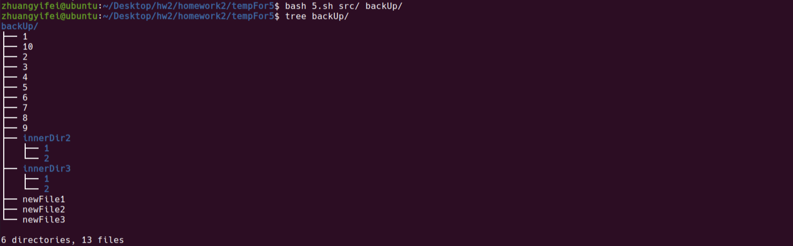

# 										浙江大学实验报告


课程名称:   <u>Linux应用技术基础</u>                   实验类型： <u>验证型</u>

实验项目名称：   <u>程序设计</u>

学生姓名： <u>庄毅非</u>    专业：<u>软件工程</u>      学号：  <u>3200105872</u>        

电子邮件地址：<u>1099665018@qq.com</u>             手机（可选）： <u>17346399235</u>         

实验日期： <u>2021年 12 月16 日</u>

 


## 一、实验环境

​	实验中使用的是在Mac vmware fusion环境中安装的虚拟机

#### 计算机配置：

​	CPU:两个虚拟 intel-i7-9750H @2.6GHz CPU

  	  GPU: VMware SVGA II Adapter
  	
  	  Memory: 总计3.8G内存，缓存为750MB，交换文件为2G

#### 操作系统环境：

​	Ubuntu(Linux 5.22.0-37-generic Ubuntu 20.04.3 LTS)

##### Linux版本：

​	内核：Linux 5.22.0-37-generic x86_64

​    发行版：Ubuntu 20.04.3 LTS


## 二、实验内容和结果及分析

1. #### （15分）编写一个shell脚本程序，它带一个命令行参数，这个参数是一个文件名。如果这个文件是一个普通文件，则打印文件所有者的名字和最后的修改日期。如果程序带有多个参数，则输出出错信息。

```bash
#!/bin/bash
###########################################################
# Function  :获取用文件的拥有者和最后更新时间				   #
# Date      :2021-12-16                                   #
# Author    :庄毅非                                        #
# studentID :3200105872                                   #
###########################################################

# 检查命令行参数，如果不是1，在输出用法之后退出
if [[ $# == 0 || $# -gt 1 ]]; then
    echo "用法: ./script1.sh 文件名"
    exit 0
fi
if [[ -f $1 ]]; then
    set -- $(ls -l "$1")
    #获取拥有者
    owner="$3"
    #获取最后更新时间
    updTime="$6/$7/$8"
    echo -e "owner'name : \n\t$owner\nlast updated time: \n\t$updTime"
fi
```

程序运行截图


2. #### （15分）编写shell程序，统计指定目录下的普通文件、子目录及可执行文件的数目，统计该目录下所有普通文件字节数总和，目录的路径名字由参数传入。（不能使用sed、awk、tr、rev等工具）

```bash
#!/bin/bash
###########################################################
# Function  :统计指定目录下的普通文件、子目录及可执行文件的数目  #
#            统计该目录下所有普通文件字节数总和				  #
# Date      :2021-12-16                                   #
# Author    :庄毅非                                        #
# studentID :3200105872                                   #
###########################################################
#如果参数数量错误，那么输出用法并退出
if [[ $# != 1 ]]; then
    echo "用法: ./script2 文件夹路径"
    exit 0
fi
#分别统计文件数、文件夹数、可执行文件数
files=0
dirs=0
execs=0
bitsForFiles=0
for i in $(ls -A "$1"); do
	#为文件，那么file加一，同时统计其字节数
    if [[ -f "$i" ]]; then
        let files++
        let bitsForFiles+=$(wc -c "$i" | cut -d' ' -f1)
    #为目录，那么dirs加一
    elif [[ -d "$i" ]]; then
        let dirs++
    #为可执行文件，那么execs加一
    elif [[ -x "$i" ]]; then
        let execs++
    fi
done
#输出结果
echo -e "文件数: $files\t 总字节数:$bitsForFiles"
echo "文件夹数: $dirs"
echo "可执行文件数（不包含目录）: $execs"

```

程序运行截图


①：待测试目录


其中有4个文件夹，1个可执行文件（1.sh）

②： 所有普通文件字节数


③：程序调用示例


3. #### （15分）编写一个shell 脚本，输入一个字符串，忽略（删除）非字母后，检测该字符串是否为回文(palindrome)。对于一个字符串，如果从前向后读和从后向前读都是同一个字符串，则称之为回文串。例如，单词“mom”，“dad”和“noon”都是回文串。（不能使用sed、awk、tr、rev等工具）

```bash
#!/bin/bash
###########################################################
# Function  :判断字符串是否为回文                            #
# Date      :2021-12-16                                   #
# Author    :庄毅非                                        #
# studentID :3200105872                                   #
###########################################################
# 读入字符串，声明数组
read -p "请输入一个字符串: " str
declare -a alphas
counter=0
# 扫描字符串，将为字母的输入存储到数组中
for i in $(seq 0 $((${#str} - 1))); do
    temp=${str:$i:1}
    case "$temp" in
    # 如果是字母，那么添加到数组中，同时counter++
    [a-zA-Z])
        alphas[$counter]=$temp
        counter=$(($counter + 1))
        ;;
    # 如果不是字母，不执行任何操作
    *)
        :
        ;;
    esac
done
# 扫描数组，双指针检查是否为回文
length=${#alphas[@]}
for i in $(seq 0 $(($length - 1))); do
	# 双指针算法判断是否为回文
    if [[ "${alphas[$i]}" != "${alphas[$(($length - $i - 1))]}" ]]; then
        echo "输入的字符串不是回文"
        exit 0
    fi
done
echo "输入的字符串是回文"
```

程序运行截图


4. #### （15分）编写一个shell脚本，把当前目录下文件大小大于100K的文件全部移动到~/tmp/ 目录下。（不能使用sed、awk、tr、rev等工具）

```bash
#!/bin/bash
###########################################################
# Function  :将当前文件夹中大于100k的文件移动到~/tmp中         #
# Date      :2021-12-16                                   #
# Author    :庄毅非                                        #
# studentID :3200105872                                   #
###########################################################
# 使用find命令，maxdepth规定不对子目录进行递归搜索（如果需要进行递归搜索的话，请将"-maxpth 1"删去），使用-type指定为文件类型，使用-size +100k表示文件大小应该大于100k
# 此后使用xargs命令，将符合条件的文件移动至~/tmp中
find . -maxdepth 1 -type f -size +100k    | xargs -I {} mv {} ~/tmp
```

程序运行截图


5. #### (30分）编写一个实现文件备份和同步的shell脚本程序dirsync。程序的参数是两个需要备份同步的目录，如:

   dirsync ~\dir1 ~\dir2  # ~\dir1为源目录，~\dir2为目标目录

   dirsync程序实现两个目录内的所有文件和子目录（递归所有的子目录）内容保持一致。程序基本功能如下。

   1\) 备份功能：目标目录将使用来自源目录的最新文件，新文件和新子目录进行升级，源目录将保持不变。dirsync程序能够实现增量备份。

   2\) 同步功能：两个方向上的旧文件都将被最新文件替换，新文件都将被双向复制。源目录被删除的文件和子目录，目标目录也要对应删除。

   3\) 其它功能自行添加设计。

```bash
#!/bin/bash
###########################################################
# Function  :bash实现文件备份和同步							#
# Date      :2021-12-16                                   #
# Author    :庄毅非                                        #
# studentID :3200105872                                   #
###########################################################

#######################################
# 递归比较输入的两个文件夹，实现要求中的备份功能
# 使用的全局变量:
#   无
# 参数:
#   $1为源文件夹，$2为目标文件夹
# 返回值:
#   无
#######################################
function dirsyncHelper() {
    # 检查目标目录是否存在，如果不存在，就先创建
    if [ ! -d "$2" ]; then
        mkdir "$2"
    fi
    # 获取源目录中所有子文件，子目录列表
    dirlist=$(ls "$1")
    # 在循环中遍历文件/文件夹
    for itemName in ${dirlist[*]}; do
        if [ -f "$1/$itemName" ]; then
            # 如果是文件，目标目录不存在该文件或者目标目录中的文件的最后修改时间比源文件中早，则直接copy
            if [ ! -f "$2/$itemName" ]; then
                cp "$1/$itemName" "$2/$itemName"
            else
            # 使用test中的-nt参数比较两文件最后更新时间，如果源文件比目标文件更新时间更近，那么使用源文件更新木包文件
                if [ "$1/$itemName" -nt "$2/$itemName" ]; then
                    cp "$1/$itemName" "$2/$itemName"
                fi
            fi
        elif [ -d "$1/$itemName" ]; then
            # 如果是目录，并且目标文件夹中不存在该目录，则先创建目录
            if [ ! -d "$2/$itemName" ]; then
                mkdir -p "$2/$itemName"
            fi
            # 递归检查
            dirsyncHelper "$1/$itemName" "$2/$itemName"
        fi
    done
}

#######################################
# 递归比较输入的两个文件夹，实现要求中的同步功能（类似上述函数的逆过程）
# 使用的全局变量:
#   无
# 参数:
#   $1为目标文件夹，$2为源文件夹
# 返回值:
#   无
#######################################
function dirsyncHelper_reverse() {
	# 获取目标文件夹中的文件、文件夹列表
    dirlist=$(ls "$1") 
    for itemName in ${dirlist[*]}; do
        if [ -f "$1/$itemName" ]; then
            # 如果是文件，而源文件夹中不存在该文件,那么删除当前目标文件夹中的该文件
            if [ ! -f "$2/$itemName" ]; then
                rm -i "$1/$itemName"
            else
                #检查目标文件夹中文件的修改时间，并在其早于源文件夹对应文件中修改时间的时候进行更新
                if [ "$1/$itemName" -nt "$2/$itemName" ]; then
                    # echo "$1/$name covers $2/$name"
                    cp "$1/$itemName" "$2/$itemName"
                fi
            fi
        elif [ -d "$1/$itemName" ]; then
        	# tag判断文件夹是否被删除，如果没有被删除，递归执行本函数，否则进入下一轮循环
            tag="1"
            # 如果是目录，并且源文件夹不存在该目录，则直接删除当前目标文件夹中的目录
            if [ ! -e "$2/$itemName" ]; then
                rm -rf "$1/$itemName"
                tag="0"
            fi
            # 递归检查
            if [ "$tag" == "1" ]; then
                dirsyncHelper_reverse "$1/$itemName" "$2/$itemName"
            fi
        fi
    done
}

# counter=0
# 检查命令行参数
if [ ! $# -eq 2 ]; then
    echo "用法: dirsync dir1 dir2"
    exit 0
fi

# 将源文件夹复制到目标文件夹
dirsyncHelper "$1" "$2"

# 遍历目标文件夹，检查是否出现源文件夹中没有的文件或文件夹，如果有，检查源文件夹时间，更新文件夹中的旧文件
dirsyncHelper_reverse "$2" "$1"

```

程序运行截图

1. #### 备份功能：

   1\):首先创建源目录，创建完毕之后的源目录结构如下

   ​	

   2\):之后调用脚本，生成的目标文件为backUp文件夹

   

   可以发现，源文件夹src和目标文件夹backUp具有相同的结构

   3\):之后在源文件夹中创建newFile1,newFile2,newFile3三个新文件

   

   再次调用脚本，得到新的backUp文件夹

   
   
   可以发现，源文件夹中的三个新文件成功的被同步到了目标文件夹中
   
   4\):修改源文件夹中的文件1，并执行脚本，通过执行脚本前后backUp/1中内容的不同可以发现程序实现了从源文件夹到目标文件夹的同步
   
   


2. #### 同步功能:

   1\):接下来，删除源文件夹中的innerDir1文件夹

	

	在执行脚本前查看backUp文件夹结构，可以发现此时backUp文件夹中innerDir1文件夹仍然存在

	执行脚本，可以发现innerDir1文件夹被删除了，实现了从源文件夹到目标文件夹的同步

	

	2\):改变目标文件夹中backUp/10的内容，再次运行脚本，可以发现脚本成功的用更新时间更近的backUp/10文件覆盖了较旧的src/10文件
	
	


6. #### 选做题（4分，如果平时成绩没有满分，可计入平时成绩）：

用C语言写一个名字为myls程序，实现类似Linux的ls命令，其中myls命令必须实现-a、-l、-i等选项的功能。

要求myls程序使用系统调用函数编写，不能使用exec系统调用或system()函数等调用ls命令来实现。命令man ls可以得到更多ls选项的含义。有用的系统调用：stat( )、opendir( )、readdir( )和getcwd( )等。

源程序

```c
/*********************************************************************************
  *FileName:   myls.c
  *Author:  庄毅非
  *Date:  2021-12-10
  *Description:  用C语言写一个名字为myls程序，实现类似Linux的ls命令
  *Function List:
     1.lsFunc 实现ls功能的函数
     2.showFileInfo 输出单个文件或文件夹的信息
**********************************************************************************/
#include <stdio.h>
#include <stdint.h>
#include <string.h>
#include <stdlib.h>
#include <dirent.h>
#include <sys/types.h>
#include <sys/stat.h>
#include <pwd.h>
#include <grp.h>
#include <time.h>
#define DEBUG

typedef int bool;
struct
{
    bool displayAllFile;        //-a
    bool detailMode;            //-l
    bool displayInode;          //-i
    bool anotherDisplayAllFile; //-A
    /*
        bool addIcon;               //-F
        bool recursiveMode;         //-R
        bool reverseMode;           //-r
        bool timeSequence;          //-t
    */
} displayType;
// 文件夹路径
char dirPath[256];

int read(int number, char **options);
void lsFunc();
void showFileInfo(char filePath[]);

int main(int argc, char *argv[])
{
    //读入所有参数
    if (!read(argc, argv))
    {
        //读入失败
        return 1;
    }
    // 执行ls函数
    lsFunc();

    return 0;
}
int read(int number, char **options)
{
    // 初始化参数表均为0，表示默认的ls
    memset(&displayType, 0, sizeof(displayType));
    for (int i = 1; i < number; i++)
    {
        // 读取参数表
        if (options[i][0] == '-')
        {
            int counter = 1;
            while (counter <= 255 && options[i][counter] != '\0')
            {
                switch (options[i][counter++])
                {
                case 'h':
                    puts("用法: ./myLs 选项[-aAil] 文件夹路径");
                    return 0;
                case 'a':
                    displayType.displayAllFile = 1;
                    break;
                case 'l':
                    displayType.detailMode = 1;
                    break;
                case 'i':
                    displayType.displayInode = 1;
                    break;
                case 'A':
                    displayType.anotherDisplayAllFile = 1;
                    break;
                default:
                    printf("ls: 无效的参数 %s\n ", options[i]);
                    exit(1);
                    break;
                }
            }
        }
        else
        {
            //如果不是以'-'开头，那么输入的是文件夹路径，保存到dirPath中
            strcpy(dirPath, options[i]);
        }
    }
    //如果检查完所有参数之后文件夹路径为空，那么设置为当前文件夹
    if (dirPath[0] == '\0')
    {
        //如果没有输入路径，就是当前目录。
        dirPath[0] = '.';
    }
    return 1;
}
void lsFunc()
{
    DIR *dirent;
    struct dirent *ptr;

    dirent = opendir(dirPath);
    //处理文件夹不存在的情况
    if (dirent == NULL)
    {
        printf("this directory %s doesn't exist, please check path you input\n", dirPath);
        exit(1);
    }

    //文件夹存在，执行ls
    while ((ptr = readdir(dirent)) != NULL)
    {
        showFileInfo(ptr->d_name);
    }
    closedir(dirent);
}
void showFileInfo(char filePath[])
{
    //获取文件详细数据结构 struct stat info
    struct stat info;
    if (stat(filePath, &info) == -1)
    {
        fprintf(stderr, "cannot read info of file %s", filePath);
        exit(-1);
    }
    if (displayType.detailMode)
    {
        //读取权限
        char permissions[11];
        strcpy(permissions, "----------");

        if (S_ISDIR(info.st_mode))
        {
            permissions[0] = 'd';
        }
        else if (S_ISBLK(info.st_mode))
        {
            permissions[0] = 'c';
        }
        else if (S_ISCHR(info.st_mode))
        {
            permissions[0] = 'b';
        }
        //创建用户权限
        if (info.st_mode & S_IRUSR)
        {
            permissions[1] = 'r';
        }
        if (info.st_mode & S_IWUSR)
        {
            permissions[2] = 'w';
        }
        if (info.st_mode & S_IXUSR)
        {
            permissions[3] = 'x';
        }

        //用户组权限
        if (info.st_mode & S_IRGRP)
        {
            permissions[4] = 'r';
        }
        if (info.st_mode & S_IWGRP)
        {
            permissions[5] = 'w';
        }
        if (info.st_mode & S_IXGRP)
        {
            permissions[6] = 'x';
        }

        //其他用户权限
        if (info.st_mode & S_IROTH)
        {
            permissions[7] = 'r';
        }
        if (info.st_mode & S_IWOTH)
        {
            permissions[8] = 'w';
        }
        if (info.st_mode & S_IXOTH)
        {
            permissions[9] = 'x';
        }

        //获取用户名
        struct passwd *pwPtr = (struct passwd *)malloc(sizeof(struct passwd));
        struct group *groupPtr = (struct group *)malloc(sizeof(struct group));
        if ((pwPtr = getpwuid(info.st_uid)) == NULL)
        {
            fprintf(stderr, "cannot read userName of %s", filePath);
        };
        if ((groupPtr = getgrgid(info.st_gid)) == NULL)
        {
            fprintf(stderr, "cannot read groupName of %s", filePath);
        };

        //读取用户信息
        int64_t fileSize;
        char *time = ctime(&info.st_atime);
        time[strlen(time) - 1] = '\0';
        if (displayType.displayAllFile)
        {
            if (displayType.displayInode)
            {
                printf("%-10lld ", (uint64_t)info.st_ino);
            }
            // TODO add arguments
            printf("%s %4d %-8s %-8s %8lld %-12s %s\n", permissions, info.st_nlink, pwPtr->pw_name, groupPtr->gr_name, info.st_size, time, filePath);
        }
        // 处理-A
        else if (displayType.anotherDisplayAllFile)
        {
            if (filePath[0] == '.' && (filePath[1] == '\0' || filePath[1] == '.'))
                return;
            if (displayType.displayInode)
            {
                printf("%-10lld ", (uint64_t)info.st_ino);
            }
            printf("%s %4d %-8s %-8s %8lld %-12s %s\n", permissions, info.st_nlink, pwPtr->pw_name, groupPtr->gr_name, info.st_size, time, filePath);
        }
        //没有 -a ,也没有-A,直接输出
        else
        {
            if (filePath[0] == '.')
                return;
            if (displayType.displayInode)
            {
                printf("%-10lld ", (uint64_t)info.st_ino);
            }
            printf("%s %4d %-8s %-8s %8lld %-12s %s\n", permissions, info.st_nlink, pwPtr->pw_name, groupPtr->gr_name, info.st_size, time, filePath);
        }
        // free(pwPtr);
        // free(groupPtr);
    }
    else
    {
        if (displayType.displayAllFile)
        {
            if (displayType.displayInode)
            {
                printf("%-10lld ", (uint64_t)info.st_ino);
            }
            printf("%s \n", filePath);
        }
        // 处理-A
        else if (displayType.anotherDisplayAllFile)
        {
            if (displayType.displayInode)
            {
                printf("%-10lld ", (uint64_t)info.st_ino);
            }
            if (filePath[0] == '.' && (filePath[1] == '\0' || filePath[1] == '.'))
                return;
            printf("%s \n", filePath);
        }
        //没有 -a ,也没有-A,直接输出
        else
        {
            if (displayType.displayInode)
            {
                printf("%-10lld ", (uint64_t)info.st_ino);
            }
            if (filePath[0] == '.')
                return;
            printf("%s \n", filePath);
        }
    }
}

```

程序运行截图


## 三、讨论和心得

1. #### 遇到的问题以及解决方法

   (1): 在程序二中需要将文件的字节数加到全局变量`bitsForFiles`中，但是由于`wc -c`得到的结果中含有文件名，不能直接相加，使用egrep的话又会出现部分情况下`wc -c `的结果中的数字部分被忽略，导致得到的总字节数偏小。最后参考了课件中的方法，使用`cut -d' ' -f1`提取出数字部分，成功解决问题。

   (2): 在程序5中需要比较两个文件的最后更新时间，一开始我使用的是`find file1 -newer file2`的方式进行比较，但是后来我发现在实际执行过程中由于从源文件夹到目标文件夹的同步过程较快，导致两者之间的时间差别并不大，find并不能识别这么小的时间差别，导致文件并不能更新到最新版。最后参考了stackoverlfow上的一个[回答](https://unix.stackexchange.com/questions/372857/compare-two-file-modification-dates),使用test中的-nt选项解决了该问题

   (3): 还是程序5，在实现递归函数的时候总是提示我找不到文件夹，无法执行` [ file1 -nt file2 ]` 命令，后来发现是在函数开始的时候忘记检查目标文件夹是否已经存在了，在增加了检查逻辑之后，程序成功运行。

2. #### 收获及心得

   通过完成这次实验，我对于linux bash编程有了一定的了解，能够用简单的bash命令进行组合，完成一些比较复杂的工作。通过完成`myls.c`程序，我对于操作系统内部一部分命令(比如ls)的实现也有了一定的了解，拓宽了我的知识面，可以说收获很多。


