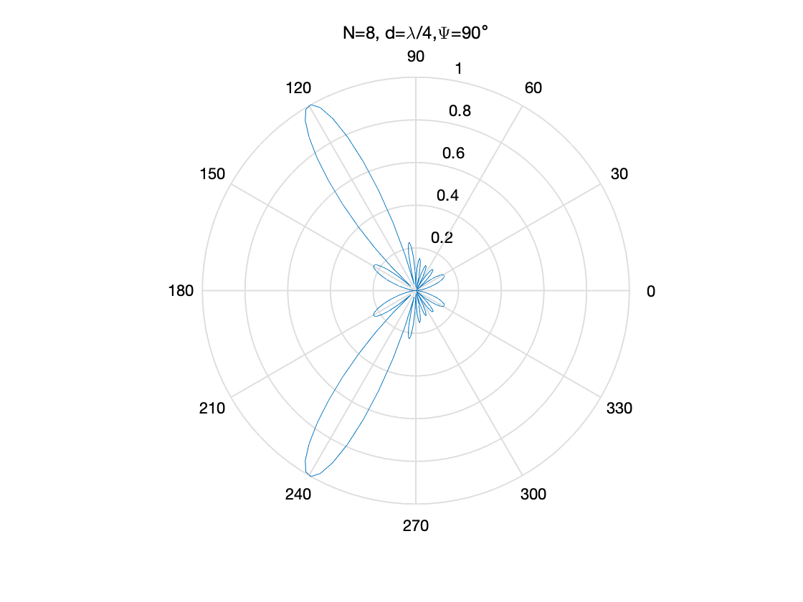

**姓名： <u>庄毅非                      </u>			专业：<u>软件工程           </u> 学号： <u>3200105872</u>**

**课程名称：<u>信息与电子工程导论</u>      任课老师： <u>史治国</u>**

**实验名称： <u>阵列和天线          </u> <u>实验日期：2021年11月24日星期三</u>**


## 实验目的和要求

### 实验目的：

​	理解不同的**天线单元数，天线单元间距以及相邻辐射单元之间的相差**的选取对于阵列天线传播效果的影响，以及能够通过调节上述三个参数来获取不同的方向图。

### 实验要求

​	利用MATLAB编写一个计算程序，计算相控阵天线的方向图，天线单元数为8，间距$d =\frac{λ}{4}$; **λ**为电磁波波长。考察**相邻辐射单元之间的相差**对方向图的影响。改变**天线单元数和间距**，观察方向图的变化。

## 实验原理

​	天线在通信过程中运用广泛，是一种用来辐射和接受无线电波的装置，一般是将传输线中的电磁能转化为自由空间中的电磁能，或者是将空间中的电磁波转换为传输线中的电磁能，其辐射和接受辐射都具有方向性。

​	相控阵天线是实际使用中比较常见的一种天线种类，主要原理是通过调节每个阵元的幅度和相位使得电磁波在某一个方向上的传播增强，产生具有指向性的波束。

​	因此，我们可以根据实际需要，以调节阵元幅度、相位以及阵元个数的方式，使得电磁波的传播在空间中形成特定的形状，得到比较理想的传播效果。


## 实验内容

​	利用MATLAB编写一个计算程序，计算相控阵天线的方向图，天线单元数为8，间距$d =\frac{λ}{4}$; **λ**为电磁波波长。考察**相邻辐射单元之间的相差**对方向图的影响。改变**天线单元数和间距**，观察方向图的变化。

 

## 实验结果和分析
1. 首先运行给出的参考代码，输入相位差角度为$90$度，得到方向图如下

    

    可以发现，此时向自由空间中传播的电磁波几乎都集中在180附近。

 2. 接下来，我将天线的个数改为16，得到新的一个方向图

    

    可以发现，这时候向180附近传播的电磁波占总电磁波的数量的比例变得更高，因此可以通过增加天线个数的方式增强信号在某一方向上的传播。

 3. 将天线个数改回8，同时将相差分别改为30，180

    ​     相差为30度的方向图

    

    ​	    可以发现，此时信号的传播几乎都集中在100和250附近。

    ​    相差为180度时的方向图

    ​	

    ​    可以发现此时信号向各个方向传播的集中程度是比较接近的。

 4. 最后，设置天线个数为8，相差为90度，设置间距为$\lambda/2$,得到如下的方向图

    

    可以发现此时信号的传播和开始设置间距为$\lambda/2$的表现是比较不一样的，不再仅仅局限于一个方向，而是集中在120和240两个方向附近。


## 实验结论


1. 不同的阵列天线个数，阵元间距，相差的选择会影响阵列天线在空间中传播信号的效果。
2. 增加阵列天线的个数会显著增强信号在某些方向上的传播强度。
2. 实际应用中可以通过调节相差来实现阵列天线向指定方向上传播信号，也可以实现向四面八方传播信号（个人猜测类似基站的作用）。
2. 调节间距对于传播方向图也有一定的影响。


## 源代码和分析

```matlab
clc; 								%清除命令窗口的内容
clear all;							%清除工作空间的所有变量；
%参数设置
f=10*10^9; 						%频率为10GHz
c=3*10^8; 						%真空中的光速
lmd=c/f; 							%波长
k=2*pi/lmd; 						%传播常数
eta=120*pi; 						%波阻抗，常数
rho=1000*lmd; 					%以距离原点1000*lambda的球面上的场作为远场
syms phi
N=8; 							%阵列中单元个数,适当调节可以显著增强信号在某些方向上的传播强度，调节相差可以实现阵列天线向指定方向上传播信号，也可以实现向四面八方传播信号
d=lmd/4; 						%阵元间距，调节间距可以获得不同的方向图
%相位差
PhaseDifference=input('PhaseDifference(度, 可正负)='); 		%输入天线单元间的相位差
PhaseDifference=PhaseDifference*pi/180; 					%转化为弧度（换算公式：2pi = 360度）
Et=0;
for i=1:N
  x=(i-N/2-0.5)*d; 									%第i个天线单元离原点距离
  r=sqrt(rho*rho+x*x-2*rho*x*cos(phi)); 					%第i个天线单元离P点距离
  Et=Et+j*k*eta*exp(-j*k*r)/4/pi/r*exp(j*(i-1)*PhaseDifference);%N个天线单元的叠加电场
end
%phi取0到360度
t1=linspace(0,2*pi,200); % 创建刻度值
Et_num=double(vpa(subs(Et,phi,t1))); % 使用上述给出的刻度替换phi,并指定结果的精度
Et_num_abs=abs(Et_num); 			%电场幅度
%画图
figure(1) 
polar(t1,Et_num_abs/max(Et_num_abs)); % 绘制极坐标图像
title(['N=8, d={\lambda}/4,{\Psi}=',num2str(PhaseDifference*180/pi),'{\circ}']);
set(figure(1),'color',[1 1 1]); % 设置背景为白色
```

