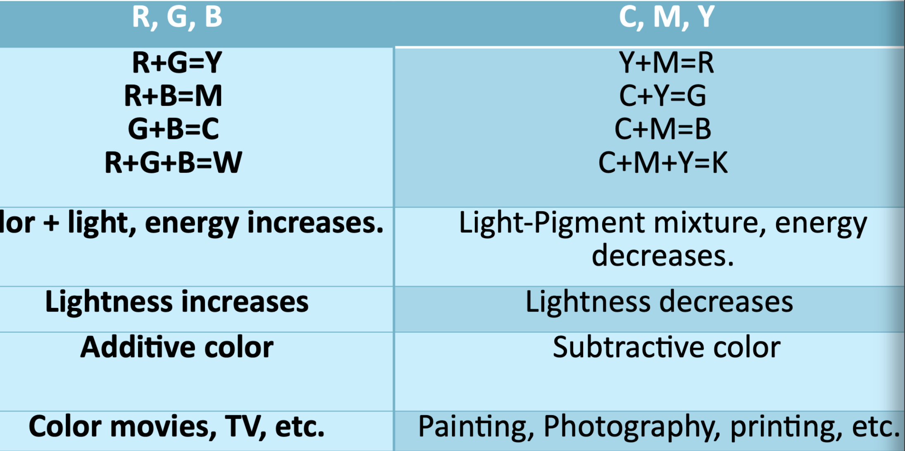
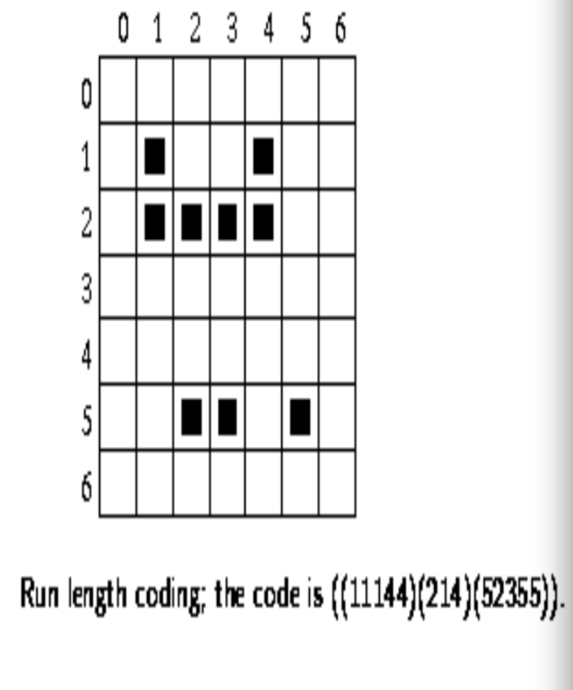
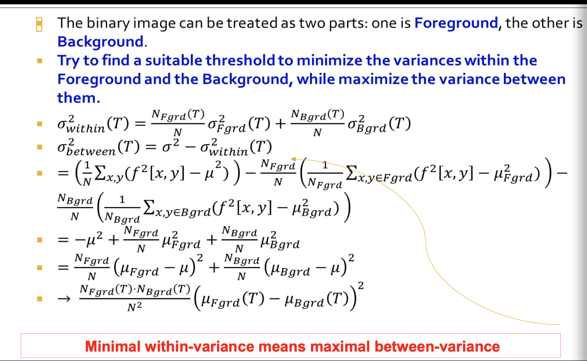
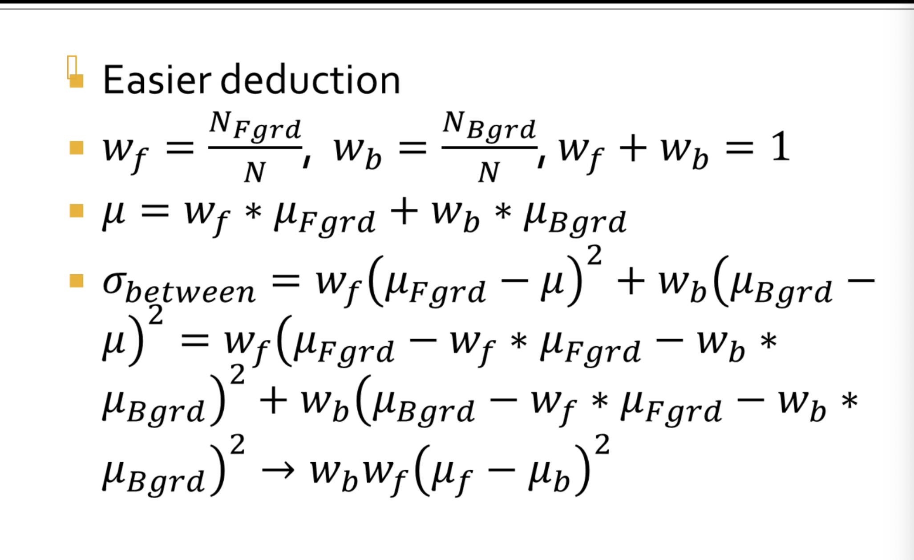
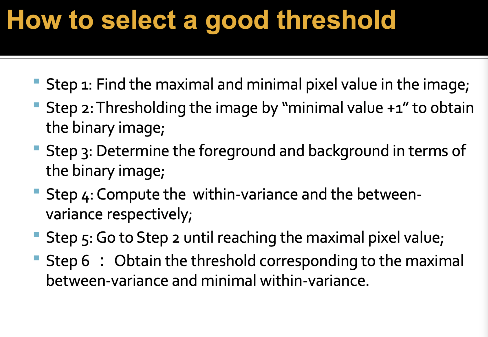
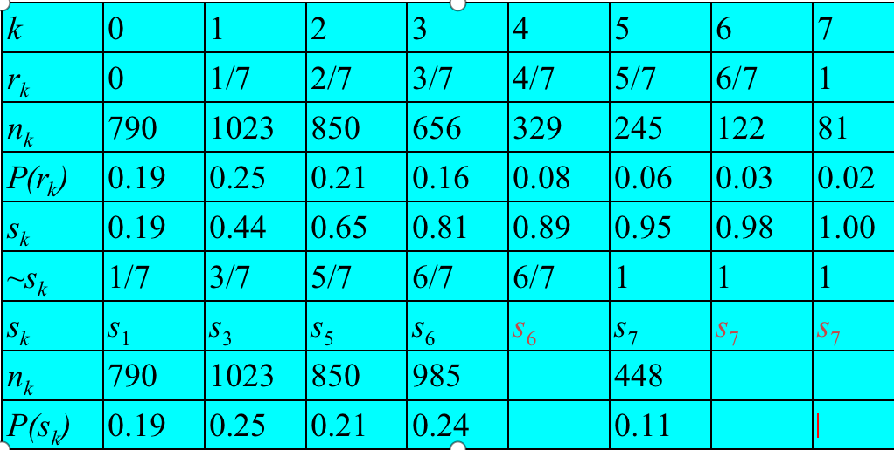
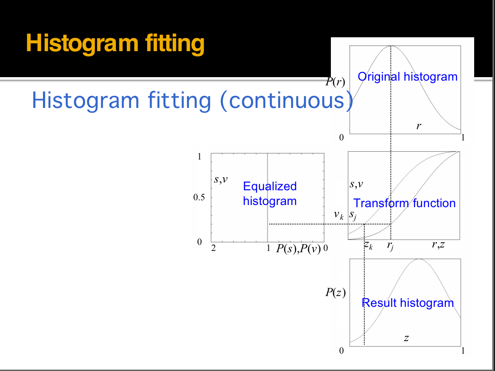
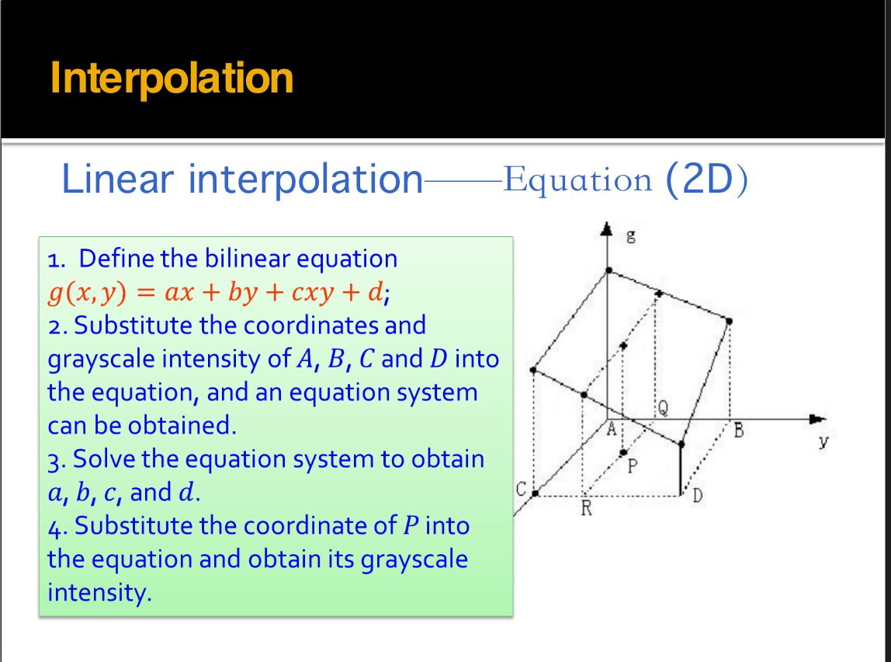
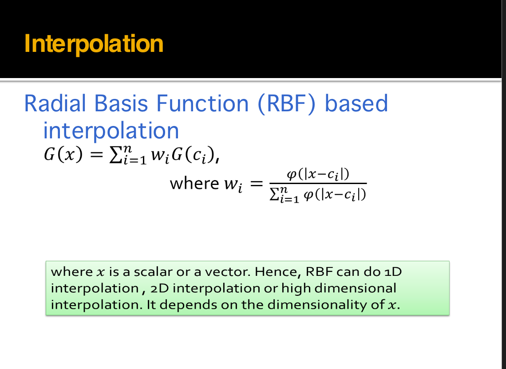
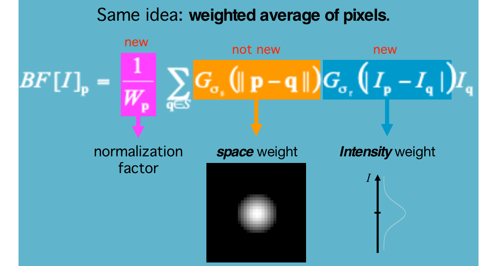

1. ppt1-5 图像来源

2. 为什么说图像形式很重要

   >1. 多媒体无处不在，数字图像是信息呈现的主要形式
   >2. 数字图像是展示信息的主要形式
   >   1. 视觉是人类感知世界的基础
   >   2. 计算机视觉和计算机图像学的基础
   >   3. 应用广泛

3. warping和morphing的区别（等科普问题）

   >wraping指的是图像经过数字化处理之后扭曲变化的过程
   >
   >morphing指的是图像从一种形态无缝渐变成另一种形态

4. **超分辨率是干什么的，插值之间的区别**

   >能够用于图像重建，恢复图像中缺失的细节。
   >
   >插值算法也是用来恢复图像的一类算法，但是和超分辨率技术相比插值算法并不能恢复图像的高频细节？（存疑）

5. 图像的获取(20210927-13 20210927-17),相机的结构，怎么成像（20210927-18），重点是ccd的成像过程

   >CCD->diode(二极管)->amplfier(放大器)->ADC（模数转换器）->DSP（数字信号处理器）->存储介质
   >
   >(1)当使⽤数码相机拍,景物反射的光线通过数码相机的镜头透射到CCD上, 
   >
   >(2)当CCD曝光后，光电⼆极管受到光线的激发⽽释放出电荷，⽣成感光元件的电信号。 
   >
   >(3) CCD控制芯⽚利⽤感光元件中的控制信号线路对发光⼆极管产⽣的电流进⾏控制， 由电流传输电路输出，CCD会将⼀次成像产⽣的电信号收集起来，统⼀输出到放⼤器。 
   >
   >(4)经过放⼤和滤波后的电信号被传送到ADC，由ADC将电信号（模拟信号）转换为数字信号数值的⼤⼩和电信号的强度与电压的⾼低成正⽐，这些数值其实也就是图像的数据。 
   >
   >(5)此时这些图像数据还不能直接⽣成图像，还要输出到DSP（数字信号处理器）中， 在DSP中，将会对这些图像数据进⾏⾊彩校正、⽩平衡处理， 并编码为数码相机所⽀持的图像格式、分辨率，然后才会被存储为图像⽂件。 
   >
   >(6)当完成上述步骤后，图像⽂件就会被保存到存储器上,我们就可以欣赏了

6. 单反相机光学成像结构

   >主反光板->副反光板->AF检测模块

7. 光圈大小变化的影响

   >光圈大：图像模糊，不够清晰
   >
   >光圈过小的问题：
   >
   >	1. 进光量太小，比较暗
   >	1. 光圈太小，会导致衍射
   >	1. 不容易控制

   

8. 加上棱镜之后的目的和具体影响

   >能够将光线聚集到胶片上，避免弥散圆出现
   >
   >改变棱镜的形状能够改变焦距

9. 景深受哪些因素的影响（光圈，焦距）

   >小光圈能够增大景深，使得景物周围的物件更清晰

10. 颜色的物理意义（重点RGb）（20210927-29）

  >彩色是由光和物体之间的相互作用产生的，比如反射，折射等等。
  >
  >颜色分为彩色和非彩色。彩色是单色(RGB)和其组合，物体会根据其本身的颜色反射对应波长的光，因此其会在白光下呈现不同的颜色。
  >
  >非彩色是白色、黑色和灰度强度不同的颜色。消色物体呈现中性颜色，不会呈现为彩色。
  >
  >如果三颜色的三种光的强度是相同的，那么就会发生消色。

11. 波长的变化（20210927-30）

    >波长是人脑对到达视网膜的不同波长的光线的感受。可见光390->780,长波为红，短波为紫。
    >

12. 视网膜成像原理（20210927-31）（细胞数量），对光敏感。

    >视网膜中有杆状和锥状细胞，
    >
    >杆状数量多，对光的变化比较铭感，但是不能够识别颜色。
    >
    >锥状细胞只能在强光下工作，但是可以识别不同的颜色。

13. 感知优先级（调饱亮），敏感度（亮度，因为细胞多）

    >优先级：在其他条件相同时，人们首先注意到色调(hue),然后是饱和度(saturation),最后才是亮度（lightness）
    >
    >敏感度：人眼对于光亮度的变化最敏感，这是由于对光敏感的杆状细胞数量较多，和hdr有关

14. 颜色空间：设备相关，设备无关，设别依赖，要举例子和给出缩写字母的具体意义

    >设备相关
    >
    >- RGB: 
    >  - 全称： Red Green Blue
    >  - 物理意义： 表示颜色中的三原色，使用加色方法形成色彩。在立方体表示的主对角线上，三原色的强度是一样的，对角线表示从黑色(black)到白色(brightness)的渐变，也就是灰度（消色）。
    >
    >- CMY：
    >  - 全称：Cyan Magenta Yellow， 
    >  - 物理意义：彩色打印纸本身是不发光的，所以打印机试用一些能够吸收特定波长光波的颜料来进行纸的着色，他使用减色法来形成所需的颜色，如果三种光是等量的，就是黑色。
    >
    >- HSV
    >  - 全称：Hue, Saturation, Intensity/Value
    >  - 物理意义：基于人类视觉系统的定义的
    >    - 饱和度：径向大小，顶面V=1,也就是R=1,G=1,B=1
    >    - 色相：绕轴旋转, $0^o$表示红色，$120^o$表示绿色，$240^o$表示蓝色
    >    - 强度值：顶面的半径长度
    >
    >
    >
    >设备无关
    >
    >- CIE XYZ
    >  - 基于三原色理论，认为一切颜色都是RGB的混合，使用函数计算。1931年给出Yxy颜色空间，Y->luminance,xy是基于XYZ计算的结果
    >- CIE L\*a\*b
    >  - 是对CIE,XYZ的改进，克服了非比例问题。L亮度，a绿色和红色，b为蓝色和黄色
    >- CIE YUV
    >  - 在TV中被广泛使用
    >
    >​	
    >
    >

15. 颜色空间的覆盖（39）

    >sRGB < Adobe RGB < ProPhoto RGB
    >
    >颜色空间覆盖的范围逐渐增大

16. CMY和RGB的物理意义，加减色（43）

    >
    >
    >注意换算公式
    >$$
    >R + G = Y \\
    >R + B = M \\
    >G + B = C \\
    >R + G + B = W
    >$$
    >
    >
    >

17. HSV的优势（剥离亮度和颜色 45）

    >1. 接近人眼的实际感受
    >2. 调整色调只需要调节一个通道，比较方便
    >3. 颜色为线性分布，比较均匀

18. JPEG格式压缩策略，优点（59）

    >Joint Photographic Experts Group
    >
    >压缩策略：根据给定的压缩率的要求，将图像信息从高频部分到低频部分进行移除。
    >
    >优势：
    >
    >	1. 高频部分占据的存储空间比较多，因此对于高频部分的移除能够实现高压缩率
    >	1. 低频信息保留了物体的基本结构和颜色分布，是图像的关键部分。
    >	1. 常用在互联网中
    >
    >缺点：
    >
    >1. 不能用在线条，文本等的压缩上
    >2. 有损压缩会导致artifact的出现

19. 行程编码（86）

    >行程编码用来描述物体边界，能够用静态数据结构表示。
    >
    >编码格式：每一个括号的第一个数字是行号，此后为二元组的序列，每一个二元组的第一个数字是起始位置，第二个数字是最后的位置。
    >
    >

20. 图像格式，有无压缩，压缩有损无损,怎么做到（要回举例）(20211011a-50)

    >bmp：无压缩图片格式
    >
    >jpeg：有损图片格式
    >
    >tiff:能有损能无损，支持多种压缩方式
    >
    >gif:经过压缩，无损
    >
    >png：无损数据压缩

21. bmp存储和4的倍数之间的关系（20211011a-58）

    >对于bmp图像，图像每一行的字节数都必须是4的倍数，少的话在后面加上0，比如
    >$$
    >输入：A0\ 37\ F2\ 8B\ 31\ C4 \\
    >实际存储结果:A0\ 37\ F2\ 8B\ 31\ C4\ 00\ 00
    >$$
    >

22. 怎么得到二值图像(20211018-4 6)

    >最简单的方式是是设置一个阈值，将低于阈值的颜色都设置为0，高于阈值的图像都设置为1（255）（纯白）
    >

23. ==如何寻找最佳阈值（20211018-8），要会计算ostu==

    >ostu大津算法
    >
    >简化版：前景像素比例 * 后景像素比例 * 两者平均灰度差值的平方
    >
    >
    >
    >
    >
    >
    >
    >

    >计算过程
    >
    >OTSU是阈值分割中一种常用的算法，它可以根据图像自动生成最佳分割阈值。**OTSU的核心思想是类间方差最大化。**
    >
    >## **OTSU算法详解**
    >
    >令 ![[公式]](https://www.zhihu.com/equation?tex=%5Cleft%5C%7B+0%2C1%2C2%2C...%2CL-1+%5Cright%5C%7D) 表示一幅大小为 ![[公式]](https://www.zhihu.com/equation?tex=M%5Ctimes+N) 像素的数字图像中的 ![[公式]](https://www.zhihu.com/equation?tex=L) 个不同的灰度级， ![[公式]](https://www.zhihu.com/equation?tex=n_%7Bi%7D) 表示灰度级为 ![[公式]](https://www.zhihu.com/equation?tex=i) 的像素数。
    >
    >图像中的像素总数为： ![[公式]](https://www.zhihu.com/equation?tex=n%3Dn_%7B0%7D%2Bn_%7B1%7D%2B...%2Bn_%7BL-1%7D) 。
    >
    >像素的灰度级为 ![[公式]](https://www.zhihu.com/equation?tex=i) 的概率为： ![[公式]](https://www.zhihu.com/equation?tex=p_%7Bi%7D%3D%5Cfrac%7Bn_%7Bi%7D%7D%7Bn%7D) 。且有： ![[公式]](https://www.zhihu.com/equation?tex=%5Csum_%7Bi%3D0%7D%5E%7BL-1%7D%7Bp_%7Bi%7D%7D%3D1) 。
    >
    >现在，假设我们选择一个阈值 ![[公式]](https://www.zhihu.com/equation?tex=T%28k%29%3Dk%2C0%3Ck%3CL-1) 。并使用它把输入图像阈值化处理为两类 ![[公式]](https://www.zhihu.com/equation?tex=C_%7B1%7D) 和 ![[公式]](https://www.zhihu.com/equation?tex=C_%7B2%7D) ，其中![[公式]](https://www.zhihu.com/equation?tex=C_%7B1%7D)由图像中灰度值在范围 ![[公式]](https://www.zhihu.com/equation?tex=%5B0%2Ck%5D) 内的所有像素组成， ![[公式]](https://www.zhihu.com/equation?tex=C_%7B2%7D) 由灰度值在范围 ![[公式]](https://www.zhihu.com/equation?tex=%5Bk%2B1%2CL-1%5D) 内所有像素组成。
    >
    >则像素被分类到![[公式]](https://www.zhihu.com/equation?tex=C_%7B1%7D)中的概率为： ![[公式]](https://www.zhihu.com/equation?tex=P_%7B1%7D%28k%29%3D%5Csum_%7Bi%3D0%7D%5E%7Bk%7D%7Bp_%7Bi%7D%7D) （1）
    >
    >像素被分类到![[公式]](https://www.zhihu.com/equation?tex=C_%7B2%7D)中的概率为：![[公式]](https://www.zhihu.com/equation?tex=P_%7B2%7D%28k%29%3D%5Csum_%7Bi%3Dk%2B1%7D%5E%7BL-1%7D%7Bp_%7Bi%7D%7D%3D1-P_%7B1%7D%28k%29)
    >
    >则分配到类![[公式]](https://www.zhihu.com/equation?tex=C_%7B1%7D)的像素的平均灰度值为：
    >
    >![[公式]](https://www.zhihu.com/equation?tex=m_%7B1%7D%28k%29%3D%5Csum_%7Bi%3D0%7D%5E%7Bk%7D%7BiP%28i%7CC_%7B1%7D%29%7D%3D%5Csum_%7Bi%3D0%7D%5E%7Bk%7D%7B%5Cfrac%7BiP%28C_%7B1%7D%7Ci%29P%28i%29%7D%7BP%28C_%7B1%7D%29%7D%7D%3D%5Cfrac%7B1%7D%7BP_%7B1%7D%28k%29%7D%5Csum_%7Bi%3D0%7D%5E%7Bk%7D%7Bip_%7Bi%7D%7D+)
    >
    >类似的，分配到类 ![[公式]](https://www.zhihu.com/equation?tex=C_%7B2%7D) 中的像素的平均灰度值为：
    >
    >![[公式]](https://www.zhihu.com/equation?tex=m_%7B2%7D%28k%29%3D%5Csum_%7Bi%3Dk%2B1%7D%5E%7BL-1%7D%7BiP%28i%7CC_%7B2%7D%29%7D%3D%5Cfrac%7B1%7D%7BP_%7B2%7D%28k%29%7D%5Csum_%7Bi%3Dk%2B1%7D%5E%7BL-1%7D%7Bip_%7Bi%7D%7D)
    >
    >灰度级为0到k的像素的平均灰度值为： ![[公式]](https://www.zhihu.com/equation?tex=m_%7Bk%7D%3D%5Csum_%7Bi%3D0%7D%5E%7Bk%7D%7Bip_%7Bi%7D%7D) （2）
    >
    >整个图像的平均灰度值为：![[公式]](https://www.zhihu.com/equation?tex=m_%7BG%7D%3D%5Csum_%7Bi%3D0%7D%5E%7BL-1%7D%7Bip_%7Bi%7D%7D) （3）
    >
    >可以验证以下式成立： 
    >
    >![[公式]](https://www.zhihu.com/equation?tex=P_%7B1%7D%28k%29%5Ccdot+m_%7B1%7D%28k%29%2BP_%7B2%7D%28k%29%5Ccdot+m_%7B2%7D%28k%29%3Dm_%7BG%7D) （4）
    >
    >![[公式]](https://www.zhihu.com/equation?tex=P_%7B1%7D%28k%29%2BP_%7B2%7D%28k%29%3D1) （5）
    >
    >则类间方差定义为(**为方便书写省略 ![[公式]](https://www.zhihu.com/equation?tex=k)** )：（由式（4）、（5）可推得）
    >
    >![[公式]](https://www.zhihu.com/equation?tex=%5Csigma_%7BB%7D%5E%7B2%7D%3DP_%7B1%7D%28m_%7B1%7D-m_%7BG%7D%29%5E%7B2%7D%2BP_%7B2%7D%28m_%7B2%7D-m_%7BG%7D%29%5E%7B2%7D%3DP_%7B1%7DP_%7B2%7D%28m_%7B1%7D-m_%7B2%7D%29%3D%5Cfrac%7B%28m_%7BG%7DP_%7B1%7D-m%29%5E%7B2%7D%7D%7BP_%7B1%7D%281-P_%7B1%7D%29%7D)（6）
    >
    >全局方差为：
    >
    >![[公式]](https://www.zhihu.com/equation?tex=%5Csigma_%7BG%7D%5E%7B2%7D%3D%5Csum_%7Bi%3D0%7D%5E%7BL-1%7D%7B%28i-mG%29%5E%7B2%7Dp_%7Bi%7D%7D) （7）
    >
    >令 ![[公式]](https://www.zhihu.com/equation?tex=%5Ceta%3D%5Cfrac%7B%5Csigma_%7BB%7D%5E%7B2%7D%28k%29%7D%7B%5Csigma_%7BG%7D%5E%7B2%7D%7D) ，其中 ![[公式]](https://www.zhihu.com/equation?tex=%5Csigma_%7BB%7D%5E%7B2%7D%28k%29%3D%5Cfrac%7B%28m_%7BG%7D%5Ccdot+P_%7B1%7D%28k%29-m%28k%29%29%5E%7B2%7D%7D%7BP_%7B1%7D%28k%29%5Ccdot%281-P_%7B1%7D%28k%29%29%7D) （8）
    >
    >**由式（6）可知，两个均值** ![[公式]](https://www.zhihu.com/equation?tex=m_%7B1%7D) **和** ![[公式]](https://www.zhihu.com/equation?tex=m_%7B2%7D) **彼此隔得越远，** ![[公式]](https://www.zhihu.com/equation?tex=%5Csigma_%7BB%7D%5E%7B2%7D) **越大，这表明类间方差是类之间的可分性度量。** 因为![[公式]](https://www.zhihu.com/equation?tex=%5Csigma_%7BG%7D%5E%7B2%7D) 是一个常数，所以 ![[公式]](https://www.zhihu.com/equation?tex=%5Ceta) 是一个**归一化后的可分性度量**。
    >
    >所以我们要求得最佳阈值 ![[公式]](https://www.zhihu.com/equation?tex=k%5E%7B%2A%7D) ，使得 ![[公式]](https://www.zhihu.com/equation?tex=%5Csigma_%7BB%7D%5E%7B2%7D) 最大，即：
    >
    >![[公式]](https://www.zhihu.com/equation?tex=%5Csigma_%7BB%7D%5E%7B2%7D%28k%5E%7B%2A%7D%29%3D%5Cmax_%7B0+%5Cleq+k%5Cleq+L-1%7D%7B%5Csigma_%7BB%7D%5E%7B2%7D%28k%29%7D)
    >
    >## OTSU算法步骤
    >
    >1. **计算输入图像的归一化直方图。使用 ![[公式]](https://www.zhihu.com/equation?tex=p_%7Bi%7D) ， ![[公式]](https://www.zhihu.com/equation?tex=i%3D0%2C1%2C2%2C...%2CL-1) 表示该直方图的各个分量。**
    >2. **用式（1），对于 ![[公式]](https://www.zhihu.com/equation?tex=k%3D0%2C1%2C2%2C...%2CL-1) ，计算 ![[公式]](https://www.zhihu.com/equation?tex=P_%7B1%7D%28k%29) 。**
    >3. **用式（2），对于 ![[公式]](https://www.zhihu.com/equation?tex=k%3D0%2C1%2C2%2C...%2CL-1) ，计算 ![[公式]](https://www.zhihu.com/equation?tex=m%28k%29) 。**
    >4. **用式（3）计算全局灰度均值 ![[公式]](https://www.zhihu.com/equation?tex=m_%7BG%7D) 。**
    >5. **用式（8），对于 ![[公式]](https://www.zhihu.com/equation?tex=k%3D0%2C1%2C2%2C...%2CL-1)，计算类间方差 ![[公式]](https://www.zhihu.com/equation?tex=%5Csigma_%7BB%7D%5E%7B2%7D%28k%29) 。**
    >6. **得到OTSU阈值 ![[公式]](https://www.zhihu.com/equation?tex=k%5E%7B%2A%7D)，即使得![[公式]](https://www.zhihu.com/equation?tex=%5Csigma_%7BB%7D%5E%7B2%7D%28k%29)最大的 ![[公式]](https://www.zhihu.com/equation?tex=k) 值。如果最大值不唯一，则将各个最大![[公式]](https://www.zhihu.com/equation?tex=k) 值平均得到 ![[公式]](https://www.zhihu.com/equation?tex=k%5E%7B%2A%7D) 值。**
    >7. **在 ![[公式]](https://www.zhihu.com/equation?tex=k%3Dk%5E%7B%2A%7D) 处计算可分性度量 ![[公式]](https://www.zhihu.com/equation?tex=%5Ceta) 。**

24. 如果给定图像亮度变化（本地自适应）（20211018-17）

    >图像中亮度变化比较大的时候使用本地自适应二值化
    >
    >1. 设置一个窗口，寻找窗口内的合适阈值
    >2. 滑动该窗口，遍历整个图像

25. 二值化图像的特点（20211018-5）

    >优势：	
    >
    >1. 更小的存储空间
    >2. 更高效
    >3. 能够用在灰度图上
    >4. more cheap(不知道什么意思)
    >
    >
    >
    >缺点：
    >
    >1. 应用领域受限
    >2. 不能表示3D数据
    >3. 表现力不足，不能表示视图细节
    >4. 不能控制对比度

26. 形态学(20211018-21开始)

    > dilation：膨胀，只要移动窗口触碰到了原图像，那么中心点就在结果图像中
    > 

27. 腐蚀和膨胀，开闭等的物理意义

    >dilation: 能够将部分后景点改变为前景点，从而扩展图像的边界，以及填补图像中的洞。
    >
    >erosion:  能够移除边界，以及不想要的小噪声
    >
    >

28. 给一个结构，进行腐蚀等操作（可能一维或二位）

    >见ppt，实质上就是移动窗口

29. 腐蚀膨胀对偶性

    >$$
    >\begin{aligned}
    >&(A \ominus B)^{c}=\left\{z \mid(B)_{z} \subseteq A\right\}^{c} \\
    >&=\left\{z \mid(B)_{z} \cap A^{c}=\emptyset\right\}^{c} \\
    >&=\left\{z \mid(B)_{z} \cap A^{c} \neq \varnothing\right\} \\
    >&\quad A \oplus B=\left\{z \mid(B)_{z} \cap A \neq \varnothing\right\} \\
    >&\stackrel{A}{\longrightarrow}=A^{c} \oplus B \\
    >& 则 \quad(A \bigoplus B)^{c}=A^{c} \ominus B
    >\end{aligned}
    >$$
    >
    >

30. 做了操作的目的（去噪 没有损失原信号）(20211018-61)

31. 灰度图的原则（韦伯原理）

    >灰度图中最高和最低强度之间的差值和最高亮度的比值应该在1%~2%之间，才能够使得图像能够分辨
    >

32. 伽马修复

    > 首先，灰度越大，图像越亮
    >
    > gamma小于1：
    >
    > ​	暗区域对比度变大，亮区域对比度变小 图像平均灰度变大，变亮
    >
    > gamma大于1：
    > 	暗区域对比度变小，亮区域对比度变大 图像平均灰度变小，变暗

33. 直方图的概念

    >直方图是一个统计学工具，能够反映色彩或者灰度的比例，但是不能反映结构信息，检索和匹配的时候会出错
    >
    >1. 空间域图像处理技术基础
    >2. 反映图像的灰度分布，但无法传达图像中视觉信息的结构变化, 反映图像的灰度分布，但未能传达图像中视觉信息的结构变化对数操作，可视化增强
    >3. 对于给定的图像是唯一的
    >4. 不同的图像可能会共享一个直方图

34. 直方图均衡化的概念

    >概念：
    >
    >​	图像直方图均衡化后，图像的直方图变得均匀，即不同的灰度等级在图像中出现的概率相同。

35. 均衡化公式的推导+图像 离散化之后的方法，看例题 57,62

    >直方图均衡化计算
    >
    >

36. 均衡化实际上不均衡的原因

    >步骤2中，所得的sk不可能正好等于8级灰度值中的某一级，因此需要就近归入某一个灰度级中。这样，相邻的多个sk就可能落入同一个灰度级，需要在步骤3时将处于同一个灰度级的像素个数累加。因此，离散灰度直方图均衡化操作以后，每个灰度级处的概率密度（或像素个数）并不完全一样。 
    >

37. 看到例子之后的解释

    > 直方图均衡化实质上是减少图像的灰度级以换取对比度的加大。在均衡过程中，原来的直方图上出现概率较小的灰度级被归入很少几个甚至一个灰度级中，故得不到增强。若这些灰度级所构成的图象细节比较重要，则需采用局部区域直方图均衡化处理。 
    >

38. 直方图的匹配 70-76 注意三步

    >方法简述：
    >    在步骤1和2中，分别计算获得两张表（参见直方图均衡化中的算例），从中选取一对vk、sj，使vk = sj，并从两张表中查出对应的zk、rj。这样，原始图像中灰度级为rj的所有像素都映射成灰度级zk，最终得到所期望的图像。
    >本质上就是获得同一个纵坐标对应的两个横坐标，将两个横坐标做映射
    >
    >

39.  直方图的对数增强和指数增强

    >对数: 扩展低灰度，压缩高灰度
    >
    >指数：扩展高灰度，压缩低灰度

40. 简单几何操作

    >translation rotation scale(比例) shear(切变) mirror

41. 插值法概念，双边插值，最近邻法 36 37

    >最近邻法，行插值——按顺序寻找每一行中的空洞像素，设置其像素值与同一行中前一个像素的像素值相同。 
    >
    >

42. 最近邻插值局限性  38

    >如果图像中有比较明显的几何结构，那么最近邻插值之后得到的结果将不太光滑连续。

43. 绘制41 列出方程，计算P点，给出过程

    >
    >
    >定义双线性方程g(x,y)=ax+by+cxy+d 。
    >分别将A、B、C、D四点的位置和灰度代入方程，得到方程组。
    >解方程组，解出a、b、c、d四个系数。
    >将P点的位置代入方程，得到P点的灰度。

44. RGF插值概念

    >
    >

45. 注意marph和wrap的区别 morph有几何和颜色的变化，wrap只是形状的变化，颜色不变 morph有两个关键帧 中间通过插值实现(56)

    >这里讨论的Morph变形不同于一般的几何变换(Warp)。
    >Morph变形指景物的形体变化，它是使一幅图像逐步变化到另一幅图像的处理方法。
    >这是一种较复杂的二维图像处理，需要对各像素点的颜色、位置作变换。
    >变形的起始图像和结束图像分别为两幅关键帧，从起始形状变化到结束形状的关键在于自动地生成中间形状，也即自动生成中间帧。

46. 表情比例图：为什么加上之后细节丰富

    >捕捉由表面变形引起的照明变化, 和待处理的图片本身无关
    >

47. 表情映射步骤 82(要会用)

    >
    >
    >

48. 一维卷积 95 卷积的定，离散条件下卷积的定义 计算过程

49. 卷积就是加权求和，再归一化

50. 卷积的应用 图像平滑 72 高斯均值滤波 74 各向同性

51. 中值滤波（非线性） 78 79 不会变糊 保持边缘 计算过程82 思考偶数大小窗口的均值滤波计算方式

52. 二阶 拉普拉斯锐化 86 例子88 89

    >将原始图像和拉普拉斯图像叠加在一起的简单方法可以保护拉普拉斯锐化处理的效果，同时又能复原背景信息。 
    >
    >

53. 双边滤波， 35 general idea, 考虑两方面的特点 和高斯滤波不同，高斯滤波只考虑空间，不考虑intensity domain

    >双边滤波和高斯滤波不同，他不仅考虑了空间域，也就是图像中可能位置的集合，也考虑了强度与，也就是所有课可能的像素的集合。
    >

54. 双边滤波公式 45 给出公式 解释符号的意思 结合general idea写

    >
    >
    >式子中：
    >$$
    >BF[I]_p是输出的结果 \\
    >W_p是归一化常量 \\ 
    >右侧对窗口求和 \\
    >\sigma_s表示空间域滑动窗口 G_{\sigma_s}相当于那个权重数组 \\
    >\sigma_I表示强度域映射函数 G_{\sigma_I}相当于另一个权重数组 \\
    >$$
    >只有在空间上和强度上都相近的像素点才会被考虑
    >
    >双边滤波不受分辨率和曝光的影响

55. 47 高斯滤波和双边滤波的比较，双边滤波为什么好：保边不保梯度

56. $\sigma_r$和$\sigma_s$变化对图像的影响：都是越大越糊，越小越不糊

57. 彩色图双边滤波 欧氏距离， 64

58. 加速版双边滤波：用到了二维fft

59. 引导滤波和双边滤波之间的比较：

    >1. 都是保边的
    >2. gf是非递归的，计算复杂度较低
    >3. O(1)时间，快且准确
    >4. 梯度保持，不会发生逆转
    >5. 在平滑方面更加通用

60. 为什么保梯度 144 delta

61. 傅里叶变换理论来源

    >是复杂傅里叶级数的一个例子
    >
    >主要用在频域上的傅里叶分析上
    >
    >由于三角函数可以无限长，所以最终得到的结果事实上是有误差的，这也是为什么有时候我们需要更加特定的工具来处理信号

62. 怎么通过操作频率去噪(example removing )

    >通过傅里叶变换将原函数转换为多个三角函数的和，将其中不需要的部分（通常是高频的部分）去掉，将剩余的三角函数部分重新求和，输出的图像
    >

63. 给处例子，说明（月球图片）

    >首先使用傅里叶变换将原图像转换为多个从低频到高频的三角函数的和，图像中的条纹在傅里叶变换所得到的结果中一般频率较高，将结果中的高频成分去掉就可以实现对于这些条纹的降噪。
    >

64. fft过程 110 111

65. 幅度和相位的重要性的比较 116 117 相位角重要

66. 图像特征：检测方法：重要点位置讨论 119

67. 掌握推导过程：120

68. 解释lambda和harrils的关系:122, 123 之间的关系就是这个式子 响应值由式子给出

69. 哈里斯在几种情况的不变性：126 intensity,旋转等等是否有不变性，缩放敏感

70. 解决敏感的方法： 129 使用哈里斯-拉普拉斯 130 每个尺度都用哈里斯，使用拉普拉斯最大的图像印证了132的讨论，极值点位置不变

    不是极值点位置不稳定

71. snf滤波：本质上都是自由化，如果是2，1，小于1能保边

72. 图像特征点检测的计算，采样窗口的朝向：150 投票方法，柱子最高的就是方向，所以具有旋转不变形，算出oritation跟着就好

73. 具体计算方法sift: 152掌握

74. sift尺度不变性：经过筛选，提取和方向有关的特征，投票选出，不管原图尺度是多少，在包含了所有尺度的尺度空间下都能找到那些稳定的极值点

75. 步骤158->159 注意sift怎么用的

76. surf算法：检测和提取两部分 检测：161:计算积分图，使用二阶滤波器，nms筛除多余点，找到最大值，二次插值， 提取：162，标准有64位，实际上有65位，加上了符号表示方向 164 回答的时候就是标准答案，也就是64

77. 积分图的概念：167 

78. 图像拼接：170 最少要几个点： 以及ransac的步骤和目的：抵抗autolab的影响

79. 剥离具体基本颜色和纹理结构分离 175 pyramid

80. 拼接的主要步骤 177

    >detected key points
    >
    >cal SIFT descriptor
    >
    >match SIFT desc
    >
    >fitting the transformation
    >
    >do RANSAC
    >
    >image blending

81. 机器学习：bp作用，为什么引入卷积和

    >1. 初始化一个随机的h，计算w_h
    >2. 计算错误偏离E = (w_h - y) ^ 2
    >3. 计算W_i = W_{i-1} - \梳子 偏E/偏W，特别的，W_k = w_ij^(k-1)
    >4. 重复上述步骤，直到E小于一个阈值
    >
    >
    >
    >cnn：
    >
    >​	权值共享
    >
    >​	局部连接
    >
    >​	池化
    >
    >
    >池化作用：
    >
    >​	降低卷积层输出的维度，减少参数传递，防止过拟合
    >
    >
    >cnn缺陷：
    >
    >​	计算成本高
    >
    >​	需要大量标记数据进行监督学习
    >改进：RBM，DBM，auto-encoder学习

