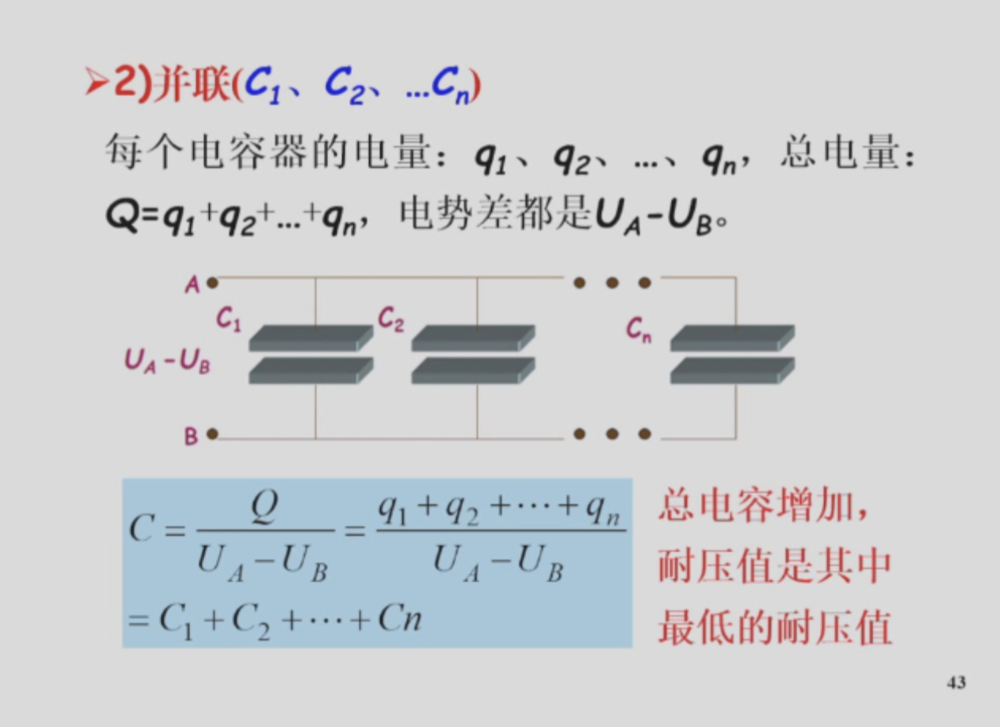

# 大雾笔记

#### chapter 13 静电场

##### [prereading]:

1. 库仑定律：$\vec{F}_{12}=-\vec{F}_{21}=k \frac{q_{1} q_{2}}{r_{12}^{3}} \vec{r}_{12}$ ，也可写作$\vec{F}_{12}=-\vec{F}_{21}=\frac{1}{4 \pi \varepsilon_{0}} \frac{q_{1} q_{2}}{r_{12}^{3}} \vec{r}_{12}$  也就是说,$k = \frac{1}{4\pi \varepsilon_0}$
2. 场强定义式：$\vec{E}=\frac{\vec{F}}{q_{0}}$ 
3. 点电荷电场强度:$\vec{E}=\frac{\vec{F}}{q_{0}}=\frac{1}{4 \pi \varepsilon_{0}} \frac{Q}{r^{3}} \vec{r}$ 
4. 均匀带电圆环的场强：$E =\frac{z \lambda}{4 \pi \varepsilon_{0}\left(z^{2}+R^{2}\right)^{3 / 2}} \int_{0}^{2 \pi R} d l=\frac{z q}{4 \pi \varepsilon_{0}\left(z^{2}+R^{2}\right)^{3 / 2}} \approx \frac{q}{4 \pi \varepsilon_{0} z^{2}}$ 相当于电荷集中在圆心的点电荷
5. 圆盘的场强：$E=\int d E_{z}=\frac{z \sigma}{4 \varepsilon_{0}} \int_{0}^{R}\left(z^{2}+r^{2}\right)^{-3 / 2}(2 r) d r=\frac{\sigma}{2 \varepsilon_{0}}\left(1-\frac{z}{\sqrt{z^{2}+R^{2}}}\right)$ 
6. 如果z远小于R，那么圆盘可以视为无穷大，则$E = \frac{\sigma}{2 \varepsilon_{0}}$
7. 如果z远大于R，那么圆盘可以视为点电荷
8. 电通量：$\begin{aligned}
   &\phi_{e}=\int d \phi_{e}=\int_{S} E \cos \theta d S 
   =\int_{S} \vec{E} \cdot d \vec{S}
   \end{aligned}$ 
9. 高斯定理：闭合曲面的电通量和其包围的电荷存在确定关系:$\phi_{e}=\oiint_{S} \vec{E} \cdot d \vec{S}=\frac{1}{\varepsilon_{0}} \sum_{i} q_{i}$ 如果电荷分布和空间坐标有关，那么做一个积分即可
10. 需要注意的是，闭合曲面的电通量只和它所包围的电荷量有关，但是其场强和外部电荷也有关系
11. 由高斯定律，我们有如下的结论：
12. 带电直线的场强：$E \cdot 2 \pi r l=\frac{1}{\varepsilon_{0}} \lambda l \quad E=\frac{\lambda}{2 \pi \varepsilon_{0} r}$ 
13. 无限大平面产生的场强：$$2 E S=\frac{1}{\varepsilon_{0}} \sigma S \quad E=\frac{\sigma}{2 \varepsilon_{0}}$$ 

##### 13.6 环路定理

1. 静电场中的电场力是保守力，做功大小只和始末位置有关，和路径无关

2. 环路定理：一个电荷在静电场中经过一个环回路径，那么电场力的做功是0（原因是电势不变）

  $$
    \oint \vec{E} \cdot d \vec{l}=0
  $$
  
3. 高斯定理中面积分可为非0->有源场，环路定理中闭合线积分为0->有势场

4. 电场力做功大小是电势能变化的负值。
  $$
    A_{ab} = W_a-W_b = -\Delta{W}
  $$
  因此，如果取无穷远为0势点，那么电荷在该点的电势能就是将该点移动到无穷远处的过程中电场力做功的大小。从而我们有
  $$
    \begin{aligned}
    &W_{p}=q_{0} \int_{p}^{\infty} \vec{E} \cdot \mathrm{d} \vec{l} =q_{0} \cdot \frac{q}{4 \pi \varepsilon_{0}} \int_{r_{p}}^{\infty} \frac{\mathrm{d} r}{r^{2}}=\frac{q_{0} q}{4 \pi \varepsilon_{0} r_{p}}
    \end{aligned}
  $$
  
5. 电势公式 $U_{p}=\frac{W_{p}}{q_{0}}=\int_{p}^{\infty} \vec{E} \cdot \mathrm{d} \vec{l}$，即将电荷从该点移动到无穷远处中场强的线积分。因此电势差能够表示成从一个点到另一个点的场强的线积分

6. 电势叠加原理（类似场强）。
   $$
     \begin{aligned}
     U_{p}=\sum_{i=1}^{n} \frac{q_{i}}{4 \pi \varepsilon_{0} r_{i}}
     \end{aligned}
   $$
   
7. 电偶极子的电势分布$U_{p}=\frac{q r_{e} \cos \theta}{4 \pi \varepsilon_{0} r^{2}}=\frac{\vec{p}_{e} \cdot \vec{r}}{4 \pi \varepsilon_{0} r^{3}}$(注意两个约等于)

8. 注意：在求电势的过程中，一般优先考虑高斯定律求场强，然后用定义式

#####13.8 场强和电势

1. 等势面和电场线处处垂直

2. 电势梯度矢量，方向取在该点电势变化最快的地方，大小是电势的变化率，是该点场强的相反数$\vec{E}=E_{n} \vec{e}_{n}=-\frac{\mathrm{d} U}{\mathrm{~d} n} \vec{e}=-\nabla U$

3. 从而我们有$\begin{aligned}
   &\vec{E}=E_{x} \vec{i}+E_{y} \vec{j}+E_{z} \vec{k}=-\left(\frac{\partial U}{\partial x} \vec{i}+\frac{\partial U}{\partial y} \vec{j}+\frac{\partial U}{\partial z} \vec{k}\right)=-\nabla U
   \end{aligned}$

   也就是说在已知电势的数学表达式的情况下，我们可以通过求三个偏导数求场强的矢量表达式（注意符号）。
   
4. 球壳内部处处等势，等于球面的电势，在把球等效的时候注意这一点

#### chapter14 静电场

1. 空腔：
    - 如果空腔内部电荷代数和为0，那么空腔内表面不带电（高斯定律+静电场环路定律）
    - 如果内部有电荷，那么导体内部的电荷位置，大小的变化不会影响导体外表面电场的分布
    - 如果导体接地，那么内部电场无论如何都不会影响外部电场，外部电场无论如何都不会影响内部电场
2. 电容器分析:
    - 电荷守恒列出电荷密度分析
    
    - 使用静电平衡法则列出某一点的场强为0的式子
    
    - 联立解方程。
    
    - 在腔内的电荷会在腔外感应出等量的电荷。
    
    - 例题:
    
      
    
      
    
      
    
3. 球体内部的电势大小等于其表面电势大小等于点电荷在表面产生的电势大小

#####  14.3 电容

1. 定义：孤立导体所带的电荷量和表面的电势之间的比值 $C=\frac{q}{U}=4 \pi \varepsilon_{0} R, \quad U=\frac{1}{4 \pi \varepsilon_{0}} \frac{q}{R}$

2. 电容定义式：$C=\frac{Q}{U_{A}-U_{B}}$ ，电荷量和两板之间电势差的比值

3. 平行板电容器：$C = \frac{q}{U_A-U_B}=\frac{\varepsilon_{0}S}{d}$ 使用高斯定律和电容定义式，从而平行板电容器的电容大小只和其几何结构决定

4. 圆柱形电容器

   $\begin{aligned}
   U_{A}-U_{B}=\int_{R_{A}}{ }^{R_{B}} \vec{E} \cdot \mathrm{d} \vec{l}
   =\int_{R_{A}}^{R_{B}} \frac{\lambda}{2 \pi \varepsilon_{0} r} \mathrm{~d} r=\frac{\lambda}{2 \pi \varepsilon_{0}} \ln \frac{R_{B}}{R_{A}} 
   \end{aligned}
   $
   $ 
   \begin{aligned}
   C =\frac{Q}{U_{A}-U_{B}}=\frac{\lambda l}{U_{A}-U_{B}} 
   =\frac{2 \pi \varepsilon_{0} l}{\ln \left(R_{B} / R_{A}\right)}
   \end{aligned}$
   
   主要就是使用高斯定律

5. 球形电容器(注意这里的球是导体，也就是说电荷只分布在表面上)

   $\begin{aligned}
   C &=\frac{q}{U_{A}-U_{B}} 
   =4 \pi \varepsilon_{0} \frac{R_{B} R_{A}}{\left(R_{B}-R_{A}\right)}
   \end{aligned}$  

6. 电容器的串联和并联

   - 串联：串联的结果会使得总电容减小，耐压增加

   - 并联：并联的结果会使得总电容增加，但是耐压值是最低的耐压值

     

##### Chapter 14.4 电介质的极化

1. 电介质是绝缘体，在电场中对电场有影响，内部场强不为零
2. 介电常数：将电解质插入已经平衡的电容器中会使得原来的电容发生变化，变化的比值叫做介电常数。 场强也会发生变化

3. 无极分子：正负电中心重合

4. 有极分子：正负电中心不重合，具有电偶极矩，宏观上大量分子的电偶极矩的和食物0

5. 无极分子的电偶极矩就是0

6. 电介质在外电场中的时候，在和外电场垂直的表面层中会出现正负电荷层，电荷被称为束缚电荷或者是极化电荷。对于无极材料，就是电子位移极化，对于有极材料，就是取向/转向极化

7. 电极化强度。也就是说电极化强度和外电场正相关

   上面是qL的积分

   

##### 14.5 束缚电荷

1. 电介质极化的时候的极化电荷面密度等于极化强度沿着外法线方向的分量
2. 束缚电荷体密度

3. 例题

   

   

   

##### Chapter 14-6 电介质中的静电场

1. 在一个内部含有一个金属球的一个球壳外部放置一个点电荷，分析外球带的电荷：使用两种方法计算球心的电势

2. 重点注意接地的球心的电势为0

3. 对于孤立导体，其电容器的另一个板子就是无穷远

4. 对于极限电压的问题，可以解出电荷密度之后回带到E的式子中

5. 束缚电荷产生的场强不会影响外部电场

6. 注意求D使用高斯定律

7. 注意！：空气中场强:自由电荷产生的场强:电介质中实际场强:束缚电荷产生的场强=  $ 1: 1 : \frac{1}{\varepsilon} : 1-\frac{1}{\varepsilon} $. 但是插入电介质会改变自由电荷产生的场强的大小，进而改变空气中的场强大小，因为Q和d可能改变，从而导致电荷密度的变化

8. 

   注意上述公式中的P的曲面积分只考虑表面的电荷（内部的电荷视为0），而且关于等号后面是加法还是减法，是根据坐标系的选择确定；然后是注意是电荷体密度积分的负值

9. 接地：电势为0

##### Chapter 14-7 电场能量

1. 恒容的平行板电容器（不是恒压，恒压要使用电势差等于场强的积分）中间插入任意厚度的电介质，所得到的电容器的最终场强为
   
   
2. 如果电荷是连续分布的，使用二重或者三重积分

3. 电容器携带的能量
    
    
4. 电场携带的能量：

    

    从而我们有电场能量密度,使用其积分我们可以计算任何带电体系的能量

    

### Chapter 15 电流和磁场

##### [15-1] 电流

1. 电流定义式：$I = \frac{dq}{dt} = nqSv$，表征单位时间通过的电荷量的大小
2. 电流密度：$j = \frac{I}{S_n} = nqv$
3. 磁场中的线圈受到的力矩大小为$M = NISBsin\theta$, 其中$\theta$ 为n和B的夹角

### Chapter 20 光的干涉

1. 折射率：$n = \frac{c_0}{c}$,根据定义式可以得到$\lambda_{n} = \frac{\lambda}{n}$,原因是$\lambda * v =v$

2. 相位差：$\delta \phi$ = $\frac{2 * \pi * \delta L}{\lambda}$,其中$L = n * r$，叫做光程

3. 光程具有可加性

4. 干涉相长：$\delta L =k * \lambda$

5. 干涉相消：$\delta L = \frac{2 * k - 1}{2} \lambda$

6. 对于样式双缝干涉实验，其光程差为：$L = \frac{d}{D}x$,x为距离对称中心的距离

7. 干涉条纹的强度分布：

   对于一般波的干涉，干涉后的合振幅为:
   $$
   E_{P}^{2}=E_{1}^{2}+E_{2}^{2}+2 E_{1} E_{2} \cos \Delta \varphi
   $$
   设 $S_{1} 、 S_{2}$ 到达 $P$ 点的 $E$ 矢量: $E_{1}=E_{2}=E$, 则有:
   $$
   \begin{aligned}
   &E_{P}^{2}=2 E^{2}+2 E^{2} \cos \Delta \varphi=2 E^{2}(1+\cos \Delta \varphi) \\
   &E_{P}^{2}=4 E^{2} \cos ^{2} \frac{\Delta \varphi}{2} \quad\left(\because 1+\cos \alpha=2 \cos ^{2} \frac{\alpha}{2}\right) \\
   &I_{P}=4 I \cos ^{2} \frac{\Delta \varphi}{2}\\其中\delta \phi 由光程定义公式给出
   
   \end{aligned}
   $$

8. 

### Chapter 24 原子的玻尔理论

1. 氢原子光谱波长规律：$\lambda = B \frac{n^2}{n^2 - 4}, \ \ \ \ \ n = 3,4,5,6$(巴尔末公式)

2. 对巴尔末公式做改造，得到里德伯公式 $\widetilde v = \frac{1}{\lambda} = R_H(\frac{1}{2^2} - \frac{1}{n^2})$

3. 将里德伯公式中的2替换为1，得到莱曼线系

   将里德伯公式中的2替换为3，得到怕行线系

   替换为4，为布拉开系

   天魂为5，的打破普丰德系

   于是有一个一般的公式：$\tilde{\nu}=R_{\mathrm{H}}\left(\frac{1}{m^{2}}-\frac{1}{n^{2}}\right) \quad m=1,2,3, \cdots ; \quad n=m+1, m+2,....$

4. 三个假设

   1. 定态假设：$E = E(n)$
   2. 跃迁假设：$hv = E_n - E_k$
   3. 量子化条件：$L = n \overline h$,式子中$\overline h$为约化普朗克常数，为$h / 2 \pi$

5. 从三个假设得到的结论：

   1. 轨道量子化：$r_n = n^2 * a_9$
   2. 能量量子化：氢原子的能量是量子化的，为$E_n = -\frac{13.6}{n^2}eV$

### Chapter 25 量子力学基础

1. 德布罗意关系式：$\lambda = \frac{h}{mv}$
2. 不确定性原理
   1. 位置和动量的不确定性关系：$\Delta x \Delta p_x \geq \frac{ \hbar}{2}$
   2. 能量和时间的不确定性关系：$\Delta E \Delta t =  \frac{\hbar}{2}$
3. 薛定谔方程：
   1. 定态薛定谔方程，$\nabla^{2} \psi+\frac{2 m}{\hbar^{2}}(E-U) \psi=0$
   2. 波恩关于波函数的统计解释
   3. 波函数是单值，连续和有限的，同时具有归一化条件:$\int_{V} \Psi^{*} \Psi \mathrm{d} V=1$
4. 一维无限深势阱
5. 势垒和隧道效应
6. 原子钟电子的状态由n,l,$m_1,m_2$决定，并受到泡利不相容原理的约束
7. 

