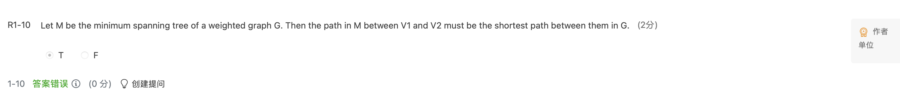

1. 排序算法稳定性

   - 不稳定：一堆希尔快选（堆排序，希尔排序，快速排序，选择排序）

   - 稳定：冒泡，插入，归并，基数

   - 时间复杂度：

     

2. 邻接表和邻接矩阵 :ok_hand:

3. 最小生成树算法

   - prim 算法
   - 克鲁斯卡尔算法

4. 欧拉公式 $v-e+f=2 $

5. 非递归实现中序遍历

   ```c
   void inOrder2(BinTree *root)      //非递归中序遍历
   {
       stack<BinTree*> s;
       BinTree *p=root;
       while(p!=NULL||!s.empty())
       {
           while(p!=NULL)
           {
               s.push(p);
               p=p->lchild;
           }
           if(!s.empty())
           {
               p=s.top();
               cout<<p->data<<"";
               s.pop();
               p=p->rchild;
           }
       }    
   } 
   ```

6. 普通数组转大根堆

   对所有有孩子的节点，检查其是否比孩子更大，如果不是，那么将其和孩子中更大的那个数字交换，并继续检查交换下去的小的数字，直到叶子节点。
   
7. 迪杰斯特拉算法

   >```c
   >#include<stdio.h>
   >#include<stdlib.h>
   >#include<string.h>
   >#define MAX 510
   >#define INF 0x3f3f3f3f
   >#define max(a,b) ((a) > (b) ? (a) : (b))
   >int g[MAX][MAX],dist[MAX],st[MAX];
   >int num[MAX];
   >int v,e,start,end;
   >int resc[MAX];
   >int weight[MAX];
   >void dij(){
   >    dist[start] = 0;
   >    num[start] = 1;
   >    resc[start] = weight[start];
   >    for(int i =0 ;i<v;i++){
   >        int t = -1;
   >        for(int j = 0;j<v;j++){
   >            if(!st[j] && (t == -1 || dist[t] > dist[j])) t = j;
   >        }
   >        st[t] = 1;
   >        for(int i = 0;i<v;i++){
   >            if(dist[i] > dist[t] + g[t][i]){
   >                num[i] = num[t];
   >                resc[i] = resc[t] + weight[i];
   >                dist[i] = dist[t] + g[t][i];
   >            }
   >            else if(dist[i] == dist[t] + g[t][i]){
   >                num[i] += num[t];
   >                resc[i] = max(resc[i],resc[t] + weight[i]);
   >            }
   >        }
   >    }
   >    printf("%d %d",num[end],resc[end]);
   >}
   >int main(){
   >    memset(dist,INF,sizeof(int) * MAX);
   >    memset(g,INF,sizeof(int) * MAX * MAX);
   >    scanf("%d %d %d %d",&v,&e,&start,&end);
   >    for(int i = 0 ;i<v;i++){
   >        scanf("%d",weight + i);
   >    }
   >    for(int i = 0;i<e;i++){
   >        int a,b,c;
   >        scanf("%d %d %d",&a,&b,&c);
   >        g[a][b] = g[b][a] = c;
   >    }
   >    dij();
   >    return 0;
   >}
   >```
   >
   >
   >
   >

8. 有边数限制的最短路算法 Bellman-Ford算法

   ```c
   // 如果松弛n次之后仍然可以继续松弛，那么存在负环
   int bellman_ford()
   {
       memset(dist,0x3f,sizeof dist);
       dist[1]=0;
       for(int i=1;i<=k;i++) // k为边数限制
       {
           memcpy(backup,dist,sizeof dist);
           for(int j=1;j<=m;j++)
           {
               int a=edge[j].a,b=edge[j].b,w=edge[j].w;
               dist[b]=min(dist[b],backup[a]+w);
           }
       }
       return dist[n];
   }
   
   ```

   

9. 多源最短路 弗洛伊德算法

   ```c
   //初始化
       for (int i = 1; i <= n; i ++ )
           for (int j = 1; j <= n; j ++ )
               if (i == j) d[i][j] = 0;
               else d[i][j] = INF;
   
   void floyd()
   {
       for (int k = 1; k <= n; k ++ )
           for (int i = 1; i <= n; i ++ )
               for (int j = 1; j <= n; j ++ )
                   d[i][j] = min(d[i][j], d[i][k] + d[k][j]);
   }
   ```

10. 最小生成树算法

  1. prim算法

     ```c
     和dij类似，但是更新节点的时候min中是g[i][j],也就是说只是考虑到集合的距离
     ```

  2. 克鲁斯卡尔算法

     ```c
     首先对所有的边做排序，此后使用贪心算法选择最小的边，使用并查集检查其连接的两个端点是否形成环，直到遍历所有的边，检查是否连通即可
     ```

     

11. 网络流：EK算法

   ```c
   #include<stdio.h>
   #include<stdlib.h>
   #include<string.h>
   #define MAX 510
   #define mapMax 1000000
   #define INF 0x3f3f3f3f
   #define min(a,b) ((a) < (b) ? (a) : (b) )
   int iniPos,endPos;
   int e[MAX * 2],ne[MAX * 2],h[mapMax],idx=0;
   int w[MAX * 2];
   int map(char *input){
       int res = 0;
       for(int i = 0;i<3;i++) res = res * 26 + (input[i] - 'A');
       return res;
   }
   void add(int a, int b, int c){
       e[idx] = b,ne[idx] = h[a],w[idx] = c,h[a] = idx++;
       e[idx] = a,ne[idx] = h[b],w[idx] = 0,h[b] = idx++;
   }
   int st[mapMax];
   int queue[mapMax];
   int pre[mapMax];
   int in[mapMax];
   int bfs(){
       memset(st,0,sizeof(int) * mapMax);
       in[iniPos] = INF;
       st[iniPos] = 1;
       int front = -1,rear = -1;
       queue[++rear] = iniPos;
       while(front != rear){
           int cur = queue[++front];
           for(int i = h[cur];i!= -1;i = ne[i]){
               if(!st[e[i]] && w[i] > 0){
                   in[e[i]] = min(in[cur],w[i]);
                   pre[e[i]] = i;
                   st[e[i]] = 1;
                   if(e[i] == endPos) return 1;
                   queue[++rear] = e[i];
               }
           }
       }
       return 0;
   }
   int main(){
       memset(ne,-1,sizeof(int) * MAX * 2);
       memset(h,-1,sizeof(int) * mapMax);
       char input1[4],input2[4];
       int lines;
       scanf("%s %s %d",input1,input2, &lines);
       iniPos = map(input1),endPos = map(input2);
       int weight;
       for(int i = 0;i<lines;i++){
           scanf("%s %s %d",input1,input2,&weight);
           add(map(input1),map(input2),weight);
       }
       int r = 0;
       while(bfs()){
           r += in[endPos];
           for(int i = endPos;i!=iniPos;i = e[pre[i] ^ 1]){
               w[pre[i]]-=in[endPos];
               w[pre[i] ^ 1] += in[endPos];
           }
       }
       printf("%d",r);
       return 0;
   }
   ```

   

12. 有权重的EK算法

   略

13. 双连通分量的寻找 tarjan算法

   ```c
   #include<string.h>
   #define eMax 1000
   int e[eMax],ne[eMax],h[eMax],idx = 0;
   int stack[40],instack[40],top = -1,low[40],dfn[40],timestamp = 0,counter = 0,bel[40];
   void tarjan(int i){
       dfn[i] = low[i] = ++timestamp;
       instack[i] = 1;
       stack[++top] = i;
       for(int j = h[i];j != -1;j = ne[j]){
           //printf("%d->%d",i,e[j]);
           if(!dfn[e[j]]){
               tarjan(e[j]);
               if(low[e[j]] < low[i]) low[i] = low[e[j]];
           }
           else if(instack[e[j]] && dfn[e[j]] < low[i]) low[i] = dfn[e[j]];
       }
       if(low[i] == dfn[i]){
           ++counter;
           int temp;
           do{
               temp = stack[top--];
               instack[temp] = 0;
               bel[temp] = counter;
           } while(temp != i);
       }
   }
   void StronglyConnectedComponents( Graph G, void (*visit)(Vertex V) ){
       memset(h,-1,sizeof(int) * 20);
       memset(ne,-1,sizeof(int) * eMax);
       int v = G->NumOfVertices;
       for(int i =0;i<v;i++){
           if(!dfn[i])
               tarjan(i);
       }
   }
   ```

   

14. 欧拉回路：是可能的，当且仅当所有节点的度都是偶数

15. 欧拉路径是可能的，当且仅当只有两个节点的度是奇数

16. 基数排序

17. LSD MSD

18. 入栈和出栈的物体相同的时候（比如入栈是ooo），那么所有出战的可能性有$C_{n}^{2n} / (n + 1)$种，也就是卡特兰数

19. 二次函数检测(quadratic probing)的是$d + 1 \\ d + 2^2 \\ d + 3 ^ 2$这样的序列，不是根据位置来计算的

20. double hash的意思是如果hash1函数的结果b是不可用的，那么计算hash2函数的结果，记为c，那么检测的序列是b + nc，而不是根据位置进行hash

18. rehash就是找到和当前hash表大小两倍最接近的质数，将其作为新hash表的大小进行hash，得到新的索引之进行存储


# 例题

1. 

​	答案是2，注意二次函数哈希的时候，i表示碰撞的次数，同时由于$i^2$前面具有正负号，所以随着碰撞次数的增加符号要交换

2. 

   答案是D，负权回路不会导致无限循环，因为可以打上标记来避免

3. 

   答案是B，即使DAG中任意两个点之间可以互通，拓扑排序也不是唯一的，因为可能不存在

4. findKthLargest

   ```c
   int FindKthLargest ( int A[], int N, int K ) 
   { 
     int *H, i, next, child; 
     H = (int *)malloc(++N, sizeof(int)); 
     for ( i=1; i<N; i++ ) H[i] = A[i-1]; 
     BuildMinHeap(H, K); 
     for ( next=K+1; next < N; next++ ) { 
       H[0] = H[next]; 
       if ( H[0] > H[1] ) { 
         for ( i=1; i*2 <= K; i=child ) { 
           child = i*2; 
           if ( child!=K && ①_____H[child+1] < H[child]_____________) child++; 
           if (②__H[0] > H[child]________________) 
             H[i] = H[child]; 
           else   break; 
         } 
   ③___H[i] = H[0]___________; 
       } 
     } 
     return ④H[1]______; 
   }
   ```

5. qselect

   ```c
   ElementType Qselect( ElementType A[], int K, int Left, int Right )
   {
       ElementType Pivot = A[Left];
       int L = Left, R = Right+1;
   
       while (1) {
           while ( A[++L] > Pivot );
           while(A[--R] < Pivot);
           if ( L < R ) Swap( &A[L], &A[R] );
           else break;
       }
       Swap( &A[Left], &A[R] );
       if ( K < (L-Left) )
           return Qselect(A, K, Left, R-1);
       else if ( K > (L-Left) )
           return Qselect(A, K - (L - Left), L, Right);
       else
           return Pivot;
   }
   ```

6. 


​	parent的确不一定，但是祖先ancestor是一定的

8. 

   上面的那题记住就好，可能是不同的边但是和是一样的，下面的话确实

9. 

   纵向来看，可以统计出入度，答案是B

10. 栈中序转后序，如果是运算符，那么弹栈直到栈顶元素优先级低于当前运算符，如果是右括号，那么弹栈到左括号

11. 

12. 

    答案是D

13. 

    答案是f，注意这里没有提到worst

14. 

    如果是worst的话，那么的确有一个下界，但是如果没有提到worst的话，那么可能都不需要走完流程

15. 注意看题，哈希表的哈希函数的取模数字不一定是哈希表的长度

16. 

    答案是1

17. 

​	答案是A

18. 

    选择排序 5前是1
