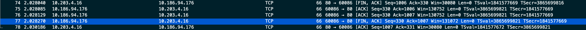

# 信息安全原理

### 3200105872 庄毅非 软工2002

## 一、实验目的：

学习使用wireshark分析计算机进行网络连接时所发送和收到的数据包

实验中使用的系统为macos monterey 12.3.1

## 二、实验步骤

1. 安装wireshark并监听本机网络
2. 分析计算机在连接**[http://www.cs.zju.edu.cn](http://www.zju.edu.cn/)**的时候所发送和接收的数据包

## 三、实验过程

3->4： DNS解析

5->8: 3次握手

9->10: http请求

11: 4次挥手

1. 首先，启动wireshark，并使其监听`Wifi: en0`
2. 在清空本地dns缓存之后，在浏览器地址栏请求http://www.cs.zju.edu.cn

3. 可以看到，在建立tcp连接之前，计算机首先向dns解析服务器询问上述连接服务器的ip地址，第66帧是本机发出的查询请求,第67帧是dns服务器返回的查询结果。

   

   
图1 发出的两个dns请求

3. 查看第66帧的查询内容，可以看到为type A，表示查询的dns是一个iPv4地址，之后的class IN表示表示查询范围是在互联网上查询，查询域名为http://www.cs.zju.edu.cn。

   

   
图2 28帧查询信息

4. 查看第67帧的dns响应，发现其给出了http://www.cs.zju.edu.cn对应的ip地址为10.203.4.16

   

   
图3 29帧dns查询结果

​	使用curl -vvv 进行检测，发现所查询的ip地址符合上述结果，并且还给出了连接的端口为80

图4 curl查询域名对应的ip地址

5. 在获取了服务器ip地址之后，进行三次握手

图5 三次握手涉及的tcp请求

6. 首先，本机发送一个tcp请求进行第一次握手，分析第一个数据包格式。

   可以看到链路层（Ethernet）中包含了本机mac地址（可以使用ifconfig获得）为`14:7d:da:d1:de:69`, 服务端mac地址`2c:21:72:60:6f:c2`,其最后一个字段`Type`提示了服务端请求所使用的网络层协议为IPv4。

   在网络层中我们可以看到使用的ip协议为IPv4,请求没有分片，数据包寿命为64，并且告知服务端传输层使用的协议为tcp6。

   在传输层我们可以看到传输的目标端口为80，flag为syn，这是建立第一次握手的标识，表示客户端向服务器发送的同步请求。

   

   
图6 tcp第一次握手

7. 之后，客户端向本地回复一个tcp响应。链路层和网络层和上述分析相似。在传输层，我们看到服务器在收到第一次请求之后回复了一个（ack,syn）包。

   

   
图7 服务端tcp响应

8. 客户端在收到上述响应之后，向服务器回复一个ack包，和客户端之间确认连接。

   

   
图8 客户端返回的ack包

9. 在上述三个包交换完毕之后，客户端和服务器之间完成tcp连接建立。客户端向服务器正式发出http/GET请求，其应用层为超文本传输协议（http）。Host表示服务器地址，User-Agent就是发送请求的程序（这里使用firefox发送请求），Accept要求响应html文件等格式的文件，Accept-coding表示接受的编码格式为gzip,Cookie表示请求者身份。

   

   
图9 客户端发出的http请求

\_10.  服务器在收到上述请求之后，返回所请求的资源。可以看到返回的状态码为200，表示请求成功。Content-Encoding表示使用的压缩方式为gzip。Content-Length表示响应头空行之后的数据长度，便于客户端进行解压。

图10 客户端返回html文件

\_11. 随后，服务端发起4次挥手，断开连接，整个请求流程结束。

图11 4次挥手

## 四、 总结

1. 实验中，如果不先清空dns缓存，直接访问http://www.cs.zju.edu.cn，那么本机无需向dns服务器发送查询请求，直接访问对应的ip地址，网页加载时间更短。
2. html网页资源请求的流程整体为
   1. 本机查询dns缓存中是否有该域名，如果有，直接转到第2步，否则想dns服务器询问对应的ip地址
   2. 获取到ip地址之后，通过3次交换tcp包，建立tcp连接
   3. 客户端向服务器请求对应的资源（比如html文件）
   4. 服务器返回对应资源
   5. 在资源传输完毕之后，执行4次挥手，断开连接。