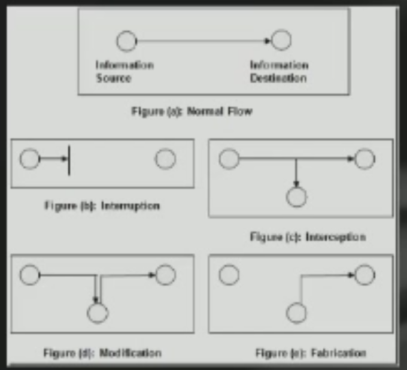

# infosec final review

## 考试

1. 4.24 8:00 -> 10:00
2. 东2-201
3. 英文试卷，中英文答题
4. 闭卷考试
5. 填空、单选、判断、问答、应用（使用安全知识思考和解决现实中的安全问题，回答某种场景下可能存在的安全隐患，给出对抗策略）

## 一、 intro

1. most attacks are from insiders

## 二、 Information security

1. 太公兵法是中国最早的密文

2. 豪密是中国共产党第一个密文

3. 凯撒密码：
   - 通过字母移位实现
   - 一共有25个不同的密钥

4. 古代加密技术：...

5. 近代加密技术：

   - 蛋写术
   - microdot
   - bacon's ciper

6. 密码学的演进阶段
   1. ***kerchhoff原则***
      - 即使加密系统除了密钥之外的一切信息都被泄漏，系统仍然是安全的
      - 意味着密码学从“史前”演进为了经典密码学
      - 加强了安全性：一切不变的东西都会被破解，**难以改变且长时间使用的东西都假设对手知道**
      - 使得加\解密相关的机器的大规模生产成为可能
      - **没有理由认为加密算法是保密的，密码的强度要在对方已知的前提下定义**
      - **安全取决于密钥的保密，而不是算法**
      - 第一次进化：从经验到科学
   2. 计算机发明
      - 为了破解ENIGMA发明，同时加速加密解密
      - 理论基础：香农信息论
      - DES标志着现代加密技术的出现
      - 第二次进化：从手工到机械到电子
   3. 公钥加密
      - 使得两个单位在无需交换密钥的情况下就能够传输大量加密信息
      - 最广泛使用的公钥加密算法：RSA
      - 第三次进化：密码学理论的革命
   4. ？移动互联网
      - 不仅要安全
      - 云计算，集群计算破解密文
      - 第四次进化：密码学相关的技术和应用的进化

7. 信息安全的重要性：
   1. PC时代，病毒为了炫耀或者破坏
   2. 互联网时代，蠕虫和DOS攻击，为了获利和变现
   3. 后互联网时代，.....。

8. 计算机信息安全和纸质文件信息安全的不同**（增、删、改、签）**
   1. 区分原文和拷贝的难易（增）
   2. 对于文件的修改是否会留下马脚（改）
   3. 纸质文件较难摧毁（删）
   4. 纸质文件有签名这样的特征（签）

9. 计算机安全的特点
   1. 综合性：安全取决于最短板
   2. 过程性：安全模型不断发展
   3. 动态性：安全系统不断更新、改善、进化
   4. 继承性：使用多层技术和手段保证安全
   5. 相对性：相对安全，不是绝对安全

10. 计算机安全的元素
   1. confidency（保密性）：其他人能看到数据吗
   2. integrity（一致性）：不能被非法修改（黑客篡改主页）
   3. availability（可用性）:资源可获取吗（ddos攻击）
   4. authenticity（真实性）: 身份验证，他人不可伪装

11. 计算机安全的概念：
    1. 漏洞：系统中的弱点，可能被利用来非法访问资产
    2. 威胁：一系列环境造成潜在损害
    3. 攻击：攻击者利用漏洞进行攻击
    4. 控制：移除或者削弱漏洞
    4. 风险 = 漏洞 + 威胁 + 资产，也就是R = V + T + A

12. 安全攻击方式
    1. interruption：阻断信息的正常传输，损害可用性，主动攻击，难预防，容易检测

       执行方式：破坏硬件，引入噪音，dos攻击

    2. interception：攻击保密性，被动攻击，难检测，容易预防，不可能完全避免，

       防御方式：加密等

       执行方式：

       	- wiretap:窃听
       	- link monitor: 链接监控
       	- package capture:抓包
       	- system hacking ：黑入系统

    3. modification：攻击完整性，主动攻击，难预防，容易检测

       防御方式：数字水印等

       方式：

       	- 修改数据库中的数据
       	- 黑入系统
       	- 通信延迟
       	- 修改硬件

    4. fabrication：攻击真实性，主动攻击，难预防，容易检测

       执行方式：

       - 数据库中插入假信息
       - 使用假ip地址发送包
       - 使用假冒的邮件地址和网页地址

    

13. 被动攻击：inteception，难检测，预防会更高效
14. 主动攻击：interruption，modification，fabrication，容易检测，但是难预防

## 3. 密码学

1. 密码学相关的符号

2. 凯撒密码清楚了解

3. 维吉尼亚密码清楚了解，反频率分析

   如果加密用的密钥的长度比原有的文本更短，那么会出现一系列重复的部分，只要得到重估部分的最小公因数，就很有可能是密钥的长度，之后对于每一部分的密文，使用频率分析即可

4. 皇后密码了解，破解方式：频率分析

5. 频率分析，测试密钥长度

6. enigma 大概了解如何工作

   只有三个轮子的密钥空间是：26 ** 3, 破解了频率分析

   同时，轮子本身可以交换顺序，于是上述空间变为26 ** 3 * 6 = 105456

   之后，又安排了插线板，于是又增加了C(26,4) * C(4,2) / 2的空间

7. enigma符合kerckhoff原则

   1. 加密算法是：轮子的物理结构和整个机器的结构，这是不变的
   2. 密钥是轮子的最初顺序、每个轮子最初的位置，以及插线板的位置

8. 块加密了解

   将输入的bit流转换为含有n字节的单元，仅仅对于每一个字节单元做加密，而不管块之间的关系

9. 经典密码学：
   1. 对称加密

   2. firstel 结构

      1. 使用块加密

      2. 使用乘积密码的方式解决了密钥过长的问题

      3. 实现雪崩效应的方式

         1. 扩散 diffusion,使密文的统计特性和原文之间的关系尽量复杂

            实现方式：频繁交换左右两块

         2. 扰乱 confusion, 是的密文的统计特性和密钥之间的关系尽量复杂

            实现方式：

            	- 更大的块，通常是64bit和128bit
            	- 密钥长度，通常是128bit
            	- 交换的次数（number of rounds), 交换次数越多，一般越安全
            	- 子密钥生成算法：好的生成算法可以增加密文分析的难度
            	- 轮函数：更大的复杂度可以增加密码分析的阻力

   3. DES， 3DES， AES基本结构

      1. DES加密：
          1. 使用64bit块，56bit密钥

          2. 强大的雪崩效应

          3. 只能够暴力破解，反破解能力强

          4. 当然，现在56bit不够用

          5. 大致过程：一图胜千言

             

             右边的块直接被写到做百年，同时分成两份的密钥执行左移之后合并成为48位，然后和右边的块的扩展进行异或运算，之后进行替换后和左边执行异或运算，输出到新的右边结果

      2. 三重DES

         1. 密钥空间变为56 * 3 = 168
         2. 只要K3 = K2，或者K2 = K1,就能够向前兼容DES算法
         3. 被GPG使用

      3. AES加密

         1. 解决了3DES和DES的痛点：
            	1. 速度更快
            	1. 只需要64bit的每个块的大小
         2. AES：
            1. 块大小：128bit
            2. 密钥大小：128bit/192bit/256bit
            3. 免疫已知的所有攻击
            4. 执行速度快，兼容所有平台
            5. 设计反而简单

   4. 其他块加密算法

      1. ECB：容易受到回放攻击
      2. CBC：上一个块的加密结果是下一个块的加密输入，免疫回放攻击和对照表建立

10. 公钥密码学
   1. **非对称加密，和对称加密之间的区别、异同优缺点**
      1. 非对称加密依赖于数学函数，而不是替换或者位移
      2. 非对称加密使用两个独立的密钥
      3. 可以在不交换秘密信息的前提下交换密文，解决了密钥分发问题
      4. 解决了数字签名问题
   2. 公钥依赖于数学函数，而不是替换或者置换
   3. 有两个密钥，非对称
   4. 在不共享任何秘密信息（密钥）的前提下就可以交换大量信息
   5. 功能：
      1. 加密
      2. 签名
      3. 密钥交换
   6. 新的符号
      1. 公钥： KU
      2. 私钥： KR
   7. **单向函数**
      1. DH：计算大整数的整数次幂容易，计算离散对数困难
         1. DH过程
            1. 首先随机选取a,g,p，计算甲的公钥$A = g ^ a mod \ p$,将g,p,A发送给乙
            2. 乙得到a,g,p之后，随机选私钥b，计算$ B = g ^ b mod \ p$，将计算得到的B发送给甲，随后乙计算会话密钥$K = A ^ b mod \ p$
            3. 甲将得到的公钥B计算$K = B ^ a mod \ p$，得到会话密文K
            4. 甲乙现在可以使用会话密钥进行密文交换
         2. DH算法的安全性很大程度上取决于密钥的选取
         3. 在这个算法中，p需要很大，g则没有这个要求
         4. 缺陷：难以防备中间人攻击
      2. RSA：计算大素数相乘容易，但是大整数质因子分解难
         1. 直接看例子
         2. bob生产了两个随机数p = 5, q = 11。因此 n = pq = 55, (p -1) * (q - 1)= 40
         3. 之后，bob找到了连个整数e = 3, d = 27的乘积满足$3 * 27 = 1(mod 40)$,所以bob的公钥就是3，私钥就是27
         4. 之后，bob将密钥对(3,55)发送给alice，alice将其存储到自己的密码本中
         5. 之后，alice想要发送13给bob的时候，首先到密码本中查到bob的密钥对是(3，40)
         6. 然后alice计算$13 ^ 3 mod 55 = 52$,她将52发送给bob
         7. bob收到52之后，使用自己的私钥27计算，$m = 52 ^ {27} mod 55$ = 13，解密结束 
      3. RSA另一个例子
         1. 首先，bob产生两个随机数p = 101, q = 113,之后计算n = p * q = 11413
         2. 然后，bob找到两个这个数e = 3533, d = 6597,计算符合e * d = 1 (mod (p - 1) * (q - 1))
         3. 然后bob将密钥对(3533,11413)发送给alice，alice将其存储到自己的密码本中
         4. 当alice想要发送9726给bob的时候
         5. alice首先查找到bob的密钥对是(3533,11413)
         6. 之后，alice计算c = $9726 ^ {3533} mod {11413}$ = 5761，alice将其发送给bob
         7. bob收到5761之后，计算$m = 5761 ^ {6597} mod 11413$ = 9727,解密结束
      4. 使用符号表示
         1. 首先，bob找到连个随机数p,q,计算n = pq
         2. 之后，bob找到另外俩个数字e,d,需要符合e * d = $1 mod ((p - 1) * (q - 1))$
         3. bob将密钥对（e,n）发送给alice
         4. 当alice想要发送m给bob的时候，首先得到bob的密钥对(e,n)
         5. alice计算c = $m ^ e mod \ n$，alice将c发送给bob
         6. bob受到c之后，使用自己的私钥d计算$m = c ^ d mod \ n$，得到明文m
      5. 不需要掌握推导，但是要知道大致过程

11. 对称密钥：快，便宜，密钥分发困难

12. 公钥密码：计算困难，代价高，但是可以实现密钥分发

13. 实际应用：
    1. 使用公钥交换密钥
    2. 使用对称密钥进行加密解密

14. 对于数字签名的要求

    1. 签名绑定到文件上
    1. 签名必须是可信的，接受者有理由相信文件是签名者签名的
    1. 签名不能够被伪造
    1. 签名不能够被复用
    1. 被签名的文件是不能够再被修改的
    1. 签名不能够被抵赖
    2. 接收者可以验证签名，签署者不能抵赖
    3. 第三方也可以验证
    4. 具有时效性，签名和时间是绑定的
    5. 和内容相关
    6. **使用单向散列函数：如果直接使用公钥签名文件，代价高，文件体积变大，所以不使用公钥，而是对于文件的特征签名（也就是先hash得到一个固定长度的位串，之后对于位串进行签名），需要抗碰撞，使得构造新文件故意碰撞困难**

15. 签名和加密的不同点

    1. 签名使用自己的私钥进行签名，接受者使用签发者的公钥进行验证
    2. 加密使用对方的公钥进行加密，接受者使用自己的私钥进行解密

16. 一个典型的签名过程

    1. 首先，bob的密钥是d =27, n = 55，发送给alice的密钥对是(3,55)
    2. 现在，bob想要签名一个文件，文件的内容是m = 19
    3. bob计算$s = m ^ d mod \ n$ = 24
    4. bob将24附在文件的末尾，发送(19,24)给alice
    5. alice收到后，计算$t = 24 ^ {3} mod\  55$ = 19，检测发现19就是文件的内容，于是alice认定文件就是bob发送的

17. 如果文件的体积过大，要签名的话就需要使用一个单向的散列函数计算文件的特征数字，之后再按照上述签名过程进行签名

    这个散列函数必须具有以下特性:

    - 容易计算
    - 反向计算是不可行的
    - 寻找hash碰撞困难

18. MAC概念

    1. 概念：消息认证码

    2. 流程：一图胜千言

       

    3. MAC和数字签名之间的区别

       1. 对于mac，发送者何接受者需要使用相同的密钥K，因此，mac只能够被少数几个接受者验证，而数字签名可以被所有有发送者公钥的人验证。
       2. mac没有提供不可否认服务，只要我有别人的密钥，我也可以伪造；而数字签名具有不可为造性。
       3. 使用mac的好处？
          1. mac更快，快得多
          2. 不可否认不是一直必
       4. 呢个挂钩对于文档和包进行内容认证，使用对称密钥和hash实现，和签名不通，但是也可以用在签名中

## 认证和授权

1. 认证手段：所有，所知，所在，个人特征（DNA，指纹等）
2. 密码如何选择和存储
   1. 字典攻击的概念
   2. 密码加盐，可以部分抵御字典攻击
   3. 自己如何选择密码 xxxxxxJD xxxxxxxxlmao
3. kerboas: 了解基本概念，无需了解过程
   1. 主要就是是的互联网上的用户不能够为伪造他人的身份信息访问服务
   2. 主要流程就是
      1. 每次登录的时候，向一级令牌分发者请求访问二级分发中心的令牌A
      2. 得到令牌A之后，客户端向二级分发中心请求访问对应服务器的令牌B
      3. 得到上述令牌B之后，客户端就可以使用这个令牌向客户端发出请求，客户端在检验对应权限之后提供服务
   3. 主要优势：
      1. 无需用户不断输入密码，减少打扰率
      2. 密码为加密传输，不会被截获并破解
      3. 免疫重放攻击，因为令牌具有时间限制
   4. 依赖：
      1. 实现kerbeos协议，需要可靠的第三方分发令牌
      2. 由于请求服务需要经过多级分发者，最终提供服务的服务器的负载有所下降
      3. ticket能够别重用，减少了分发服务的负载，同时使得整个服务的流程更加方便（毕竟直接使用ticket就可以请求服务，无需每次都向一级分发者秦秋二级分发者的令牌）
      4. 由于最终不是使用密码请求服务而是使用ticket，所以减少了密码泄漏的几率
      5. 减少了终端服务器的负载，提高了整个鉴权系统的效率
      6. 由于使用了时间戳，并且对于分发的令牌都附上了有效时间，所以能够有效的防御重放攻击
   5. 在kerberos协议中，使用session key 作为认证的凭证。
   6. kerberos v5: 在上述流程的基础上做出改进。
      1. v4只支持DES加密算法，但是v5可以支持其他的加密算法
      2. v4只支持ip协议，但是v5可以支持其他互联网协议
      3. ticket的寿命：v4支持最多1280分钟（其实就是时间有限的意思），但是v5没有这个限制
      4. 鉴权凭证的传输：v5允许传输鉴权凭证，但是v4不允许
      5. v5减少了密钥的交换
   7. kerberos的缺陷：
      1. 时间依赖：由于在提供ticket的时候要附上过期的时间，所以要提供可靠的服务，kerberos必须有一个准确的时间同步机制。
      2. 由于最终是否提供服务只看是否有ticket，所以攻击者一旦得到最终的ticket，就可以执行重放攻击
      3. 猜测攻击：用来认证的弱密码可能被攻破，kerberos中并没有提供对于密码的进一步保护机制
      4. 对于密钥和会话密钥（session key）的保存不能够在常见的计算机系统中
4. 访问控制和授权
   1. 涉及到的术语
      1. 主体：主体表示需要访问其他资源的对象，比如用户，或者是用户程序的进程
      2. 客体：课题表示被主体访问的对象，比如文件，内存中的数据等
      3. 权限：权限表示主体能够在客体上执行的操作的集合，比如最熟悉的rwx
   2. DAC: 自主访问控制（典型例子：unix like os)
      1. 对于每一个客体，维护所有主体在其之上的权限列表
      2. 对于每一个主体，维护其对于所有客体的权限列表
      3. 对于权限的控制事实上是比较弱的，比如一个用户可以在其他用户的客户的可执行程序添加木马拷贝文件，从而越权获取文件权限。
   3. MAC： 强制访问控制
      1. bell-lapadual模型：为了解决比如上述的问题，MAC要求主体不能向上读，向下写，这样当木马拷贝文件的行为就是违规的
   4. 隐通道：是一种在进程之间进行违反计算机安全规则的交换信息行为。
      1. 例子：资源耗尽通道：已知申请的内存大小，查看返回值
      2. 例子：负载检测通道：执行已知计算量的计算任务，查看最终执行的效率
   5. 解决方法：
      1. 关闭隐通道或者减慢其运行速度
      2. 检测使用隐通道的进程
      3. 容忍其存在
   6. 其他措施
      1. 减少共享资源的使用（cpu，内存等等），只在一个安全级别共享资源
      2. 减少带宽
   7. RBAC 基于角色的权限控制
      1. 上述鉴权机制的缺陷：
         1. DAC太弱
         2. MAC太强
         3. 维护成本过高
      2. RBAC中角色和unix中群组的区别
         1. 群组只是一系列用户
         2. 角色=用户 + 权限
   8. SAC
      1. 最小授权
      2. 分权：将系统的最高权限分配给以下三个角色：
         1. 系统管理员：管理系统维护、用户管理、软件安装等
         2. 安全管理员：管理安全配置、安全守则
         3. 修改？管理员：检查所有变更记录，监控系统安全允准啊
      3. 系统中不存在超级用户

## 网络安全

1. TCP协议栈
   1. 链路层： ARP,RARP,Ethernet,HDLC,PPP
   2. 网络层:  IP,ICMP,BGP,OSPF,IGMP
   3. 传输层: TCP, UDP
   4. 应用层: HTTP,SMTP, FTP,TELNET,DNS

1. TCP:
   
   1. 介绍：一种best effort delivery
   2. 使用滑动窗口进行传输流控制，使用序列号和ack号
   3. 同步传输，建立虚拟链接
   4. 三次握手，建立连接
      1. 客户端在建立连接的时候，向服务器发送对应的数据包（当然，需要先询问dns服务器），包中标识符号为syn
      2. 服务器接收到上述数据包后，向客户端发送ack、syn包，表示接受到数据包，同时将上述链接放入半链接队列中
      3. 客户端接受到上述数据包之后，发送ack信号，服务器收到信号之后，将上述链接放入全链接队列中，链接建立完成
   
1. UDP(不重要)
   
   1. 没有ack
   2. 没有流控制
   3. **no message continuation?**

4. 攻击:Sniffing(类似抓包)

5. ARP spoofing：ARP是无状态的，一些系统只在第一次建立连接的时候进行arp缓存，可以伪造ICMP数据包让受害者发送ARP请求，之后让自己发送给上述受害者对应的ARP响应，即可污染其ARP缓存池。通过ARP伪装，可以实现

   1. 监听攻击
   2. 中间人攻击
   3. 拒绝服务攻击

6.  IP spoofing IP伪装

   1. 一图胜千言

      

   2. 可以让局域网中的许多计算机发起ddos攻击，伪装的ip包的src设置成受害者ip即可

7. syn攻击

   1. 攻击者只发送syn信号，不回应ack信号，服务器必须不断创建进程进行服务，直到资源耗尽
   2. 预防措施：
      1. 随机枪毙
      2. 使用syn cookies, 服务器不再为每一个syn请求都创建一个进程，而是发送给其一个cookie，客户端只有再次发送改cookie，服务器才会开始服务。客户端不应该能够伪造cookie，也不能够反转cookie（？？？）
      3. 

8. **TCP SYN FLOODING**,概念，如何实现，为何攻击成功，如何防御

9. TCP SYN检测

   1. 概念：攻击者预测服务端使用的syn包，向受害者发送经过预测的syn包，让其重新组织自己所发送的包，实现资源消耗
   2. 防御手段：每次都选取一个随机的syn初始序列号，使得预测攻击不可能，实现推荐使用一个单项的hash函数

10. TCP Congrstion控制

   1. rfc要求发生丢包的时候发送者必须减半自己的发送速度直到不再丢包或者速度已经降到0
   2. 假设alice和bob是两个用户，使用同一个带宽。发生丢包的时候alice减半了七发送速度，但是bob不减半，他获得了更高的发送速度。
   3. 解决方法：在ack包中添加随机数，在返回的ack中附上这个随机数，证明自己没有作弊

11. DNS伪装

    1. 修改dns服务器或者本地dns服务，常常是污染其缓存池，从而使得访问指定域名的用户都会被重定向到一个错误的ip地址
    2. 发生原因：dns请求和相应没有鉴权机制，攻击者伪造了dns信息
    3. 防御手段：使用dnssec，是的所有的dns响应都是经过授权的。但是dnssec不提供加密服务，也不能防御dos攻击。

12. IPSEC

    1. 概念：支持在ip层的加密和授权行为
    2. AH（验证头 Authenticaion Headers)：为ip包提供数据一致性和鉴权服务，能够部分反重放攻击
    3. ESP（载荷安全性封装），提供安全的、保密、鉴权服务
    4. SA（安全关联）
       1. 定义了一系列的算法和参数，为单向的发送者-接受者数据流提供加密和鉴权服务
       2. 换句话说，如果要建立双向的安全交流通路，需要建立两个sa
       3. sa由：Security parameter index，ip包目的地地址，Security protocol identifier标识
       4. 使用isakmp进行密钥交换
          1. isakmp是一种提供建立安全关联的机制，它定义了密钥交换的框架，并没有包含在密钥交换协议中

    5. 传输模式
       1. 传输模式只保护ip包的内容，但是不保护ip包的头信息
       2. 既然ip包的头信息没有被修改，路由的过程就不会被影响，传输层和应用层的数据得到保护
       3. 常常用在两个主机端对端的通信中

    6. 隧道模式
       1. 加密整个ip包，并且添加一个新的ip头信息，常常用来进行vpn通信，用在网络到网络之间的通信，以及端对端的通信中

    7. ipsec的好处
       1. 可以加强路由和防火墙的安全性
          1. 所有经过边界的数据包都会被加密
          2. 受到防火墙保护的主机不需要担心安全问题

       2. 对于终端用户是透明的
          1. 建立在ipsec上的应用不需要担心任何特别的东西
          2. 保密性和一致性自动实现

13. TLS/SSL
    1. ssl连接和会话

       1. ssl链接是一种临时的提供服务的关系，每一个链接都和一个会话关联
       2. ssl会话由服务器和客户端的握手协议产生，会话定义了安全密码和参数，由连接的双方共享
       3. 能够避免频繁的安全参数的交换导致的高额损耗

    2. TLS/SSL协议

       1. 自上而下分为了两层，分别是握手层，定义了握手协议，密文改变协议(change ciper spec sub protocol)、和alert sub protocol。 另一层是记录层，定义了接受到了信息，块，压缩/解压，mac/hmac的计算以及加密。

       2. 握手协议介绍

          - Make the server and clients authenticate each other
          - Negotiate the encryption algorithm, MAC algorithm and encryption keys
          - Execute the handshake protocol before application data transmission .

       3. 握手的四个阶段

          1. **Phase 1: Establish safety negotiation**

             The client sends client_hello message having the following parameters : Version, random numbers, security ID, Ciphertext family, Compression method

             Server sends back hello_server message having the same parameters, the server picks out from proposed set of cryptographic algorithms and compression methods

          2. **Phase 2: Server authentication and key exchange**

             If the server needs to be authenticated, sent certificate

             Send server_key_exchange packets (depending on the type of algorithm used, for example, if the Diffie-Hellman algorithm, exchange agreement of global parameters)

             Send the signature information to authenticate (ClientHello.random | | ServerHello.random | | ServerParams)

             Server requests a certificate_request to client
              Server sends a hello-ending packet server_hello_done

          3. **Phase 3: Client authentication and key exchange**

             Send your own CA certificate certificate

             Send the customer password exchange packets client_key_exchange, which also depends on the type of algorithm used

             Send a certificate verify message certificate_verify

          4. **Phase 4: end**

             The client sends the message change_cipher_spec

             Send the finished message under the new algorithm, new key, verify the password exchange and authentication process is successful

             Server sends change_cipher_spec messages Server sends the finished message

       4. 记录协议

          1. 分块（分为214或者更小字节）
          2. 压缩
          3. mac计算
          4. 加密
          5. 添加mac和ssl头
          6. 

14. 恶意代码
    1. 病毒(寄生），蠕虫（传输）和木马（伪装）核心概念和区分

    2. 木马：具有明显目的（用户已知），但是也隐藏了一些目的（用户不知道）

       1. 掌握所有的源代码不一定就是安全的，比如编译器有毒
       2. 有源代码是好的，但是你不能保证你是安全的
       3. 不进行自我繁殖

    3. 计算机病毒

       1. 将自己插入到一个活多个文件中，执行相同的行动
       2. 通过感染其他的文件进行繁殖

    4. 木马和蠕虫通常是一个独立的程序，病毒则要插入到其他程序中

    5. 蠕虫通过将自己拷贝到宿主系统中完成繁殖

    6. 防御方式；

       1. 不存在能够抵御所有攻击的算法

       2. 大概了解原理

          1. 在病毒检测中心，使得病毒繁殖
          2. 检测在大多数病毒文件中出现的特征字符串，将其加入到病毒特征中
          3. 如果在健康文件中找到上述字符串，就将其删除
          4. 最终剩下的字符串就是病毒的特征字符串

       3. 以及如何对抗病毒

          1. 区分数据和指令，只能写数据，只能执行可执行部分，不能够执行数据

             ，对于修改文件属性（数据和指令）的行为进行审查。一旦修改可执行文件，就将其改为数据文件，禁止其执行。

          2. 限制进程对于资源的访问，让可执行程序只能够在最低的权限执行，或者使用虚拟机。

          3. 禁止资源共享，Use separation implicit in integrity policies

          4. 检测对于文件的修改

          5. Detect actions beyond specifications，Treat execution, infection as errors and apply fault tolerant techniques

          6. Analyze statistical characteristics

    7. 僵尸网络是什么：

       Botnet = network of autonomous programs capable of

       acting on instructions

       • Typically a large (up to several hundred thousand) group of remotely controlled “zombie” systems
        • Machine owners are not aware they have been compromised

       • Controlled and upgraded via IRC or P2P

       Used as the platform for various attacks

       • Distributed denial of service (DDoS)
        • Spam and click fraud
        • Launching pad for new exploits/worms

    8. 怎么用于攻击和ddos的概念（不是针对漏洞的攻击，使用僵尸网络执行ddos）  

Build a botnet of zombies

Attacker

• Multi-layer architecture: use some of the zombies as “masters” to control other zombies

Command zombies to stage a coordinated attack on

the victim

Master machines

• Does not require spoofing (why?)
 • Even in case of SYN flood, SYN cookies don’t help (why?)

of different sources

Overwhelm victim with traffic arriving from thousands

Zombie machines Victim

