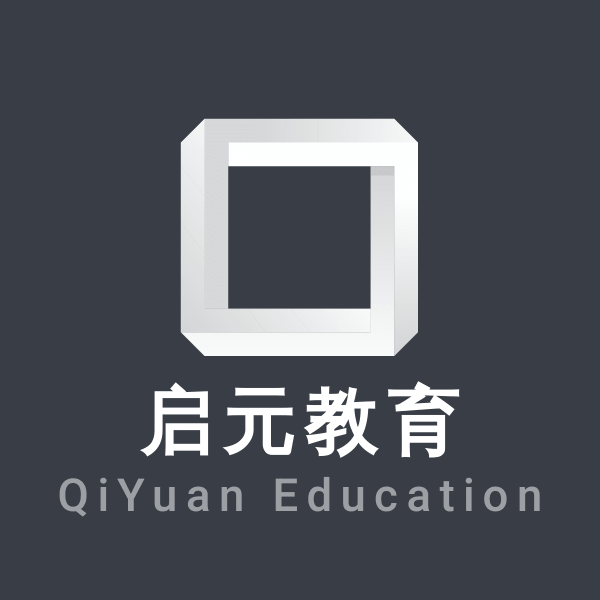

# 创业启程计划书

##### 引言：

​	”教育兴则国家兴，教育强则国家强“，习近平总书记在党的十九大上也指出，“建设教育强国是中华民族伟大复兴的基础工程，必须把教育事业放在优先位置，深化教育改革，加快教育现代化，办好人民满意的教育。要全面贯彻党的教育方针，落实立德树人根本任务，发展素质教育，推进教育公平，培养德智体美全面发展的社会主义建设者和接班人”。教育作为国家的一个国家的发展基础之一，近年来已经受到党中央和社会各界的越来越多的关注和重视。

​	但是，传统的教育方式也存在一些明显的弊端。比如传统教育的教学过程以教师“讲”为主、学生“听”为辅，学生动口、动手、动脑的机会很少，不利于发挥学习的主动性以及发展智力和能力。同时在传统的教育形式中，学生处于被动接受知识的学习状态，并不是处于一个主体地位，难以调动自身的学习积极性；同时千篇一律的教学形式也阻碍了学生个性、潜力和才能的充分发挥，阻碍了兴趣和特长的培育，无益于达成因材施教。这些都要求我们对其进行充分的改革，使其适应当下我国社会对于教育的要求。

​	在计算机技术飞速发展的今天，各种新技术层出不穷。其中比较有代表性的就是人工智能技术、VR、AR技术等先进技术，以VR技术为例，其主要通过模拟人的视觉、听觉、触觉等感觉器官的功能，实现身心感受的联结，增强学习者的感受力，使人能够沉浸在计算机所生成的虚拟世界里面，并且能够通过语言、手势，感官等自然方式与计算机进行实时交互，创造了一种以人为主的虚拟空间。使用者不仅能够通过VR系统感受到在客观物理世界中所经历的“身临其境”的逼真性，而且能够突破时间和空间以及其他客观的限制，感受到真实世界中无法亲身体验到的经历。

​	所以，我们可以看到，我们可以将VR技术可以广泛用于学习情景的创设，增加学习内容的形象性和趣味性，进而实现模拟训练。通过VR进行学习和教育，不光可以减少现实空间中某些训练操作的困难和危险，更可以使训练造价得到大幅度降低。使得世界各地的同学身处同一个空间进行学习，名师可以足不出户开课授业，学生可以足不出户访遍天下名师。

 

## 1. 公司概述

​	启元教育是由xxx创始人于2022年在xx省xx市创立的公司。公司主营教育相关的VR技术的多项业务。

### 1.1 公司理念

​	启元教育一直秉持着“让先进计算机技术在教育中得到充分利用”的社会理念，坚持运用先进技术（主要是VR技术），专注于让每一个学生都能够在虚拟现实中主动学习，提升自己的实际能力水平。公司结合多项计算机先进技术，包括虚拟现实技术、大数据技术、人工智能技术等、分布式数据中心等，使得教育突破时间和空间以及其他客观的限制，让世界各地的学生身处同一个空间进行学习，名师可以足不出户开课授业，学生可以足不出户访遍天下名师。在理论教学中，学生可以在VR技术模拟的虚拟世界中观察各种原理的可视化表现，增强自己对于相关原理的掌握和理解（比如使用VR技术表现太阳系行星系统，引导学生理解万有引力定律），从而使得学生对于理论的认识不仅仅停留在比较无趣的公式上，而是真正感受到定律的实际影响；在实践教学中，启元教育计划通过虚拟现实技术为学生创设更加真实的学习情境, 通过具体直观表征形式及生动的交互体验, 让学生在虚拟环境中学会观察、探索与实验, 从而加深学生理解知识, 激发学生兴趣, 为他们带来丰富的学习体验。通过可穿戴设备, 利用增强现实技术、移动情景感知技术、物联网技术以及教育游戏等手段, 为学生构建一个全新的智慧教育环境，实现传统教育产业的产业升级。

### 1.2 公司logo

图 1-1 “启元教育”公司 logo

(注:此图仅仅为网上找到并进行一定处理后的产物，并不代表为本人所画，侵权概不负责)

## 2. 产品或服务

### 2.1 产品

​	本公司提供的VR教育服务主要是软件和硬件服务。软件部分主要包括以下3个模块，包括面向中小学以及高校的虚拟三维实验、虚拟面对面答疑、教育游戏开发；面向职业教育行业的职业实操体验，比如安装汽车轮胎体验，装配电子产品体验等；面向安全教育（比如施工安全，火灾安全等重要安全知识）的模拟体验。

​	表格2-1 软件功能模块

| 面向对象     | 主要功能                                                     |
| ------------ | ------------------------------------------------------------ |
| 中小学及高校 | 虚拟三维实验体验、虚拟面对面答疑、开发外语、历史等教育游戏促进学习 |
| 职业教育     | 提供实操体验（比如汽车轮胎安装）                             |
| 安全教育     | 模拟常见安全相关场景（比如施工安全，火灾安全等）学习安全知识 |

​	硬件部分就是VR所依赖的对应部件，比如VR眼镜、耳机等等，计划寻找代工厂进行生产。

​	综上所述，本公司提供的整体产品包括硬件部分的VR眼镜、耳机等VR技术依赖的硬件基础、以及面向中小学、职业教育、安全教育的软件服务。

### 2.2 服务

​	公司提供以下5类服务。

#### 2.2.1 出售虚拟实验软件

​	在与合作校方及其属地的教育管理部门达成合作之后之后，综合研判中小学及高校的虚拟实验需求之后，为其开发相应的虚拟实验系统。比如为小学所使用的《科学》教科书中提到的对应的观察植物，测量纸带虚拟实验；为中学教学提供虚拟化学和物理实验，帮助其学习对应的理论知识，锻炼一定的动手能力；为大学提供对应的虚拟实验（比如为大学物理实验课程提供对应的VR模拟部分）。公司则负责向学校收取对应的开发费用，以及后续的软件维护以及服务器费用，为了摊薄公司的开发费用，公司可以在一个教学区中推广自己的软件而不是局限于单一的学校，提高自己的知名度和利润率。

#### 2.2.2 出售虚拟面对面答疑系统

​	在与合作校方及其属地的教育管理部门达成合作之后之后，为其提供公司研发的线上答疑系统，学生和教师在穿戴上对应的VR设备之后，可以在线上模拟面对面答疑体验，同时老师可以使用上述虚拟实验软件进行更进一步的讲解，提高答疑效率，老师也可以预先录制一段VR影像对于一类问题进行统一答疑，提高答疑效率。公司在这里主要收取对应开发费用和维护费用，由于一个答疑系统模板可以交付给多个学校使用，所以在推广到一定规模之后公司的利润率将会比较客观。

#### 2.2.3 出售教育游戏

​	学生在传统的教育流程中往往对于一些知识的理解只能停留在记忆层面，且在一段时间之后容易遗忘。如果使得其在交互式环境中使用自己的感官感受，可以增强其理解程度。公司可以开发特定的教育游戏，比如交互式外语学习游戏，在其背诵对应的单词的时候模拟出单词对应的物体给予学生视觉、触觉、听觉等多个感官的刺激，帮助其记忆知识；或者是历史进程模拟游戏，学生操纵历史上的一个人物做出决策，了解不同的决策背后的潜在影响，让其对于特定的历史时期有更加深入的了解。公司可以向使用者购买对应的开发费用以及后期维护费用。

#### 2.2.4 出售虚拟职业教学系统

​	部分职校缺乏所需的教学条件，学生无法进行实操获取实践经验。为缺乏对应教学条件的职校提供配套的虚拟教学系统（比如汽车装配），公司在这里主要收取开发费用和维护费用。

#### 2.2.5 出售安全教育系统

​	使用先进技术模拟危险场景，帮助学生学习对应的安全知识。以火灾为例，系统可以模拟垃圾桶发生火灾，学生可以使用虚拟的灭火器进行灭火，从中学习灭火器有效性检查，灭火器的使用流程等重要安全知识。在这里公司主要收取开发费用和维护费用。

## 3. 行业分析

### 	3.1 行业历史

​	虚拟现实在教育培训中应用的首次尝试在美国。1992年, 虚拟现实技术与教育实验室在美国东卡罗琳那大学正式成立。该实验室主要是用来确认虚拟现实技术在教育上是否适用, 并且对这一技术中的软件和硬件进行评价, 以便更好地观察虚拟现实技术对教育教学活动的推广情况。1994年, 华盛顿大学和西屋科学基金会组织了一个流动教学计划, 一辆装有虚拟设备的流动教学车在各个学校中进行教育体验, 为中小学生提供虚拟现实技术的教学服务, 并观察虚拟现实教学对提高学生兴趣和领悟能力的情况。从20世纪90年代到21世纪初, 这一时期的虚拟现实设备非常贵, 其存在沉浸感不足、三维图像的质量比较差, 交互动作发生时图像变换滞后引起晕眩感等缺陷, 只有少数游戏发烧友迷恋虚拟现实的游戏。在教育培训领域, 一般是大学和公司在基金资助下展开一些应用研究, 尙未在教育界获得实际应用。在2012年, Oculus Rift推出了VR套装 (VR头盔和数据手套) , 沉浸式虚拟装置的价格下降了很多, 沉浸式VR也获得了很大的发展和推广, 从此开始在教育界中推广。

​	

### 	3.2 行业现状

#### 	 3.2.1 VR技术在教育中应用广泛

​	VR/AR教育培训通过VR/AR技术来构建虚拟的学习体验，学生由被动接受向自主体验升级，有助于提升教学质量和行业培训效果。按照应用场景划分，虚拟现实技术在教育领域的应用主要包括中小学教育、职业教育、高等教育等方面。自从2016年VR/AR市场爆发以来，微视酷、科骏、微视威、中视典、亚泰盛世等企业纷纷布局VR/AR教育市场。

​	

#### 	 3.2.2 **中国VR/AR教育投融资市场有回暖趋势**

​	从投融资市场发展情况来看，VR/AR教育行业与VR/AR整体市场一样，行业投融资热度在2015-2016年起步时期达到最大值，2017-2018年进入遇冷期，近年来回暖趋势明显，2020年国内VR/AR教育行业投融资规模达到7.11亿元，同比增长21.96%。

​	

#### 	 3.2.3 **中国VR/AR教育前景看好**

​	随着我国教育信息化建设的不断深入，政策和资本持续利好VR/AR教育市场，VR/AR教育前景看好。根据《2020年AR/VR市场调查报告》数据显示，未来12个月中，在AR/VR结合垂直的行业应用中，有28%的受访者认为教育行业受沉浸式技术影响最大，仅次于医疗保健或医疗设备行业。

​	

#### 	 3.2.4 **我国VR/AR教育培训市场规模快速增长** 

​	近年来我国VR/AR教育培训市场快速增长，根据VR陀螺数据显示，2020年我国VR/AR教育培训市场规模为13亿元，同比增长117%;随着政策的鼓励和市场的驱动，VR/AR教育市场将持续增长，到2023年这一市场规模将到达61亿元。

​	

### 	3.3 发展趋势

​	K12、高教、职教以及各类培训场景中，VR头显和解决方案已经在发挥不可替代的作用：丰富教学手段，弥补场景缺失，规避不可控风险。各大厂商深耕教育市场脚步加快，以教育场景为代表的B端行业应用将加速落地。

​	

## 

## 4. 目标市场分析

### 	4.1 目标客户

​	 使用相应模拟实验系统的客户：各大高校，中小学。

​	 使用安全教育系统的客户：安保相关部门，以及各企业中涉及危险品操作的人员。

​	 使用教育游戏的客户： 年龄较低的学生，主要是小学生。

### 	4.2 目标市场： 规模和发展趋势	

​	 近年来政府对于VR教育行业的扶持力度逐年增大，在2015年，国家教育部办公厅印发《2015年教育信息化工作要点》，要求全面推进基础教育数字教育资源的开发与应用，鼓励企业系统开发与教材配套的基础性数字教育资源和满足广大师生需求的个性化数字教育资源，并要求大力推进职业教育和继续教育优质数字教育资源开发和应用。

​	VR教育市场空间广阔，以10%的市场普及率计算，如果每套VR教师的软硬件系统平均投入50万元，那么在2015年全国的VR教育市场就有500000 * 267800 * 0.1 = 133.8亿元。

​	目前市面上并不存在VR教育产业的上下游行业垄断者，也还没有形成行业整合，新企业能够快速进入市场盈利。

## 5. 竞争分析

### 	5.1 主要竞争对手

​	目前国内专注于发展VR教育的企业并不多，和我司能够形成直接竞争的对手也较少。可能和我司构成直接竞争的企业是智天下虚拟实验室提供的涵盖初高中物理化学实验的flash掩饰，不过由于flash技术在当下已经停止维护，在可见的未来即将被淘汰，我司开发的产品并不是基于flash技术，所以智天下虚拟实验室和我司并不构成直接竞争。其他类似的科普产品，比如google星空地图、star rover、 nasa app、 go sky watch星象仪等，类型单一，不能够为中小学等教育部门提供类似我司的综合性教育平台以满足学生的需求。

### 	5.2 进入壁垒

​	包括智天下实验室、google地图等app的市场上的主要竞争对手当前占据的市场并不大，大部分主要依靠接广告订单获取收入，这会引起用户反感，并且使用的部分技术已经过时，不利于公司的长期发展。我司与此完全不同，我们的收入来源主要是出售教育平台所带来的一次性收入以及后续的维护费用盈利，籍由与政府和学校之间建立的紧密合作关系，我们能够保证稳定的收入现金流，企业也可以借此扩展自己的业务范围。

​	当然，VR行业天然的高技术要求也提高了该行业的进入壁垒，这是不可否认的。

### 	5.3 未来竞争

​	VR行业技术壁垒较高，短期内竞争不会比较激烈，长期来看，只要及时追上VR技术潮流，以及准确把握校方需求，我司也能够和新兴企业在同一层面上竞争。

### 	5.4 企业竞争地位

​	我们的收入来源主要是出售教育平台所带来的一次性收入以及后续的维护费用盈利，籍由与政府和学校之间建立的紧密合作关系，我们能够保证稳定的收入现金流，企业也可以借此扩展自己的业务范围。

## 6. 营销计划

### 	6.1 营销组合:产品、价格、促销、渠道

#### 6.1.1 产品 

​	我们计划推出的产品已经在上面提到，分为硬件和软件两个层面。软件方面，我们提供面向中小学以及高校的虚拟三维实验、虚拟面对面答疑、教育游戏开发；面向职业教育行业的职业实操体验，比如安装汽车轮胎体验，装配电子产品体验等；面向安全教育（比如施工安全，火灾安全等重要安全知识）的模拟体验。硬件方面，我们提供和我们合作的VR设备厂商生产的VR相关依赖设备。

#### 6.1.2 价格

​	定价方面采用渗透定价策略。前期为了打开市场，对学生数量多或者地区内有名的学校的采购实行免费赠送，以便快速和校方建立紧密合作。后期在建立稳定合作之后，向校方出售其他配套软硬件平台，以及向其他欲购买VR平台的学校出售软硬件进行盈利。

#### 6.1.3 促销

​	我们计划向长期合作的老客户打折出售对应产品，以及不定期向其赠送VR教学平台，以维系稳定的合作关系。同时我们也会实行老客户推荐制度，对推荐新客户的老客户降低收费金额以进行拉新。对于新加入的客户，我们也会适当降低收费以提高其购买欲望。

​	我们也会在市中心、城市广场等地实地举办VR教学体验展，让校方快速了解我司的产品、功能和优势，同时节省了大量的线下地推成本。这样一方面宣传了公司，一方面宣传了产品，还使得客户能够现场体验，缩短了客户的决策周期。

#### 6.1.4 渠道

​	我们计划先和校方接洽，在合作意向谈成之后再和当地政府报备。

### 6.2 销售预测

​	预计产品会有力抢夺类似智天下虚拟实验室一类的老式教学工具，以及部分综合性不强的教学平台。

## 7 创业团队 

### 7.1 创业团队成员介绍 

#### 7.1.1 总经理

aaa，毕业于浙江大学计算机系，有近10年的VR教育开发经历，曾经在高途任职，2022年创办启元教育公司。

#### 7.1.2 销售总监

bbb，毕业于浙江大学经济学系，有近13年销售管理相关经历，曾经在拼多多，阿里巴巴任职，2022年参与创建启元教育公司。

#### 7.1.3 技术总监

ccc，毕业于浙江大学计算机系，有近10年的VR教育开发经历以及20年的计算机图形学经历，曾经在微软、google任职，2022年参与创办启元教育公司。

#### 7.1.4 产品总监

ddd，毕业于浙江大学软件工程专业，有15年的产品管理经历，曾经在腾讯、阿里巴巴任职，2022年参与创办启元教育公司。

### 7.2 早期核心员工介绍 

​	早期团队就是aaa、bbb、ccc、ddd

### 7.3 外部专家支持介绍

​	目前已经得到了浙江大学计算机科学与技术学院kk教授的技术支持以及angle企业老总的指导。

## 8. 重要里程碑

###  8.1 企业长期目标

​	企业在未来10年的时间里计划成为我国最大的VR教育企业之一，并计划上市。

###  8.2 成长阶段

	1. 首先，和浙江当地学校合作，推广VR教育解决方案，突破VR教育的最后一公里
	1. 在上述基础上构建校园、企业、学生协同创新的VR教学平台，打造未来线上虚拟教室，足不出户老师就在身边。
	1. 企业营业范围从浙江向周边省市扩展，扩大企业受众。
	1. 企业营业范围扩展到全国，并且在部分国外市场也占有一席之地，成为国际市场上有重要影响力的巨头之一。

## 9 关键风险

###  9.1 风险

#### 9.1.1 行业政策风险

​	近年来国家加大对于教育相关产业的管理力度，关停了一系列违反现行管理制度的企业，比如去年在线教育产业就受到了较大的影响。

#### 9.1.2 金融监管风险

​	公司主营产业涉及金融部分较少，这方面的风险较小。

### 9.2 应对策略

####  9.2.1 行业政策风险对策

​	公司在未来会紧紧关注最新政策要求，学习党对教育的最新论述，做到所营业务和政策不冲突甚至契合最新政策，以减少公司受到相关政策惩罚的可能。

####  9.2.2 金融监管风险对策

​	公司会准备充足的现金流以应对不时之需。

## 10 融资需求 

### 10.1 启动资金需求

​	由于对硬件的要求并不高，我司对于启动资金的要求并不多，暂时只需要1万元人民币。

### 10.2 自有资金 

​	我们创业团队在职场工作多年，目前自有资金加上持有的股票有约3000w元。

### 10.3 融资需求 

​	未来计划融资1000万元，出让公司10%的股份，其中500万元用在加强团队建设，VR教学解决方案研、教学内容研发中；300万元用在市场推广中；200万元用在收购同质企业以及产品运营等部分。

