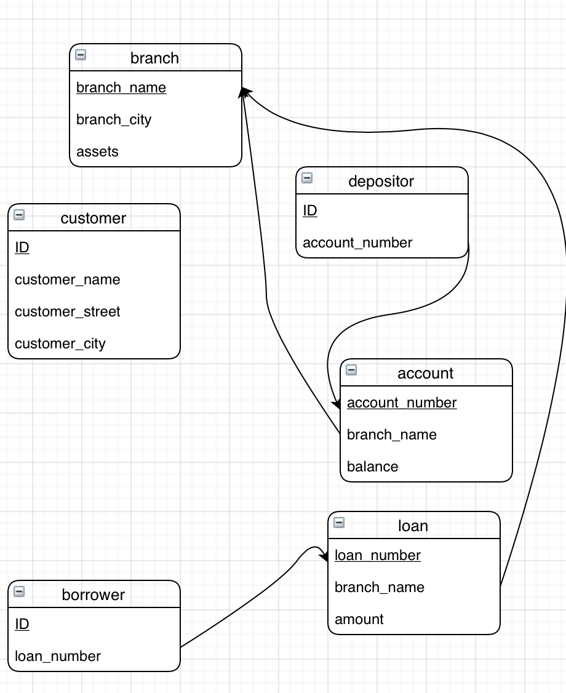

# DB HW2

3200105872	庄毅非

##### 2.7 Consider the bank database of Figure 2.18. give an expression in the relational algebra for each of the following queries

a. Find the name of each branch located in "Chicago".

Answer:
$$
\Large{\Pi_{branch\_name}({\sigma_{branch\_city = 'Chicago'}(branch)})}
$$

b. Find the ID of each borrower who has a loan in branch "Downtown"

Answer:

$$
\Large
\Pi_{ID}{
(\sigma_{branch\_name = 'Downtown'}(loan \underset{loan.loan\_number = borrower.loan\_number}\Join borrower))
}
$$

##### 2.12 Consider the bank database of Figure 2.18. Assume that branch names and customer names uniquely identidy branches and customers, but loans and accounts can be associated with more than one customer.

a. What are the appropriate primary keys?

Answer: 

| table     | primary key           |
| --------- | --------------------- |
| branch    | branch_name           |
| customer  | ID (or customer name) |
| loan      | loan_number           |
| borrower  | ID                    |
| account   | account_number        |
| depositor | ID                    |

b. Given your choice of primary keys, identify appropriate foreign keys.

Answer:

​	branch_name in loan is the foreign key of branch_name in table 'branch'.

​	loan_number in borrower is the foreign key of loan_number in table 'loan'.

​	branch_name in account is the foreign key of branch_name in table 'branch'

​	account_number in depositor is the foreign key of account_number in table 'account'.

##### 2.13 Construct a schema diagram for the bank database of Figure 2.18.

Answer:

​	

##### 2.15 Consider the bank database of Figure 2.18. Give an expression in the relational algebra for each of the following queries:

1. Find each loan number with a loan amount greater than $10000.

Answer:	
$$
\Large
\Pi_{loan\_number}(\sigma_{amount > 10000}(loan))
$$

2. Find the ID of each depositor who has an account with a balance greater than $6000.

Answer:
$$
\Large
\Pi_{ID}(\sigma_{balance > 6000}(depositor \underset{depositor.account\_number = account.account\_number} \Join account))
$$

3. Find the ID of each depositor who has an account with a balance greater than $6000 at the “Uptown” branch.

Answer:
$$
\Large
\Pi_{ID}(\sigma_{balance > 6000 \wedge branch\_name = 'Uptown' }(depositor \underset{depositor.account\_number = account.account\_number} \Join account))
$$

