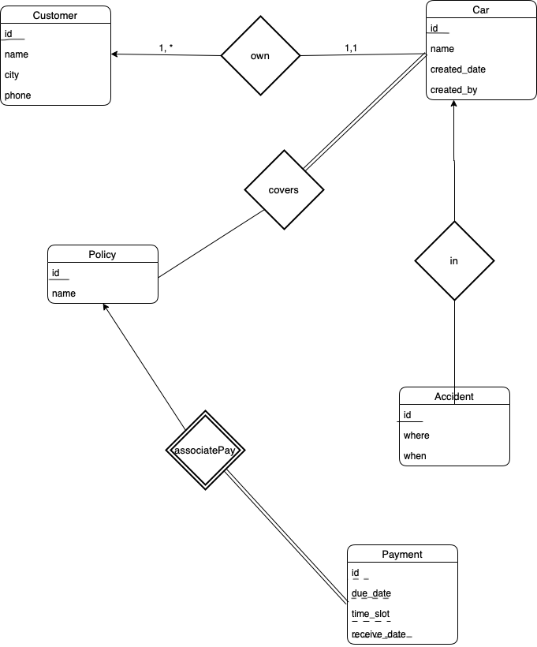
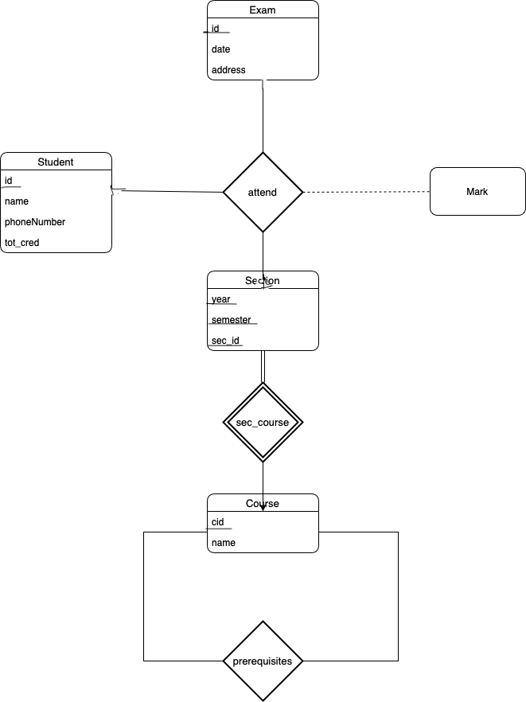
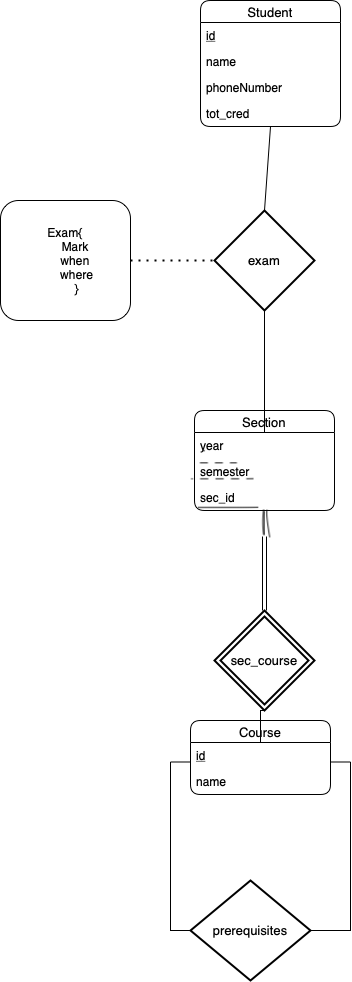
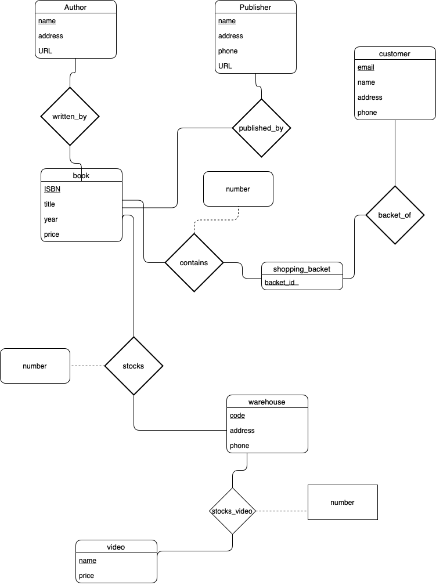
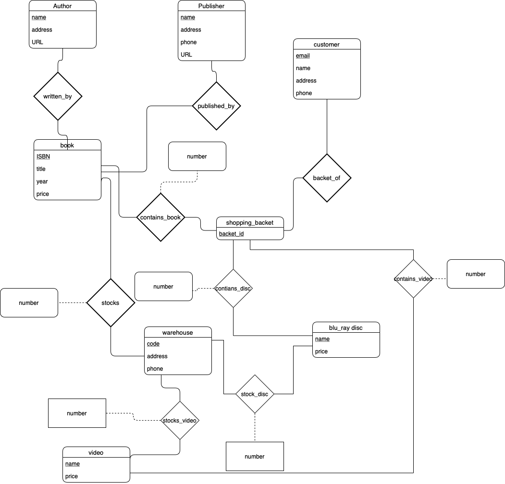

# database system principle

3200105872 庄毅非

##### 6.1 Construct an E-R diagram for a car insurance company whose customers own one or more cars each. Each car has associated with it zero to any number of recorded accidents. Each insurance policy covers one or more cars and has one or more premium payments associated with it. Each payment is for a particular period of time, and has an associated due date, and the date when the payment was received.

Answer: 

##### 6.2  Consider a database that includes the entity sets *student*, *course*, and *section* from the university schema and that additionally records the marks that students receive in different exams of different sections.

1. Construct an E-R diagram that models exams as entities and uses a ternary relationship as part of the design.

​	

2. Construct an alternative E-R diagram that uses only a binary relationship between *student* and *section*. Make sure that only one relationship exists between a particular *student* and *section* pair, yet you can represent the marks that a student gets in different exams.

   

##### 6.21 Consider the E-R diagram in Figure 6.30, which models an online bookstore.

a. Suppose the bookstore adds Blu-ray discs and downloadable video to its collection. The same item may be present in one or both formats, with dif- fering prices. Draw the part of the E-R diagram that models this addition, showing just the parts related to video.

Answer: just adding a entity set video having a relation (stock_video) with stock

b. Now extend the full E-R diagram to model the case where a shopping bas- ket may contain any combination of books, Blu-ray discs, or downloadable video.

Answer: 

