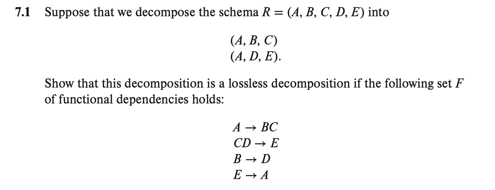

# db hw7

3200105872 庄毅非

7.1 

Answer: From the functional dependencies set we can get that $A^+$ = R,so that A is a candidate key for relation R. Denote R1 = (A,B,C) and R2 = (A,D,E), since $R1 \bigcap R2$ = A, which is a candidate key. So this decomposition is a lossless decomposition.

##### 7.13 Show that the decomposition in Exercise 7.1 is not a dependency-preserving decomposition.

Answer: It's clearly that function dependency $CD \rightarrow E$ , $B\rightarrow D$ and $E \rightarrow A$ are all not preserved in result set.

##### 7.21 Give a lossless decomposition into BCNF of schema *R* of Exercise 7.1.

Answer: From the FD set we can see that A is not candidate key for the attribute set. Then FD $A\rightarrow BC$ violate BCNF's definition, we can split R into R1 = (A,B,C,E) and R2 = (B, D), which is a BCNF schema.

##### 7.22  Give a lossless, dependency-preserving decomposition into 3NF of schema *R* of Exercise 7.1.

Answer: We can split the original set R into R1 = (A,B,C), R2 = (C,D,E), R3 = (B,D) and R4 = (A,E) and we know that R1 contians a candidate key (A), so (R1,R2,R3,R4) is a 3nf decomposition.

##### 7.30 Consider the following set *F* of functional dependencies on the relation schema (*A*, *B*, *C*, *D*,*E*,*G*):

$$
\begin{align}
& A \ \rightarrow BCD \\
&BC \ \rightarrow DE \\
&B \ \rightarrow D \\
&D \ \rightarrow A
\end{align}
$$

a. compute $B^+$

Answer: $B^+$ = ABCDE

b. Prove (using Armstrong’s axioms) that *AG* is a superkey.

Answer: 

$$
\begin{align}
\because &A \ \ \rightarrow BCD \\
\therefore & A^+= ABCD \  \ \ (by\ definition\ of\ attribute's \ closure)\\
\because & BC \rightarrow DE \\
\therefore & A^+ = ABCDE \ \ \ (transitivity \ rule)\\  
\therefore & (ABCDEG) \subset (AG)^+ \\
\because &(AG)^+ \subset (ABCDEG) \\
\therefore &(AG)^+ = (ABCDEG)
\end{align}
$$

c. Compute a canonical cover for this set of functional dependencies *F*; give each step of your derivation with an explanation.

Answer: 

step 1: remove column `D` in the right side of $BC \rightarrow DE$. Since it is an extraneous attribute, since before and after we remove it, the closure for BC is always ABCDE.

step 2: remove column `D` in the right side of A $\rightarrow$ BCD, since B $\rightarrow$ D  

step 3: remove column `C` in the left side of BC -> E, since $B^+$ contains C.

step 4: conbine B -> E and B -> D.

step 3: we can deduce that current funciton dependency and the original FD are equivalent to each other, and there is no extraneous attributes any more. So FD 
$$
\begin{align}
& A \ \rightarrow BC \\
&B \ \rightarrow DE \\
&D \ \rightarrow A
\end{align}
$$
is the canonical cover we want.

d. Give a 3NF decomposition of the given schema based on a canonical cover.

Answer: From question we can get R1 = (A,B,C), R2 = (B,D,E), R3 = (D,A). After removing redundant set, result we get is (R1 = (A,B,C), R2 = (B,D,E),R3 = (D,A)). Since there is no candidate key, we add a set R4 = (A,G). So final result is R1 = (A,B,C) and R2 = (B,D,E),R3 = (D,A),R4 = (A,G)

e. Give a BCNF decomposition of the given schema using the original set *F* of functional dependencies.

Answer: 

step 1: FD $B \rightarrow CDE$ violates BCNF's definititon, so we split R into $R1 = (\underline{B},C,D,E),R1^{'} = (A,B,G)$,we can see R1 is a BCNF.

step 2: FD $A \rightarrow B$ voilates BCNF's definition, so we can split $R1^{'}$ into  $R2 =( \underline{A},B)$, $R2^{'} = (\underline{A},\underline{G})$, then we can see R2 and $R2^{'}$ both satisfy BCNF's defintiion.

step 3: Final result is $R1 = (\underline{B},C,D,E),R2 =( \underline{A},B),R3 = (\underline{A},\underline{G})$

