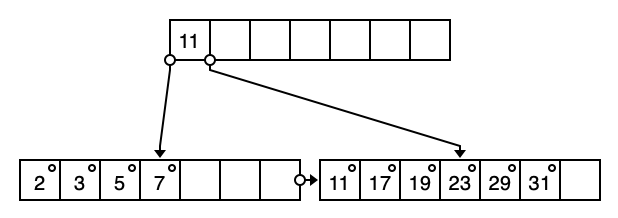
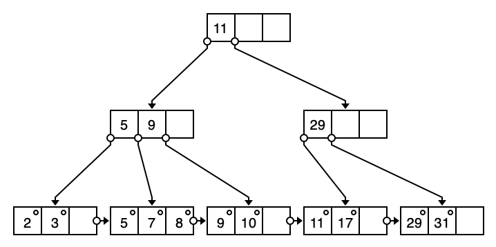
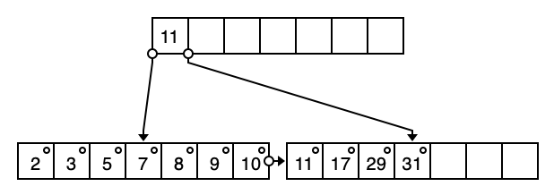

# db hw9

3200105872 庄毅非

#### 1. Construct a B+-tree for the following set of key values: (2, 3, 5, 7, 11, 17, 19, 23, 29, 31). Assume that the tree is initially empty and values are added in ascending order. Construct B+-trees for the cases where the number of pointers that will fit in one node is as follows:

##### Answer: 

##### 	a. Four	

​	

##### 	b. Six

​	

##### 	c. Eight

​	

##### 14.4 For each B+-tree of Exercise 14.3, show the form of the tree after each of the following series of operations:

##### Answer: 

##### 	For tree a: 

 1. Insert 9.

    

 2. Insert 10

    

 3. Insert 8

    

 4. Delete 23

    

 5. Delete 19

    

##### For tree b

1. Insert 9

   

2. Insert 10

   

3. Insert 8

   

4. Delete 23

​	

5. Delete 19

   

##### For Tree c

1. Insert 9.

   

2. Insert 10.

   

3. Insert 8.

   

4. Delete 23.

   

5. Delete 19.

   

##### 14.11 In write-optimized trees such as the LSM tree or the stepped-merge index, en- tries in one level are merged into the next level only when the level is full. Suggest how this policy can be changed to improve read performance during periods when there are many reads but no updates.

##### Answer:

​	 Since there are no updates, we can merge indexs in one level (denoted as level l) to next level even if current level is not full. Then when we do a read operation, there is no need for us to check indexs in level l since we wrote them to level l + 1 before, thus improving read performance.