# DB LAB2

班级：软工2002 学号：3200105872 姓名：庄毅非

实验目的：熟悉sql操作

实验平台：mysql workbench 8.0 on macos

实验内容和要求

1. 建立数据库
2. 数据定义：建立/修改/删除表格，建立/删除索引,建立/删除视图
3. 数据更新:插入/更新/删除数据
4. 数据查询，单表/多表/嵌套子查询
5. 视图操作，通过视图查询/修改数据


实验过程：

1. 建立数据库

   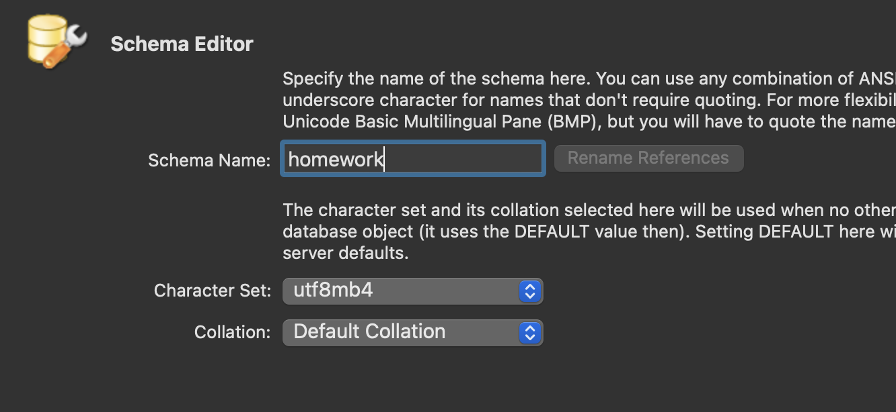

   

2. 数据定义

   2.1 表的建立

   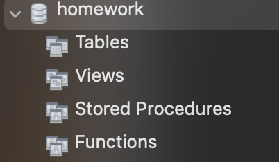

   一开始数据库中还没有表，使用以下语句创建表

   ```sql
   use homework;
   
   create table student(
   	studentID varchar(5) primary key,
   	name varchar(20) not null,
   	dept_name varchar(20)
   );
   ```

   现在数据库中多了一张表

   

   
   
   2.2 表的修改
   
   ```sql
   alter table student add haveGraduated boolean;
   ```
   以下是修改前后的变化
   
   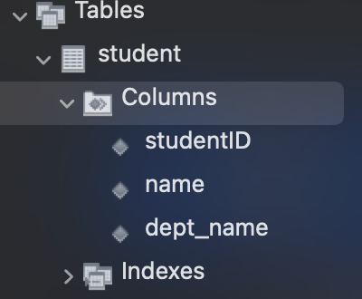
   
   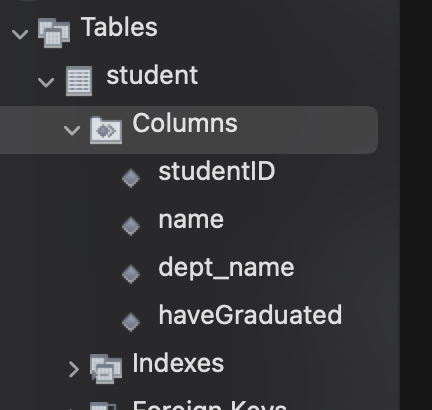 


   2.3  表的删除

    ```sql
    drop table student;
    ```

   2.4 索引的建立

   ```sql
   create index nameIndex on student(name);
   ```

   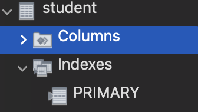

   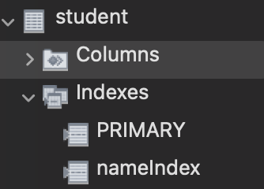

   2.5 索引的删除

   ```sql
   drop index nameIndex on student;
   ```

   2.6 创建视图

   ```sql
   create view phyStudent 
   as select * from student where dept_name = 'Physics'
   ```

   

   2.7 删除视图

   ```sql
   drop view phystudent
   ```
### 3. 数据更新

   3.1 插入数据

```sql
insert into student values('12345','john','Physics',0);
insert into student values('85625','alice','Physics',0);
insert into student values('52807','cris','Physics',0);
insert into student values('47928','tom','computer science',0);
insert into student values('24292','jerry','Physics',0);
insert into student values('49605','gg','Physics',0);
insert into student values('91079','andy','math',0);
insert into student values('85001','joe biden','law',0);
select * from student
```

结果：	

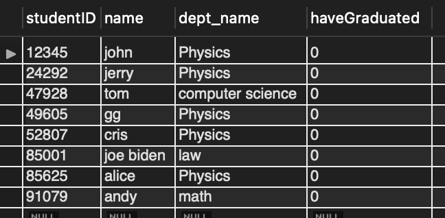

   3.2 修改数据

 ```sql
 update student 
 set haveGraduated = 1
 where name = andy;
 ```

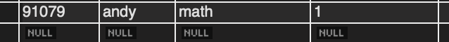

可以看到andy的毕业属性被修改为1

3.3 删除数据

```sql
delete from student
where name = 'andy';
```

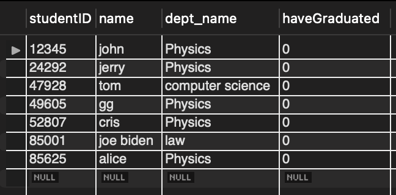

可以看到,andy相关的数据被删除了

### 4. 数据查询

  4.1 单表查询

    ```sql
    select studentId,name from student where dept_name = 'Physics';
    ```

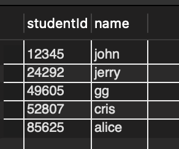

4.2 多表查询

```sql
# 建立另一个表
create table takes(
id int primary key auto_increment,
sid varchar(5) not null,
cid varchar(5) not null,
gpa double
);

insert into takes(sid,cid,gpa) values(12345,1,5.0);
insert into takes(sid,cid,gpa)  values(12345,2,4.8);
insert into takes(sid,cid,gpa)  values(85625,2,3.0);
insert into takes(sid,cid,gpa) values(52807,3,2.0);
insert into takes(sid,cid,gpa)  values(49605,2,3.4);
insert into takes(sid,cid,gpa)  values(47928,4,1.1);
insert into takes(sid,cid,gpa)  values(47928,3,2.2);
insert into takes(sid,cid,gpa)  values(91079,5,4.3);
insert into takes(sid,cid,gpa)  values(49605,2,5.0);
insert into takes(sid,cid,gpa)  values(85625,3,4.5);
insert into takes(sid,cid,gpa)  values(49605,2,3.0);
# 多表查询
select studentID,name,gpa
from student, takes
where student.studentID = takes.sid;
```

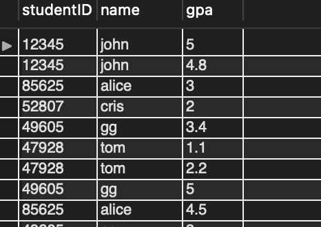

4.3 嵌套子查询

```sql
select name,sid,gpa from (select sid,gpa from takes where cid = 2) as e, student where e.sid = student.studentID order by gpa desc limit 1;
```


### 5. 视图操作

  5.1 视图数据查询

```sql
select * from phyStudent;
```

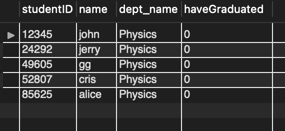

  5.2 视图数据修改

```sql
update phyStudent
set haveGraduated = 1
where name = john;
```

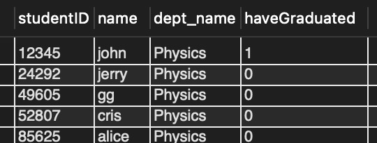

可以发现，john的数据信息被更新
