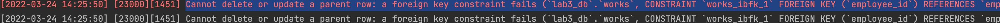

# 数据库系统 实验3

3200105872 庄毅非

## 实验过程

1. 定义若干表，包含primary key,foreign key,check的定义

```sql
use lab3_db;

create table employee (
	uid char(10),
    age int not null,
    sex char(1),
    name varchar(20),
    street varchar(20),
    city varchar(20),
    primary key(uid),
    check(sex in ('M','F')),
    check(age > 0)
);


create table works(
	id int,
    employee_id char(10),
    work_id char(20),
    salary numeric(12,2),
    primary key(id),
    foreign key(employee_id) references employee(uid),
    check(salary >= 0)
);
```


2. 想表中插入数据，考察primary key 如何控制实体完整性

```sql
#首先插入四条数据
insert into employee values('1234567890',1,'M','test-1','yuhangtang','hangzhou');
insert into employee values('1234567450',1,'F','test-2','yuhangtang','hangzhou');
insert into employee values('1234564390',1,'M','test-3','yuhangtang','hangzhou');
insert into employee values('1234561290',1,'F','test-4','yuhangtang','hangzhou');
```

此后，插入和第一个元组主键一致的新元组

```sql
insert into employee values('1234567890',1,'F','test-5','yuhangtang','hangzhou');
```

mysql报错：`[23000][1062] Duplicate entry '1234567890' for key 'employee.PRIMARY'`

3. 删除被引用表中的行，考察foreign key中on delete 子句如何控制参照完整性

   首先先在works表中插入和employee表中第一条记录对应的新元组。

   ```sql
   insert into works(id, employee_id, work_id, salary) values(1,'1234567890','123',12.2);
   ```

   之后尝试删除employee表中的第一个元组

   ```sql
   delete from employee where uid = '1234567890';
   ```

   在关闭safe mode的条件下，抛出错误:

   ```sql
   Cannot delete or update a parent row: a foreign key constraint fails (`lab3_db`.`works`, CONSTRAINT `works_ibfk_1` FOREIGN KEY (`employee_id`) REFERENCES `employee` (`uid`))
   ```

   


4. 修改被引用表中的行的primary key，考察foreign key 中on update 子句如何控制参照完整性。

   ```sql
   update employee
   set uid = '1231231231'
   where name = 'test-1';
   ```

   结果发生了一样的错误:

   ```sql
   Cannot delete or update a parent row: a foreign key constraint fails (`lab3_db`.`works`, CONSTRAINT `works_ibfk_1` FOREIGN KEY (`employee_id`) REFERENCES `employee` (`uid`))
   ```

   


5. 修改或插入表中数据，考察check子句如何控制校验完整性

   执行`insert into employee values('1234asd90',-1,'L','test-5','yuhangtang','hangzhou');`

   mysql报错：`Check constraint 'employee_chk_1' is violated.`

   

6.  定义一个asseration, 并通过修改表中数据考察断言如何控制数据完整性。

   ```sql
   create assertion assertion_age check
   (not exists (select * from employee where city = 'New York'))
   ```

   不过mysql 8.0似乎不支持断言，想要实现类似目的的话，可以使用触发器。

7. 定义一个trigger, 并通过修改表中数据考察触发器如何起作用。

   定义的trigger,每次向employee表中插入一个员工，works表中所有员工的薪水改为原来的1.1倍

   ```sql
   delimiter //
   create trigger employee_trigger
       after insert on employee
       for each row
       begin
           update works
               set salary = salary * 1.1;
       end //
   
   delimiter ;
   ```

   插入数据之前的works表：

   

   现在向employee表中插入新的数据

   ```sql
   insert into employee values('12345asd0',2,'F','test-7','yuhangtang','hangzhou');
   ```

   可以看到两个表都发生变化：

   works表：

   

   employee表：
   

