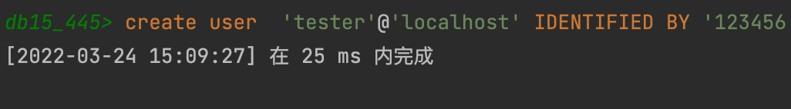
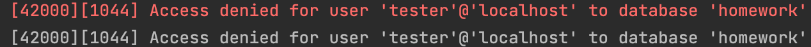
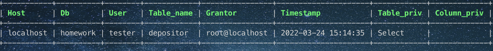
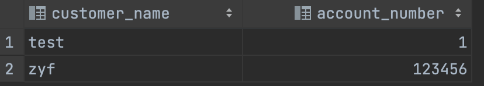
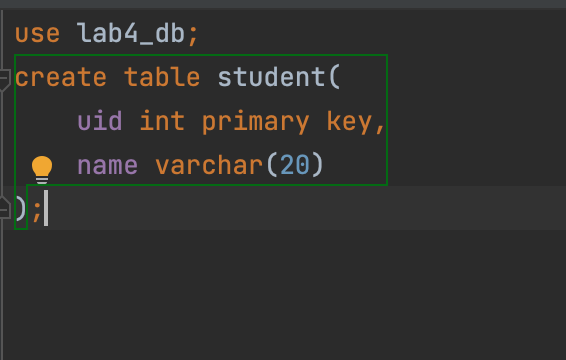
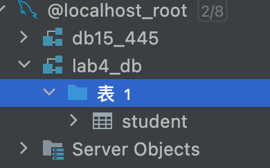
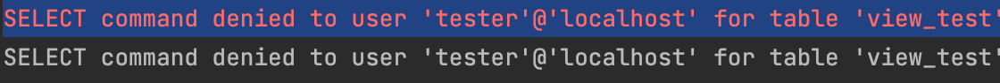
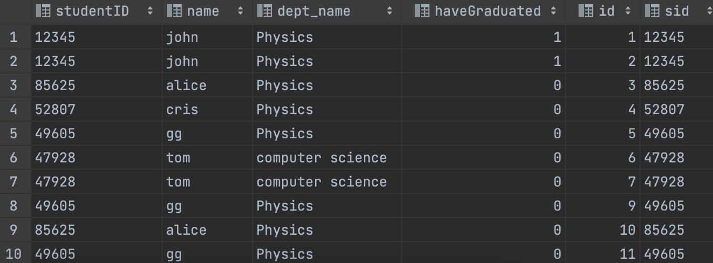

# 数据库系统 实验4

3200105872 庄毅非

## 实验过程

1. 在使用root身份登录数据库之后，创建新的用户`tester`

   ```sql
   create user  'tester'@'localhost' IDENTIFIED BY '123456';
   ```

   结果如下

   

2. 使用新的用户登录数据库，可以发现，用户查询root拥有的数据表depositor

   ```sql
   select * from homework.depositor
   ```

   

3. 回到root，给该用户授权

   ```sql
   grant select on homework.depositor to 'tester'@'localhost'
   ```

   

   查看tester@localhost拥有的权限

   ```sql
   show grants for 'tester'@'localhost
   ```

   结果如下

   ​	

   查看在表depositor上拥有权限的用户

   ```sql
   select * from mysql.tables_priv where table_name = 'depositor'
   ```

   

4. 回到tester@localhost身份,指令成功执行

   

5. 收回权限

   ```sql
   revoke select on homework.depositor from 'tester'@'localhost'
   ```

6. 建立表，考察表的生成者拥有该表的哪些权限。

   首先，以root身份授予tester在lab4_db上建立数据表的权限

   ```sql
   grant create on lab4_db.* to 'tester'@'localhost';
   ```

   接下来，以tester身份建立数据表student

   

   root身份查看，发现表创建成功

   

   发现表创建成功。

7. 使用SQL 的grant 和revoke命令对其他用户进行授权和权力回收，考察相应的作用。

   这一步在上述过程中已经完成

8. 建立视图，并把该视图的查询权限授予其他用户，考察通过视图进行权限控制的作用。

   首先，以root身份在数据库homework中创建视图view_test

   ```sql
   use homework;
   create view view_test as
   select * from student join takes 
   on (student.`studentID` = takes.sid);
   ```

   在tester权限下，执行select * from homework.view_test,报错

   

   root授权

   ```sql
   grant select on homework.view_test to 'tester'@'localhost';
   ```

   在执行对视图查询，成功：
   

   通过设置合适的视图权限，我们可以设置特定的用户或角色可视的数据库内容。

   


