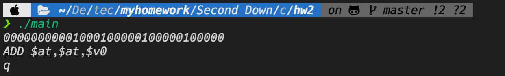

# 计算机系统原理 第二周作业

##### 庄毅非 3200105872 软工2002 

## 作业目标：

​	实现一个简单的mips反汇编器，将机器码转换到MIPS汇编指令

## 程序结构：

```c++
// convert string to uint32_t
uint32_t stringUint32(string &input);
// convert int to string
string intToString(int code);
// remove space around string
void trim(string &str);
// class of mips instruction
class instruction {...};

class DisAssembler {
 public:
  // mapping from register number to register name
  inline static map<int, string> registerMap = {...}
  /*
    op: operation code
    rs,rt,rd: register
    sa,fun,dat,adr: remain data in back of instruction
  */
  uint32_t op = 0, rs, rt, rd, sa, fun = 0, dat, adr;
  // concat a string in a list
  string concatStrings(initializer_list<string> il);
  /*
    @param:  operation: the machine operation code consist of 1s and 0s
    @return: mips assemble command like add $a0,$a1,$a2
  */
  string disAssemble(uint32_t operation);
};
// mips instruction container
static vector<instruction> instInfo(51);
// read in metadata for all instructions like 'operation code' 'fun' etc into vector instInfo.
void init();
```


​	主要部分是一个mips反汇编器，函数`DisAssembler::disAssemble`是进行反汇编的成员函数

## 作业思路及实现

​	这次作业要实现的是一个简易反汇编器，要求是将输入的32位整数(int)转换为类似`add $a0, $a1, $a2`这样的汇编指令。因此我首先对mips的汇编指令（不包括伪代码），进行按照其输出格式的不同大致分为以下几类：

​	

| 类型 | 格式                    | 成员                                          |
| ---- | ----------------------- | --------------------------------------------- |
| I    | instruction r,dat       | LUi,BEGZAL                                    |
| R    | instruction r1,r2,r3    | ADD,SUB,SLT,SLTu,AND,OR,XOR,NOR,SRLv,SRAv,MUL |
| D    | instruction r1,r2,dat   | ADDI,SLTi,SLTiu,ANDi,XORi,SLL,SRL,SRA,BEQ,BNE |
| H    | instruction rt,data(rs) | LW,LWx,LH,LHx,LHu,LHux,SW,SWx,SH,SHx          |
| J    | instruction adr         | J,JAL                                         |
| U    | instruction r1          | MFHi,MFLo,MTHi,MTLo                           |
| P    | instruction r1,r2       | JALr,MFC0,MTC0,MULT,MULTu,DIV,DIVu            |
| S    | instruction             | ERET,SYSCALL                                  |

​	在处理输入的指令的时候，首先读取其前六位（使用移位运算）和最后六位（也就是fun）并在上述类型中寻找对应的指令，如果没找到，就抛出异常；如果找到，那么按照上述'格式'读取其各位信息后，将其对应的汇编指令输出，其中寄存器名称在一个预先建立的map<int,string>中寻找。


## 使用方法

​	解压之后，进入本文件夹，运行`cmake .; make`命令，之后运行`./disAssembler`即可。

​	或者直接运行executable文件夹中的可执行文件，如果是windows用户就是disAssembler.exe文件，macos的话就是disAssembler文件


## 测试结果及分析


​	


​	如图所示，输入汇编机器码之后，程序给出了其对应的指令，输入q可以退出程序，如果机器码长度不正确或者是指令不存在，会输出错误信息。


## 主要函数

```c++
/*
  @param:  operation: the machine operation code consist of 1s and 0s
  @return: mips assemble instruction like add $a0,$a1,$a2
*/
string DisAssembler::disAssemble(uint32_t operation) {
  //进行移位运算，获取op等关键信息
  op = operation >> 26;
  rs = (operation >> 21) & 0x0000001f;
  rt = (operation >> 16) & 0x0000001f;
  rd = (operation >> 11) & 0x0000001f;
  sa = (operation >> 7) & 0x0000001f;
  fun = (operation)&0x0000003f;
  dat = (operation)&0x0000ffff;
  adr = (operation)&0x03ffffff;
  //如果op不是0或者16，那么将fun置为0（因为其他命令基本后六位都不是fun，不置为0可能会干扰类型的判断）
  if (op != 0 && op != 16) fun = 0;
  // 在预先读取的instInfo向量中寻找op和fun指令相同的指令
  string result;
  auto type = find_if(
      instInfo.begin(), instInfo.end(),
      [&](instruction &i) -> bool { return i.op == op && i.fun == fun; });
  // 指令不存在，抛出异常
  if (type == instInfo.end()) 
    throw runtime_error("cannot parse this instrution");
    
  switch (type->type) {
    // type R: instruction r1,r2,r3
    case ('R'):
      result = concatStrings({type->name, " ", registerMap[rd], ",",
                              registerMap[rs], ",", registerMap[rt]});
      break;
    // type I: instruction r1,dat
    case ('I'):
      result = concatStrings(
          {type->name, " ",
           (type->name == "LUi" ? registerMap[rt] : registerMap[rs]), ",",
           to_string(dat)});
      break;
    // type D: instruction rt,ts,dat
    case ('D'):
      result = concatStrings({type->name, " ", registerMap[rt], ",",
                              registerMap[rs], ",", to_string(dat)});
      break;
    // type H: instruction rt,data(rs)
    case ('H'):
      result = concatStrings({type->name, " ", registerMap[rt], ",",
                              to_string(dat), "(", registerMap[rs], ")"});
      break;
    // type ​J: instruction adr
    case ('J'):
      result = concatStrings({type->name, " ", to_string(adr)});
      break;
    // type P: instruction r1,r2
    case ('P'):
      if (type->name == "JALr")
        result = concatStrings(
            {type->name, " ", registerMap[rs], ",", registerMap[rd]});
      else if ((type->name == "MFC0")) {
        if (rs == 0)
          result = concatStrings(
              {type->name, " ", registerMap[rt], ",", registerMap[rd]});
        else
          result = concatStrings(
              {"MTC0", " ", registerMap[rt], ",", registerMap[rd]});
      } else
        result = concatStrings(
            {type->name, " ", registerMap[rs], ",", registerMap[rt]});
      break;
    // type S:​ instruction
    case ('S'):
      result = std::move(type->name);
      break;
    // type ​U: instruction r1
    case ('U'):
      if (type->name == "MFLo" || type->name == "MFHi") {
        result = concatStrings({type->name, " ", registerMap[rd]});
      } else {
        result = concatStrings({type->name, " ", registerMap[rs]});
      }
      break;
  }
  return result;
}
```


