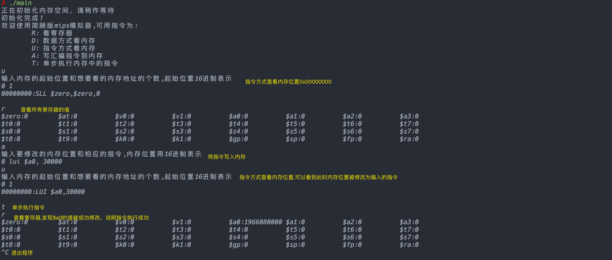

#计算机系统原理 作业4 模拟器
3200105872 庄毅非
###实现命令：  
>R-看寄存器，
    D-数据方式看内存，
    U-指令方式看内存，
    A-写汇编指令到内存，
    T-单步执行内存中的指令

初始状态下PC值为0，支持大部分简单指令
### 使用方法
进入本目录，运行make，之后出现的main文件即为所需的可执行文件

###程序运行截图

运行过程中，首先查看内存和寄存器的值，之后使用a命令将指令`lui $a0, 30000`写入内存，之后执行该指令，可以发现寄存器的值被成功修改了