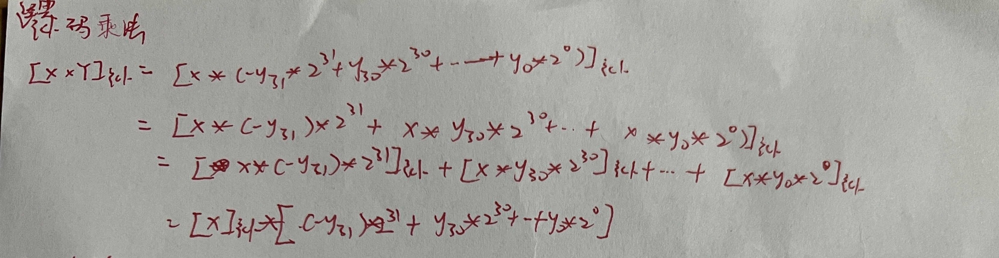
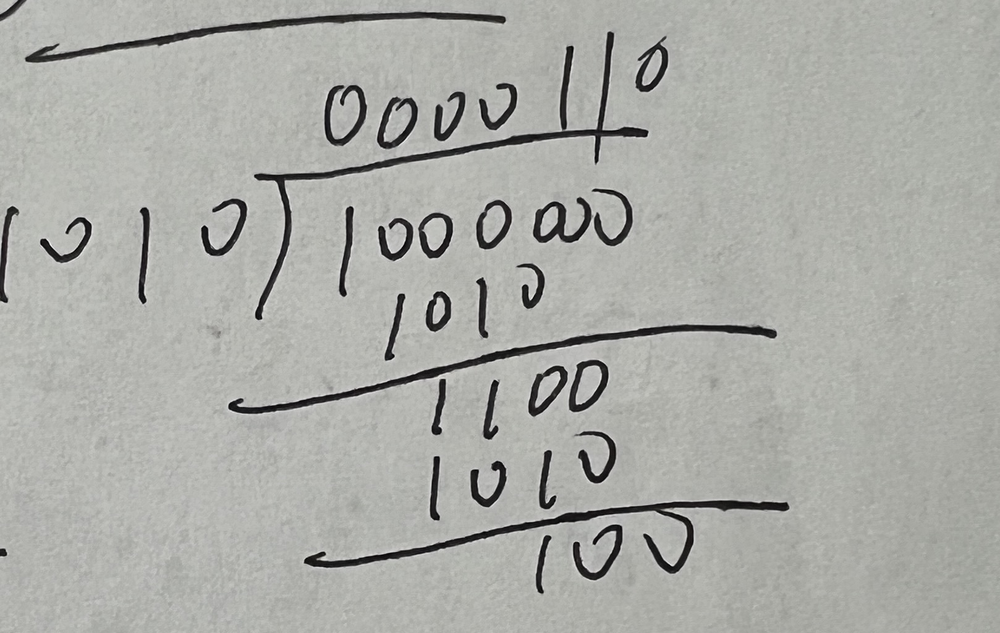
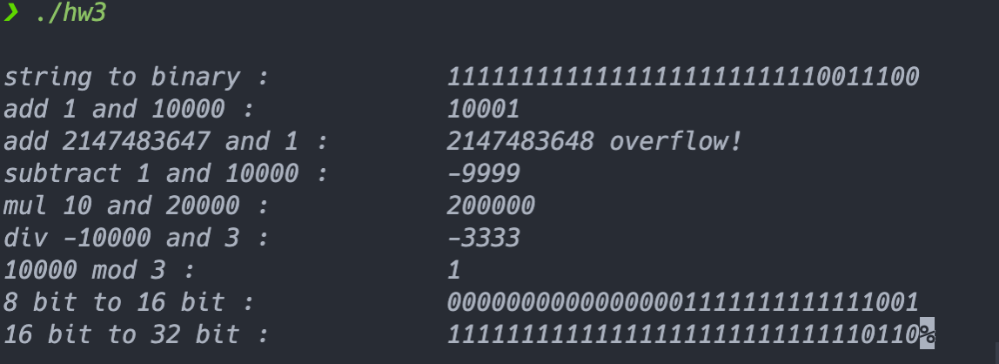

# 计算机系统原理 第六周作业

###### 3200105872  庄毅非

### 选择补码进行运算分析
1. 补码加法： 补码加法就是直接将两个数字的补码各位直接相加即可,因为如果将两个加数(记作a,b)看做无符号整数，那么其无符号形式可记为&a mod 2 ^ k \ b mod 2 ^ k&,那么加法器的输出就是($(a mod 2 ^ k + b mod 2 ^ k) mod 2 ^ k$)，可以化简为$(a + b) mod 2 ^ k$，从而可以得知两个数字补码相加的结果可以表示为其直接相加结果在k位加法器中的补码表示。比如 8 + 12, 就可以转化为01000 + 01100  = 10100 (也就是20的补码)

2. 补码减法： 补码减法可以转化为一个被减数加上减数的相反数的补码的问题，这样减法问题就转化为某种形式的加法问题，直接使用上述结论求解。 比如8 - 12 就可以转化为 8 + (-12),也就是01000 + 10100 = 11100 ， 得到的最终结果就是-4的补码。

3. 补码乘法： 
	推导： 如果将a、b视为无符号整数，那么启程发结果在k为乘法器中就可以表示为$((a mod 2 ^k)(b mod 2 ^ k)) mod 2 ^k$，化简为$(ab) mod 2 ^ k$，从而两个数字相乘，如果将其使用补码表示，那么补码相乘的结果就是实际乘法结果在k位乘法器中的补码表示。
	算法：我查阅资料得知，补码乘法领域常用的算法是一个叫做booth算法的乘法算法，其主要思路之一就是减少乘法中执行的加法次数。执行层面就是在待乘的一个数字(比如y)后面加上额外位0，之后从后往前进行遍历，如果最后的两位是10.那么将结果加上(-X)的补码（X表示另一个乘数）；如果最后的两位是01，那么结果加上X的补码，以上两步在执行完之后都要右移（除了最后一步）；如果最后两位是11或者是00，那么直接将Y和结果同时右移。在遍历结束的时候就可以得到乘法结果在k位乘法器中的表示。
	
	

   例子：

​	6 x 6

​	0000110

   x0000110

<hr>

   00001100

  000011000

<hr>

  000100100

截断可得结果为32 + 4 = 36


4. 补码除法

   整数补码除法也可以列竖式解决，先比较被除数和除数之间的大小关系，如果被除数大于等于除数，那么被除数减去除数，商加上1，直到余数小于除数，除法结束。

   例子：64 / 10 = 6 ... 4

   

编码比较

1. 原码：

   优点：简单直观，符合直觉

   缺点：不能直接参加运算，直接表示0有二义性

2. 反码/补码：

   优点：解决负数加法运算问题，将减法运算转换为加法运算，简化运算规则。

   缺点：暂无

3. 移码：
   能够便捷的解决数大小比较问题


字位扩展：
	如果是补码，那么直接在前面补上符号位的数字即可


运算溢出：
	如果两个数字补码符号相同，计算之后得到一个符号相反的数字，那么就是发生了数字溢出。


大小比较：
	直接比较两个数字的移码（使用无符号表示形式）即可。


## 程序实现

```C++
#include <iostream>
#include <string.h>
#include <bitset>
#include <iomanip>
using namespace std;
typedef unsigned int word;
bool hasOverflow = false;
uint16_t __8To16(uint8_t input)
{
    uint16_t res = 0;
    for (int i = 0; i < 8; i++)
        res |= (input & (1 << i));
    for (int i = 8; i < 16; i++)
    {
        res |= ((input >> 7) << i);
    }
    return res;
}
uint32_t __16To32(uint16_t input)
{
    uint32_t res = 0;
    for (int i = 0; i < 16; i++)
        res |= (input & (1 << i));
    for (int i = 16; i < 32; i++)
    {
        res |= ((input >> 15) << i);
    }
    return res;
}
int compare(word a, word b)
{
    if ((((a >> 31) & 1) == 1) && !(((b >> 31) & 1) == 1))
        return -1;
    else if (!(((a >> 31) & 1) == 1) && (((b >> 31) & 1) == 1))
        return 1;
    else
    {
        for (int i = 30; i >= 0; i--)
        {
            int temp = ((a >> i) & 1) - ((b >> i) & 1);
            if (temp == -1)
                return -1;
            else if (temp == 1)
                return 1;
        }
    }
    return 0;
}
//字符串转换成对应的二进制
// 输入： -8, 输出0xfffffff0
word atom(const char *input)
{
    return static_cast<word>(strtol(input, NULL, 10));
}
char *mtoa(word input)
{
    auto temp = bitset<32>(input);
    char *res = new char[33];
    for (int i = 0; i < 32; i++)
    {
        res[i] = temp.test(31 - i) ? '1' : '0';
    }
    res[32] = '\0';
    return res;
}
word madd(word a, word b)
{
    if (b == 0)
        return a;
    else
    {
        word res = madd(a ^ b, (a & b) << 1);
        if ((compare(res, 0) == 1 && compare(a, 0) == -1 && compare(b, 0) == -1) || (compare(res, 0) == -1 && compare(a, 0) == 1 && compare(b, 0) == 1))
            hasOverflow = true;

        // cout << " compare res " << res << " and 0 : " << compare(res, 0) << endl;

        // cout << " compare a " << a << " and 0 : " << compare(a, 0) << endl;

        // cout << " compare b" << b << " and 0 : " << compare(b, 0) << endl;

        return res;
    }
}
word msub(word a, word b)
{
    return madd(a, madd(~b, 1));
}
word mmul(word a, word b)
{
    int res = 0;
    for (int i = 0; i <= 31; i++)
    {
        if ((b >> i) & 1)
        {
            res = madd(res, a);
        }
        a <<= 1;
    }
    if ((compare(res, 0) == 1 && compare(a, 0) == -1 && compare(b, 0) == -1) || (compare(res, 0) == -1 && compare(a, 0) == 1 && compare(b, 0) == 1))
        hasOverflow = true;
    return res;
}
word mdiv(word a, word b)
{
    bool sign = 0;
    if (((a >> 31) & 1) ^ ((b >> 31) & 1))
        sign = 1;
    if ((int)a < 0)
        a = madd(~a, 1);
    if ((int)b < 0)
        b = madd(~b, 1);
    if (compare(a, b) == -1)
    {
        return 0;
    }
    int res = 0;
    while (compare(a, b) > 0)
    {
        res = madd(res, 1);
        a = msub(a, b);
    }
    return sign ? -res : res;
}
word mmod(word a, word b)
{
    auto temp = msub(a, mmul(b, mdiv(a, b)));
    if (static_cast<int>(temp) < 0)
        temp = madd(temp, b);
    return temp;
}
int main()
{
    string temp = "-100";
    auto res = atom(temp.c_str());
    cout << endl
         << setw(30) << left
         << "string to binary : "
         << mtoa(res);
    cout << endl
         << setw(30) << left
         << "add 1 and 10000 : "
         << (madd(1, 10000));
    cout << endl
         << setw(30) << left
         << "add 2147483647 and 1 : "
         << static_cast<word>(madd(2147483647, 1))
         << (hasOverflow
                 ? " overflow!"
                 : "no overflow");

    cout << endl
         << setw(30) << left
         << "subtract 1 and 10000 : "
         << static_cast<int>((msub(1, 10000)));
    cout << endl
         << setw(30) << left
         << "mul 10 and 20000 : "
         << ((mmul(10, 20000)));

    cout << endl
         << setw(30) << left
         << "div -10000 and 3 : "
         << static_cast<int>(mdiv(-10000, 3));

    cout << endl
         << setw(30) << left
         << "10000 mod 3 : "
         << static_cast<int>(mmod(10000, 3));

    cout << endl
         << setw(30) << left
         << "8 bit to 16 bit : "
         << mtoa(__8To16(static_cast<uint8_t>(-7)));

    cout << endl
         << setw(30) << left
         << "16 bit to 32 bit :"
         << mtoa(__16To32(static_cast<uint16_t>(-10)));
}
```

##### word atom(char*)：字符串转换成对应的二进制。

 主要就是遍历每一位，将结果和对应数字做或运算


##### char* mtoa(word)：二进制转化为对应的字符串

  主要就是遍历对应的二进制数字的每一位，如果对应的位置为1，那么返回的字符串的对应位置就是1，否则就是0，返回一个字符数组指针


##### word madd(word,word)：二进制所表示数的加法。

  这里使用递归表达式计算补码的加法。

  首先，如果不考虑数字相加的进位，那么两个数字相加（记为a、b)的结果就是两个数字做异或运算的结果，为了将两个数字的进位纳入考虑，我们还要给结果加上两个数字均为一的位置往前移一位的数字，所以最终结果是return add(a ^ b , (a & b) << 1);


##### word msub(word,word)：二进制表示数字的减法

​	减法就是加法的逆运算，所以这里直接返回add(a,add(~b,1));


##### word mmul(word,word): 二进制表示数字的乘法

​	这里就是从后往前遍历第二个数字，如果其最后一位为1，那么我们将结果加上前一个数字，在每次循环结束的时候，我们给前一个数字左移一位，其实就是在模拟竖式乘法，最后返回的结果就是所需的乘法结果。


##### word mdiv(word,word)： 二进制表示数字的除法

​	这里模拟竖式除法，也就是在前一个数字比后一个数字更大的时候，将前一个数字减去后一个数字，同时给最终的结果加上1，最后返回的结果就是所需的数字。	


##### 位扩展：

​	__8To16: 8bit 到 16bit的转化，就是将8bit直接赋值给16bit的后8位，然后将16bit的前8bit设置为和原来的8bit数字首位一样的数字。

​	__16To32： 16bit 到 32bit的转化，就是将16bit直接赋值给32bit的后16位，然后将32bit的前16bit设置为和原来的16bit数字首位一样的数字。


##### 溢出判断：

​	程序有一个全局变量hasOverflow，在每次可能发生溢出的运算结束之后都会对其进行设置。要判断是否溢出的时候直接看hasOverflow对应的bool值即可。


##### 大小比较：

​	通过compare函数实现，主要就是首先判断符号位，如果有一个是1一个是0，那么显然1对应的数字是小的数字，否则从前往后遍历两个数字，如果有一位一个数字更大，直接返回结果，否则返回相等。


## 程序运行结果



可以看到，程序成功实现了1与10000的加法，溢出判断，减法，乘法等要求的部分。


