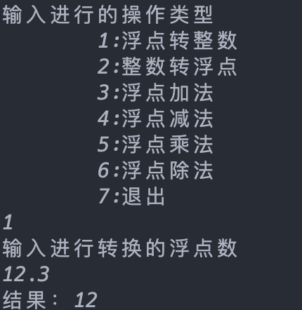
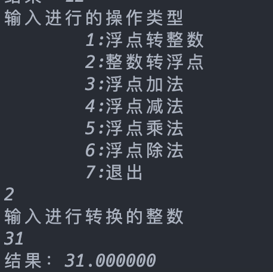
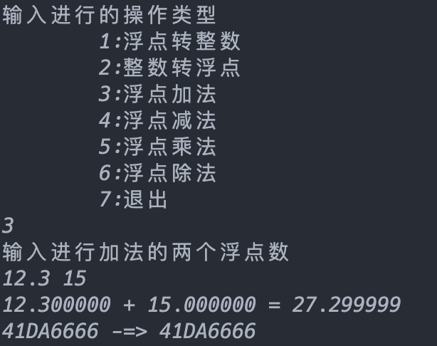
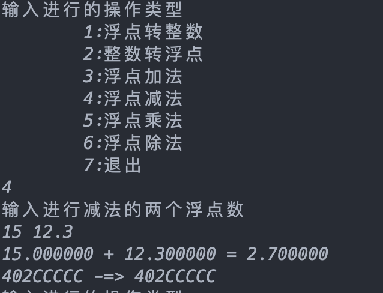
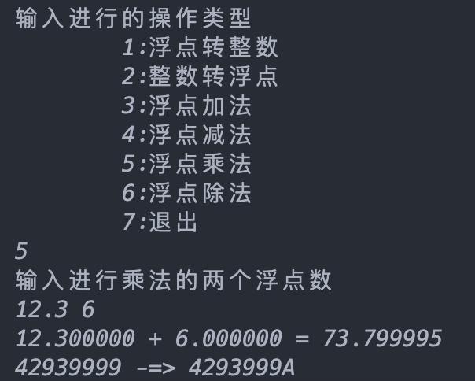
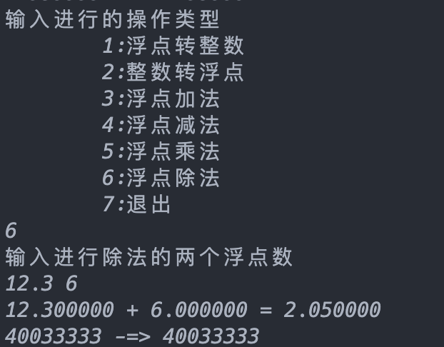

# 计算机系统原理 第七周作业

###### 3200105872  庄毅非

## 一、实验目标：

​	单精度数以IEEE754标准，请分析该标准原理，推导浮点数的算法。并编写C语言程序模拟计算，注意特殊情况的处理，比如：0、无穷、非数、四舍五入等。 


## 二、实验要求：

​	需要实现以下几种函数

```c
long ftoi(dwrd); 		// 浮点转整数
dwrd itof(int); 		// 整数转浮点
dwrd fadd(dwrd, dwrd);  // 浮点加
dwrd fsub(dwrd, dwrd);  // 浮点减
dwrd fmul(dwrd, dwrd);  // 浮点乘
dwrd fdiv(dwrd, dwrd);  // 浮点除
```


## 三、使用算法：

 1. ftoi 浮点数转化为整数

    主要思路就是基于给定的阶码，在循环中每次都减少1个阶码单位，随后将对应的尾数部分拼接到结果中的指定位置，最后再基于输入的浮点数的符号设定结果的符号，返回即可。

 2. itof 整数转化为浮点数

    这里我的实现是对竖式除法过程进行模拟，首先读取整数的最高位出现的位置，之后从该位置开始进入循环，每次将该整数减半，并将阶码加一，进入下一轮循环，直到达到最高位，然后将符号，阶码和相应的尾数进行拼接，即可得到对应的浮点数。

 3. dwrd fadd(dwrd, dwrd); #浮点加

    首先从输入的两个浮点数中获取对应的阶码和尾数，之后比较两者大小，将较小的那个浮点数的尾数和大的浮点数的尾数对齐，之后直接对两个尾数进行相加操作。对于规格化，如果两个相加的数字符号是相反的，那么将结果向左移位，并同步减少结果的阶码，直到尾数具有一个前导1；如果相加的两个数字是异号的，那么将结向右移位，同时减少结果的阶码直到尾数没有前导1。

 4. dwrd fsub(dwrd, dwrd); #浮点减

    减法是加法的逆运算，本程序中是调用fadd实现

 5. dwrd fmul(dwrd, dwrd); #浮点乘

    对于乘法，这里是模拟竖式运算，首先从输入的两个浮点数中获取对应的阶码和尾数，之后进入循环，在循环中每次判断第二个尾数是否为0，如果不是，那么查看其最后一位，如果是1，那么在结果中加上第一个尾数，否则不加，在循环的尾部对第二个尾数进行右移直到其为0。由于乘法可能导致溢出，所以我们要进行规格化，在循环中每次对于结果尾数进行右移，并将结果阶码加一，最终拼接符号，阶码，尾数部分即可得到乘法结果。

 6. dwrd fdiv(dwrd, dwrd); #浮点除

    对于除法，这里和乘法类似，是对竖式除法的模拟。思路就是在循环中每次判断剩余的数字是否比减数更大，如果是，那么将结果的对应位置设置为0，否则设置为1，最终也是在进行规格化之后返回结果。

 7. Nan，无穷，0的处理

    程序中有相应的函数进行判断。

    ```c
    int isZero(dwrd input)
    {
        return (input | 0x7fffffff) == 0;
    }
    int isPositiveInfinity(dwrd input)
    {
        return ((input >> 31) & 1) == 0 && (((input >> 23) & 0xff) == 255) && ((input & 0x7fffff) == 0);
    }
    int isNegativeInfiity(dwrd input)
    {
        return ((input >> 31) & 1) == 1 && (((input >> 23) & 0xff) == 255) && ((input & 0x7fffff) == 0);
    }
    int isNan(dwrd input)
    {
        return (((input >> 23) & 0xff) == 255) && ((input & 0x7fffff) != 0);
    }
    ```

    在实际计算中，为了编程方便，暂时没有使用。

## 三、程序用法

​	在本目录中运行`gcc floatCal.c -o floatCal`,之后运行floatCal文件即可


## 四、程序运行结果

1. 浮点数转整数

   

2. 整数转浮点数

   

3. 浮点数加法

   

4. 浮点数减法

   

5. 浮点数乘法

   

6. 浮点数除法

   

7. 大数字验证

   本程序在数字较大的时候会产生一定的误差，但是仍在可接受范围内。

   


