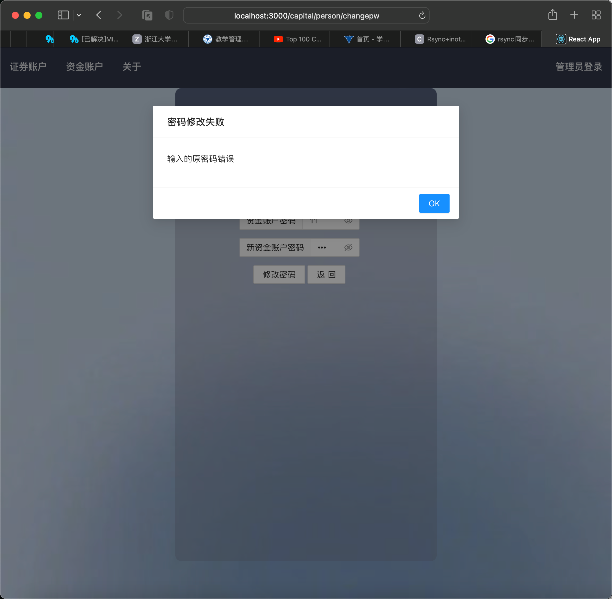

## 1.引言

### 1.1 编写目的

​	本测试报告为股票交易系统项目中的证券账户管理子系统与资金账户管理子系统的测试报告，目的在于总结测试阶段出现的问题，检测系统是否达到预期功能目标。本测试报告有助于完善我们所编写的证券管理子系统与资金管理子系统，引导我们对该系统的测试，更好地服务于用户。

​	本报告预期参考人员包括软件客户、项目经理、项目开发人员、软件质量分析人员、系统维护人员、系统使用者等。

### 1.2 项目背景

**软件系统名称**

* 股票交易系统——证券账户管理子系统及资金账户管理子系统

**任务提出者**

* 浙江大学软件工程基础课程任课老师—王新宇，助教老师—胡秉德

**开发者**

* 浙江大学2021-2022学年夏学期软件工程基础课程C1小组

**目标用户**

* 证券/资金管理员，普通客户

**实现该软件的计算机网络**

* 由若干台PC机组成的局域网

**项目相关背景介绍**

​	浙江大学软件工程基础课程分为理论课与实践课两个部分。在理论课中，教师有选择地介绍了与软件工程基础相关的理论；强调并确定了适用于整个软件生命期的基本原则，全面而深入地介绍了这些基本原则在软件设计、规范、验证、软件生产过程和管理活动中的运用。而实验课采取分组形式完成，每 5 个学生为一组，分别设有组长、主程序员、 程序员、测试员、文档员等角色。本次课程，教师选取股票交易管理系统作为综合性实验题目。其中我组主要负责证券开户、资金开户两个子系统，实现对于用户个人信息的数据库管理操作。

### 1.3 相关定义

**（1）MySQL**

​	一个小型的数据库管理系统。

**（2）JavaScript**

​	JavaScript 是一种面向对象的动态类型的区分大小写的客户端脚本语言。

**（3）SQL注入**

​	通过把 SQL 命令插入到 Web 表单递交或输入域名或页面请求的查询字符串，最终达到欺骗服务器执行恶意的 SQL 命令。

**（4）数据库连接池**

​	数据库连接池负责分配、管理和释放数据库连接，它允许应用程序重复使用一个现有的数据库连接，这项技术能明显提高对数据库操作的性能。

**（5）UTF-8**

​	UTF-8 是 UNICODE 的一种变长字符编码，又称万国码安全证书。安全证书是在进行网上交易时的身份证，或者说是私人钥匙，安全证书是唯一的，与其他任何人的证书都不相同。

**（6）MD5加密算法 Message Digest Algorithm**

​	MD5（消息摘要算法第五版）为计算机安全领域广泛使用的一种散列函数，用以提供消息的完整性保护。

**（7）React**

​	React是用于构建用户界面的 JavaScript 库，起源于 Facebook 的内部项目，该公司对市场上所有 JavaScript MVC 框架都不满意，决定自行开发一套，用于建设 Instagram 的网站，于2013年5月开源。由于 React 的设计思想极其独特，属于革命性创新，性能出众，代码逻辑却十分简单，所以，越来越多的人开始关注和使用，认为它可能是将来 Web 开发的主流工具。

**（8）Express**

​	Express是一个简洁而灵活的 node.js Web 应用框架，提供一系列强大特性帮助你创建各种Web应用。Express不对 node.js 已有的特性进行二次抽象，还在它之上扩展了Web应用所需的功能。丰富的 HTTP 工具以及来自 Connect 框架的中间件随取随用，使创建强健、友好的API变得快速又简单。

### 1.4 系统概述

​	股票交易管理系统基于完整经济模型，为各地股民提供线上交易服务，具有买卖交易股票、信息交流等功能。系统需要持续、稳定地运行，延时性小，否则将无法满足用户股票磋商交易。系统一共由六个模块构成，分别为证券账户管理系统、资金账户管理系统、交易客户端、股票中央交易系统、网上信息发布系统、交易系统管理。

**（1）证券账户管理子系统**

​	办理证券账户是走进股市的第一步。证券账户可以视为投资者进入股票交易市场的通行证，只有持有证券账户，才能进场买卖证券。想要开设证券账户，开户人必须不是国家规定禁止开户的四类人员，其他人员均可以凭相关证件到交易申请所申请开设证券账户。证券账户分为两种，分别是自然人开设的个人账户，以及法人账户。每个投资者都只能开立一个证券账户，并仅限于本人使用。自然人开立的证券账户为个人账户。开立个人账户时，投资者必须持有效的身份证件（一般为居民身份证）去证券交易所指定的证券登记机构或会员证券公司办理名册登记并开立证券账户。

**（2）资金账户管理子系统**

​	投资者委托买卖股票，须事先在证券经纪商处开立证券交易结算资金帐户，资金帐户用于投资者证券交易的资金清算，记录资金的币种，余额和变动情况。资金账户开设时，需提交本人身份证与证券账户卡，并将资金帐户和证券帐户相关联，投资者在资金帐户中的存款可随时提取，证券经纪商按活期存款利率定期计付利息并自动转入投资者的资金帐户。投资者委托买入时，资金帐户要有足够的余额。资金帐户需要设置交易密码，以便在交易客户端使用。另外，还需要设置及取款密码，用于从资金帐户里面取出资金。帐户开设完毕，用户会得到一张类似于银行卡的资金帐户卡片。通过在证券经纪商指定的交易客户端设备上面刷卡，并输入资金帐户设置的密码登陆，便可以发出买卖股票的指令，查看资金帐户的资金情况和证券帐户内的股票信息。

​	资金帐户密码可以有两张方法修改。

1. 投资者可以在证券经纪商处在开设资金帐户的设备上，通过输入原有密码和新密码来修改。
2. 投资者还可以在证券交易客户端通过输入原有密码和新密码修改。

**（3）交易客户端**

​	投资者在开办完证券帐户并在证券经纪商处开立证券交易结算资金帐户以后，就可以通过交易客户端委托证券经纪商进行股票的买卖交易了。目前存在的委托方式有很多种，主要有以下 3 种: 

* 交易设备：投资者持资金帐户卡在证券经纪商指定的刷卡设备处刷卡，并输入验证密码。然后就可以发出委托，进行交易。这是最早，也是最常见的委托方式。
* 网络：投资者通过登陆证券经纪商指定的网址，通过必要的用户和密码验证登陆。然后发出可以发出委托，进行交易。
* 电话：投资者通过申请，然后就可以致电证券经纪商指定的电话号码，通过必要的用户和密码验证，然后根据语音提示，发出委托。

​	用户登陆客户端之后，可以查询证券账户持有的股票。界面将会显示股票的名称、总数，现在价格、持有成本与持有股票损益。用户还可以查看资金账户内的资金信息，并且根据资金与股票信息发出购买、出售股票的指令进行交易。

**（4）股票中央交易系统**

​	中央交易系统是整个股票交易过程的核心部分。所有投资者发出的买卖股票指令都在这个自动撮合系统参加集合竟价或连续竟价，交易系统根据时间优先及价格优先的原则，对符合条件的指令予以成交，这个过程就是撮合成交。股票成交后，中央交易系统随后将成交记录反馈到相关的股票帐户和证券经纪商的资金帐户。股票中央交易系统还要设置涨跌停保护机制，保证股票交易市场的相对稳定性，所以每天股票的最高交易价格与最低交易价格不能超过该限制范围。

**（5）网上信息发布系统**

​	为了将交易信息能够更好地提供给各种研究机构和广大股民，需要通过建立网站实现交易信息网上发布系统。并且通过对不同用户的认证，提供不同类型的交易和统计信息。用户可以通过登录网上信息发布系统，查询股票实时的价格。股票信息通常有代码信息、K 线图等，为用户交易提供信息来源。

**（6）交易系统管理**

​	交易系统管理模块实现的是对交易系统进行监控的功能，它是一个内部管理模块，用户是股票交易所的内部人士。由于需要在适当的时候通过调整买卖双方的价格比例来促进交易，所以需要提供接口给特别的授权用户来查看不同股票的实时信息。 

### 1.5 项目概述

​	证券账户管理子系统和资金账户管理子系统均是股票交易系统的重要部分，与其他子系统有着密切的联系。

​	在证券账户管理子系统和资金账户管理子系统中，我组设置了两种身份——管理员身份与普通用户身份呢，每种身份有其各自不同的功能。而由于这两个模块整体功能比较相似，同样的身份在这两个系统中可以进行诸如账户销户等许多相同的操作，但两者又有各自独有的功能。

​	账户管理员拥有对于账号的管理权限，也就是拥有数据库的操作权限。通过管理员可以为用户提供账户开户、账户销户、挂失补办、修改密码的操作，也可以为用户查询资金、修改密码、资金存取；而普通的用户可以在线上自行完成资金查询、改密码、存取款操作操作，但是不能进行账户有关的操作，若想开户、销户、挂失补办均只能找到管理员，由其代为操作。

## 2. 测试概要

### 2.1 测试对象——证券账户管理子系统及资金账户管理子系统

​	证券账户管理子系统及资金账户管理子系统的主要用户为管理员与访客。因此，本系统的界面设计应该简洁美观、布局合理、重点突出；具有良好的可操作性，便于用户使用；性能应实时、准确。

​	作为股票交易系统中的证券账户管理子系统、资金账户管理子系统，我组根据需求实现了相应功能，并将本系统分为了六个模块，包括管理员账户管理模块、管理员资金管理模块、用户资金管理模块、管理员密码管理模块、用户密码管理模块以及信息查询模块。

### 2.2 测试内容

| 测试名称     | 目的                                                 | 内容                                                         |
| ------------ | ---------------------------------------------------- | ------------------------------------------------------------ |
| 模块功能测试 | 检测各个模块的功能是否全部实现。                     | 根据《设计说明书》里的要求针对各个模块进行功能测试，尽可能保证测试项覆盖所有功能和各种功能条件组合。 |
| 边界值测试   | 检测系统能否正常处理边界值。                         | 在一些存在边界值问题的数据里分别输入边界值，观察系统反应，检测系统的应对能力。 |
| 压力测试     | 测试系统的承受能力。                                 | 对子系统进行超过规定性能指标的测试，包括兄能够在压力过程中避免明显的性能下降，以及再压力后的及时恢复。 |
| 模块接口测试 | 测试与其他模块的接口是否完好，能否最后实现集成测试。 | 运行本子系统，观察数据库里的数据变化，检查子系统间的交互。   |

#### 2.3 测试设备


#### 2.4 测试进度安排

| 阶段                 | 内容                                                         | 时间   |
| -------------------- | ------------------------------------------------------------ | ------ |
| 第一阶段（预备阶段） | 测试人员阅读本子系统的设计文档，熟悉各个功能模块所实现的具体功能，了解本子系统各个输入数据的边界情况。同时，寻找用于测试相关的工具。 | 6月1日 |
| 第二阶段（准备阶段） | 测试人员根据各个功能模块的功能，编写测试用例，准备好测试所使用的输入数据。 | 6月2日 |
| 第三阶段（测试阶段） | 测试人员针对已经开发出来的子系统，用测试用例对系统进行模块功能测试，找出本子系统中存在的缺陷或错误。 | 6月3日 |
| 第四阶段（后期阶段） | 本子系统编码人员根据测试阶段的结果调整代码，修复存在的缺陷或错误， | 6月4日 |

###

## 3. 模块功能测试

### 3.1 模块说明

​	本系统共分为证券账户管理子系统和资金账户管理子系统，分别用来管理证券账户和资金账户。由于默认用户是在线下开户的，本系统仅设置管理员登录的方式，只有管理员才有权限进行开户销户等操作。

​	本系统还提供接口供其他组调用，其包括资金账户更改密码操作，资金账户余额查询操作，转账（包括转入转出）操作。

### 3.2 证券开户

#### 3.2.1 控制

​	证券开户操作共有两种模式，分别是个人账户开户与法人账户开户，其中法人账户是针对公司开户。本模块测试的输入控制方式为人工输入需要添加的用户个人信息。如果是个人的证券账户开户，则需要提供个人身份证号、家庭住址、手机号等基本个人信息。如果是公司开设法人证券账户，则需提供公司的营业执照、公司相关信息、委托人的身份信息等。管理员在线下开户的时候将会审核办理人的身份信息是否符合，然后提交信息到系统进行审核。系统将判断该身份是否已经开设过证券账户并返回正确的结果信息。

​	控制操作顺序：

1. 以管理员身份身份登陆，进入证券开户界面。
2. 填写开户人的个人信息、公司信息，提交信息到系统。
3. 系统将对信息进行判断与开户操作，如果成功开户将返回开户的证券账号。

#### 3.2.2 输入和预期输出

| 序号 | 输入                                               | 预期输出                       |
| ---- | -------------------------------------------------- | ------------------------------ |
| 1    | 个人信息或者公司信息有缺省                         | 提示需要填写相应字段的失败信息 |
| 2    | 输入的身份证信息不符合规范                         | 提示身份证信息有误             |
| 3    | 用户提供的身份信息已经开户                         | 返回开户失败的提示信息。       |
| 4    | 所有信息都是合法值，并且用户原来也没有开过证券账户 | 返回成功开户的证券账户账号     |

#### 3.2.3 测试结果

| 序号 | 输入                                               | 实际输出       | 是否通过测试 |
| ---- | -------------------------------------------------- | -------------- | ------------ |
| 1    | 个人信息或者公司信息有缺省                         | 与预期结果一致 | Pass         |
| 2    | 输入的身份证信息不符合规范                         | 与预期结果一致 | Pass         |
| 3    | 用户提供的身份信息已经开户                         | 与预期结果一致 | Pass         |
| 4    | 所有信息都是合法值，并且用户原来也没有开过证券账户 | 与预期结果一致 | Pass         |

#### 3.2.4 测试结果分析

​	本模块的测试主要用以检验输入信息的合法性，保证证券账户开设人在证券公司预留的身份信息是真实的，也确保每位用户凭借身份证只能开设一个证券账号。经过检验，本模块在填写用户个人信息的时候，能够处理字段信息缺少、字段内容错误和重复的异常状况，也能够正确添加用户开户的个人信息。

#### 3.2.5 测试结果截图

1. 个人信息或者公司信息有缺省


2. 输入的身份证信息不符合规范


3. 用户提供的身份信息已经开户


4. 所有信息都是合法值，并且用户原来也没有开过证券账户


### 3.3 资金开户

#### 3.3.1 控制

​	本模块测试的输入控制方式为人工输入需要添加的用户个人信息。用户需要在线下进行资金账户的开户操作，将个人信息告诉工作人员，工作人员将帮助输入开户信息。用户需要提供的开户信息有个人身份证、证券账户等。开设资金账户必须保证证券账户是有效的，而且一个证券账户可以对应多个资金账户。管理员在线下开户的时候将会审核办理人的身份信息是否符合，然后提交信息到系统进行审核。系统将判断该身份是否已经开设过证券账户并返回正确的结果信息。

​	控制操作顺序：

1. 以管理员身份身份登陆，进入资金开户界面。
2. 填写开户人的个人信息、证券账户账号，提交信息到系统。
3. 系统将对信息进行判断与开户操作，如果成功开户将返回开户的证券账号。

#### 3.3.2 输入和预期输出

| 序号 | 输入                                                       | 预期输出                                 |
| ---- | ---------------------------------------------------------- | ---------------------------------------- |
| 1    | 信息有缺省                                                 | 提示需要填写相应字段的失败信息           |
| 2    | 输入的身份证信息不符合规范                                 | 提示身份证信息有误                       |
| 3    | 用户提供的证券账号不合法，无法将资金账户和证券账户进行绑定 | 提示证券账户不存在                       |
| 4    | 所有信息都合法                                             | 返回资金账户成功开户的信息，返回资金账号 |

#### 3.3.3 测试结果

| 序号 | 输入                                                       | 实际输出       | 是否通过测试 |
| ---- | ---------------------------------------------------------- | -------------- | ------------ |
| 1    | 信息有缺省                                                 | 与预期结果一致 | Pass         |
| 2    | 输入的身份证信息不符合规范                                 | 与预期结果一致 | Pass         |
| 3    | 用户提供的证券账号不合法，无法将资金账户和证券账户进行绑定 | 与预期结果一致 | Pass         |
| 4    | 所有信息都合法                                             | 与预期结果一致 | Pass         |

#### 3.3.4 测试结果分析

​	本模块的测试主要用以检验输入信息的合法性，保证资金账户开设人预留的身份信息是真实的，也确保每位用户的资金账户能够正确绑定用户的证券账户。经过检验，本模块在填写用户个人信息的时候，能够处理字段信息缺少、字段内容错误和重复的异常状况，也能够正确添加用户开户的个人信息。

#### 3.3.5 测试结果截图

1. 信息有缺省


2. 输入的身份证信息不符合规范


3. 用户提供的证券账号不合法，无法将资金账户和证券账户进行绑定


4. 所有信息都合法


### 3.4 证券账户挂失

#### 3.4.1 控制

​	本模块测试的输入控制方式为人工输入证券账户进行挂失操作。用户需要在线下的柜台办理相关业务，将个人信息与证券账户号告诉工作人员，工作人员将帮助需要冻结的账户信息。信息提交到系统后，系统将查询数据库进行判断，查看证券账户是否存在，然后进行冻结。

​	控制操作顺序：

1. 以管理员身份身份登陆，进入证券账户冻结界面。
2. 填写用户需要冻结的证券账号，提交信息到系统。
3. 系统将对信息进行查询，如果查找到该证券账户，则进行冻结操作。

#### 3.4.2 输入和预期输出

| 序号 | 输入                                       | 预期输出                       |
| ---- | ------------------------------------------ | ------------------------------ |
| 1    | 信息有缺省                                 | 提示需要填写相应字段的失败信息 |
| 2    | 用户提供的证券账号不合法，数据库无法查询到 | 提示证券账户不存在             |
| 3    | 用户提供的证券账号已经被冻结               | 返回再次冻结失败的信息         |
| 4    | 所有信息都合法                             | 返回证券账户成功冻结信息       |

#### 3.4.3 测试结果

| 序号 | 输入                                       | 实际输出       | 是否通过测试 |
| ---- | ------------------------------------------ | -------------- | ------------ |
| 1    | 信息有缺省                                 | 与预期结果一致 | Pass         |
| 2    | 用户提供的证券账号不合法，数据库无法查询到 | 与预期结果一致 | Pass         |
| 3    | 用户提供的证券账号已经被冻结               | 与预期结果一致 | Pass         |
| 4    | 所有信息都合法                             | 与预期结果一致 | Pass         |

#### 3.4.4 测试结果分析

​	本模块的测试主要用以检验用户输入的想要冻结的证券账户信息是否正确。经过检验，本模块在填写用户个人信息的时候，能够处理字段信息缺少、字段内容错误和重复的异常状况，也能够通过数据库得到当前证券账户的信息状态，从而判断是否能够正确冻结。

#### 3.4.5 测试结果截图

1. 信息有缺省


2. 用户提供的证券账号不合法，数据库无法查询到


3. 用户提供的证券账号已经被冻结


4. 所有信息都合法


### 3.5 资金账户挂失

#### 3.5.1 控制

​	本模块测试的输入控制方式为人工输入资金账户进行挂失操作。用户需要在线下的柜台办理相关业务，将个人信息与证券账户号告诉工作人员，工作人员将帮助需要冻结的账户信息。信息提交到系统后，系统将查询数据库进行判断，查看证券账户是否存在，然后进行冻结。

​	控制操作顺序：

1. 以管理员身份身份登陆，进入资金账户冻结界面。
2. 填写用户需要冻结的资金账号，提交信息到系统。
3. 系统将对信息进行查询，如果查找到该资金账户，则进行冻结操作。冻结的资金账号将无法进行资金转入、转出操作。

#### 3.5.2 输入和预期输出

| 序号 | 输入                                       | 预期输出                       |
| ---- | ------------------------------------------ | ------------------------------ |
| 1    | 信息有缺省                                 | 提示需要填写相应字段的失败信息 |
| 2    | 用户提供的资金账号不合法，数据库无法查询到 | 提示资金账户不存在             |
| 3    | 用户提供的资金账号已经被冻结               | 返回再次冻结失败的信息         |
| 4    | 所有信息都合法                             | 返回资金账户成功冻结的信息     |

#### 3.5.3 测试结果

| 序号 | 输入                                       | 实际输出       | 是否通过测试 |
| ---- | ------------------------------------------ | -------------- | ------------ |
| 1    | 信息有缺省                                 | 与预期结果一致 | Pass         |
| 2    | 用户提供的资金账号不合法，数据库无法查询到 | 与预期结果一致 | Pass         |
| 3    | 用户提供的资金账号已经被冻结               | 与预期结果一致 | Pass         |
| 4    | 所有信息都合法                             | 与预期结果一致 | Pass         |

#### 3.5.4 测试结果分析

​	本模块的测试主要用以检验用户输入的想要冻结的资金账户信息是否正确。经过检验，本模块在填写用户个人信息的时候，能够处理字段信息缺少、字段内容错误和重复的异常状况，也能够通过数据库得到当前资金账户的信息状态，从而判断是否能够正确冻结。

#### 3.5.5 测试结果截图

1. 信息有缺省


2. 用户提供的资金账号不合法，数据库无法查询到


3. 用户提供的资金账号已经被冻结


4. 所有信息都合法


### 3.6 证券账户销户转户

#### 3.6.1 控制

​	本模块测试的输入控制方式为人工输入证券账户信息，进行销户转户操作。用户需要在线下的柜台办理相关业务，将个人信息与证券账户号告诉工作人员，工作人员将帮助对证券账户进行操作。信息提交到系统后，系统将查询数据库进行判断，查看证券账户是否存在。如果该账户存在且账户下的所有的股票均已卖出，系统则将抹去该账户的所有信息，然后用户再开设新的证券账号。如果该证券账户下仍有股票未卖出，则用户无法进行销户转户操作。

​	控制操作顺序：

1. 以管理员身份身份登陆，进入证券账户销户转户界面。
2. 填写用户需要销户转户的证券账号，提交信息到系统。
3. 系统将对信息进行查询，如果该账户存在且账户下的所有的股票均已卖出，系统则能正常执行销户转户操作；如果未完全卖出，则无法进行销户操作。

#### 3.6.2 输入和预期输出

| 序号 | 输入                                       | 预期输出                                   |
| ---- | ------------------------------------------ | ------------------------------------------ |
| 1    | 信息有缺省                                 | 提示需要填写相应字段的失败信息             |
| 2    | 用户提供的证券账号不合法，数据库无法查询到 | 提示证券账户不存在                         |
| 3    | 用户提供的证券账户未卖出所有证券           | 返回销户失败的信息                         |
| 4    | 用户提供的重新开户的个人信息有误           | 提示需要重新填写个人信息                   |
| 5    | 所有信息都合法                             | 返回成功销户信息与成功开设新证券账户的账号 |

#### 3.6.3 测试结果

| 序号 | 输入                                       | 实际输出       | 是否通过测试 |
| ---- | ------------------------------------------ | -------------- | ------------ |
| 1    | 信息有缺省                                 | 与预期结果一致 | Pass         |
| 2    | 用户提供的证券账号不合法，数据库无法查询到 | 与预期结果一致 | Pass         |
| 3    | 用户提供的证券账户未卖出所有证券           | 与预期结果一致 | Pass         |
| 4    | 用户提供的重新开户的个人信息有误           | 与预期结果一致 | Pass         |
| 5    | 所有信息都合法                             | 与预期结果一致 | Pass         |

#### 3.6.4 测试结果分析

​	本模块的测试主要用以检验用户进行证券账户的销户转户操作是否能够正常进行。该操作对于证券账户目前状态的检验要求比较高，因为注销将删去原本证券账户，该操作如果不当可能造成用户的直接损失。经过检验，本模块在填写用户个人信息的时候，能够处理字段信息缺少、字段内容错误和重复的异常状况，也能够通过对用户目前的证券账户下是否仍有未卖出股票进行判断，然后再进行账户销户转户操作。

#### 3.6.5 测试结果截图

1. 信息有缺省


 

2. 用户提供的重新开户的个人信息有误


3. 所有信息都合法


### 3.7 资金账户销户转户

#### 3.7.1 控制

​	本模块测试的输入控制方式为人工输入资金账户信息，进行销户转户操作。用户需要在线下的柜台办理相关业务，将个人信息与资金账户号告诉工作人员，工作人员将帮助对资金账户进行操作。信息提交到系统后，系统将查询数据库进行判断，查看资金账户是否存在。如果该资金账户的状态已经是销户，或者资金账户内余额没有清空，则系统将会拒绝资金账户销户的操作。

​	控制操作顺序：

1. 以管理员身份身份登陆，进入资金账户销户转户界面。
2. 填写用户需要销户转户的资金账号，提交信息到系统。
3. 系统将对信息进行查询，如果该账户存在且账户下仍有存款，则拒绝账户的注销请求。

#### 3.7.2 输入和预期输出

| 序号 | 输入                                       | 预期输出                                   |
| ---- | ------------------------------------------ | ------------------------------------------ |
| 1    | 信息有缺省                                 | 提示需要填写相应字段的失败信息             |
| 2    | 用户提供的资金账号不合法，数据库无法查询到 | 提示资金账户不存在                         |
| 3    | 用户提供的资金账户未全部转出余额           | 返回销户失败的信息                         |
| 4    | 用户提供的重新开户的个人信息有误           | 提示需要重新填写个人信息                   |
| 5    | 所有信息都合法                             | 返回成功销户信息与成功开设新资金账户的账号 |

#### 3.7.3 测试结果

| 序号 | 输入                                       | 实际输出       | 是否通过测试 |
| ---- | ------------------------------------------ | -------------- | ------------ |
| 1    | 信息有缺省                                 | 与预期结果一致 | Pass         |
| 2    | 用户提供的资金账号不合法，数据库无法查询到 | 与预期结果一致 | Pass         |
| 3    | 用户提供的资金账户未全部转出余额           | 与预期结果一致 | Pass         |
| 4    | 用户提供的重新开户的个人信息有误           | 与预期结果一致 | Pass         |
| 5    | 所有信息都合法                             | 与预期结果一致 | Pass         |

#### 3.7.4 测试结果分析

​	本模块的测试主要用以检验用户进行资金账户的销户转户操作是否能够正常进行。该操作的检验要求较高，因为如果不当可能造成用户的直接钱财损失。经过检验，本模块在填写用户个人信息的时候，能够处理字段信息缺少、字段内容错误和重复的异常状况，也能够通过数据库查询该资金账户是否已经将余额的钱全部转出，余额不为零的时候将驳回用户的注销账户请求。注销账户之后，用户可以重新输入开户信息开设资金账户，流程与之前开设资金账户一致，成功开设将会返回资金账户的账号。

#### 3.7.5 测试结果截图

1. 信息有缺省


2. 用户提供的资金账号不合法，数据库无法查询到


3. 用户提供的资金账户未全部转出余额


4. 用户提供的重新开户的个人信息有误


5. 所有信息都合法


### 3.8 资金账户资金转入

#### 3.8.1 控制

​	本模块的功能主要是将接口提供给交易客户端，由交易客户端发送请求获得权限修改我们系统管理的数据库。模块需要输入该笔转账的目标账户和转出账户以及转账的金额，目标账户即为我们当前管理的资金账户，该操作在正确验证之后，将修改数据库中账户的余额。并发导致的另外一账号余额的减少将在资金账户转出模块中实现。

​	控制操作顺序：

1. 在交易客户端中进行交易，进入资金账户界面。
2. 填写该笔交易的转出账号、转入账号与转账金额；提交信息到系统进行审核。
3. 系统将对信息进行查询，如果交易成功，将为目标账户的余额加上这笔转账的金额。

#### 3.8.2 输入和预期输出

| 序号 | 输入                                           | 预期输出                             |
| ---- | ---------------------------------------------- | ------------------------------------ |
| 1    | 信息有缺省                                     | 提示需要填写相应的转账账户和接收账户 |
| 2    | 用户提供的转账资金账号不合法，数据库无法查询到 | 提示资金账户不存在                   |
| 3    | 数据库出现连接错误，无法成功为转入账户增加余额 | 提示回滚                             |
| 4    | 所有信息都合法                                 | 提示资金账户转入成功                 |

#### 3.8.3 测试结果

| 序号 | 输入                                           | 实际输出       | 是否通过测试 |
| ---- | ---------------------------------------------- | -------------- | ------------ |
| 1    | 信息有缺省                                     | 与预期结果一致 | Pass         |
| 2    | 用户提供的资金账号不合法，数据库无法查询到     | 与预期结果一致 | Pass         |
| 3    | 数据库出现连接错误，无法成功为转入账户增加余额 | 与预期结果一致 | Pass         |
| 4    | 所有信息都合法                                 | 与预期结果一致 | Pass         |

#### 3.8.4 测试结果分析

​	本账号用以测试用户资金账户是否能够成功转入资金。交易客户端将调用资金账户转入的接口，由用户输入转入账户与转出账户进行划转。如果用户输入的转入转出账户的账号不合法，将拒绝该笔交易；或者数据库遇到故障需要回滚，以保证数据的一致性。测试结果显示，改模块能够应对输入不正确的多种情况，作出相应的反应。

#### 3.8.5 测试结果截图

这一部分无前端部分，这里只列出一些测试用例。

1. 信息有缺省

2. 用户提供的资金账号不合法，数据库无法查询到

3. 数据库出现连接错误，无法成功为转入账户增加余额

4. 所有信息都合法

### 3.9 资金账户资金转出

#### 3.9.1 控制

​	本模块的功能主要是将接口提供给交易客户端，由交易客户端发送请求获得权限修改我们系统管理的数据库。模块需要输入该笔转账的目标账户和转出账户以及转账的金额，转出账户即为我们当前管理的资金账户。在转出资金之前，需要先查看转出账户的余额，如果余额小于需要转出的金额，则拒绝该笔交易。如果账户的账号有输入错误，导致数据库无法查询到该资金账户的相关信息，则也需要拒绝该笔交易。只有确认交易成功，系统才会修改转出账户余额的金额。

​	控制操作顺序：

1. 在交易客户端中进行交易，进入资金账户界面。
2. 填写该笔交易的转出账号、转入账号与转账金额；提交该笔交易信息到系统进行审核。
3. 系统将对转出账号的余额进行查询判断，如果余额小于转账金额，系统将拒绝该笔交易。

#### 3.9.2 输入和预期输出

| 序号 | 输入                                           | 预期输出                             |
| ---- | ---------------------------------------------- | ------------------------------------ |
| 1    | 信息有缺省                                     | 提示需要填写相应的转账账户和接收账户 |
| 2    | 用户提供的转账资金账号不合法，数据库无法查询到 | 提示资金账户不存在                   |
| 3    | 数据库出现连接错误，无法成功为转出修改余额     | 提示回滚                             |
| 4    | 高并发请求                                     | 能够成功执行，保证数据库的一致性     |
| 5    | 所有信息都合法                                 | 提示资金账户转入成功                 |

#### 3.9.3 测试结果

| 序号 | 输入                                       | 实际输出       | 是否通过测试 |
| ---- | ------------------------------------------ | -------------- | ------------ |
| 1    | 信息有缺省                                 | 与预期结果一致 | Pass         |
| 2    | 用户提供的资金账号不合法，数据库无法查询到 | 与预期结果一致 | Pass         |
| 3    | 数据库出现连接错误，无法成功为转出修改余额 | 与预期结果一致 | Pass         |
| 4    | 高并发请求                                 | 与预期结果一致 | Pass         |
| 5    | 所有信息都合法                             | 与预期结果一致 | Pass         |

#### 3.9.4 测试结果分析

​	该模块是资金账户管理子系统中较为重要的一个模块，不仅因为其管理的是资金，更因为数据库在高并发的情况之下，很容易产生错误，所以我们

#### 3.9.5 测试结果截图

这一部分无前端部分，这里只列出一些测试用例。

1. 信息有缺省

2. 用户提供的资金账号不合法，数据库无法查询到

3. 数据库出现连接错误，无法成功为转出账户修改余额，则回滚。

4. 高并发请求

5. 所有信息都合法


### 3.10 资金账户余额查询

#### 3.10.1 控制

​	该模块主要会在资金账户的转账时被调用，以检测转账是否能够成功。当然，用户在自己的登陆界面也可以查询账户的余额。用户在登录之后，需要输入自己的资金账户账号进行查询。

​	控制操作顺序：

1. 用户登录资金账户，发起余额查询的请求，进入余额查询界面。
2. 填写自己的资金账号，将账号信息提交到系统进行审核。
3. 如果提交到资金账号与用户目前登录的资金账号不符合，则拒绝请求；正确则返回余额。

#### 3.10.2 输入和预期输出

| 序号 | 输入                                 | 预期输出                   |
| ---- | ------------------------------------ | -------------------------- |
| 1    | 信息有错误                           | 提示填写正确的资金账户信息 |
| 2    | 数据库出现连接错误，无法成功返回余额 | 数据库连接错误             |
| 3    | 所有信息都合法                       | 返回余额                   |

#### 3.10.3 测试结果

| 序号 | 输入                                 | 实际输出       | 是否通过测试 |
| ---- | ------------------------------------ | -------------- | ------------ |
| 1    | 信息有错误                           | 与预期结果一致 | Pass         |
| 2    | 数据库出现连接错误，无法成功返回余额 | 与预期结果一致 | Pass         |
| 3    | 所有信息都合法                       | 与预期结果一致 | Pass         |

#### 3.10.4 测试结果分析

​	该模块的测试相对而言较为简单，只需要从数据库中返回值就可以。所以需要测试的点有两个，其一是数据库连接是否有问题，能否成功从数据库中获取正确的余额；由于余额查询需要用户处于已经登陆的状态，**故这里不再进行鉴权，只是直接返回结果即可**。

#### 3.10.5 测试结果截图

这一部分的前端实现由其他小组完成，具体测试可以参照其报告内容，这里只列出一些测试用例。

1. 返回查询结果


### 3.11 资金账户修改密码

#### 3.11.1 控制

​	用户在登陆界面中可能会修改资金账户密码， 如果发送修改请求，将跳转到资金账户修改密码界面。用户需要输入原密码，由数据库验证用户身份信息是否正确。如果原密码输入错误则驳回修改密码请求；只有正确用户才可进行修改。

​	控制操作顺序：

1. 用户登录资金账户，发起修改的请求，进入修改资金账户密码界面。
2. 填写自己账户的原密码和新密码，提交修改请求到数据库系统。
3. 如果输入的原密码与数据库中 存储信息不符，则拒绝请求；正确则修改新密码。

#### 3.11.2 输入和预期输出

| 序号 | 输入                                     | 预期输出                   |
| ---- | ---------------------------------------- | -------------------------- |
| 1    | 信息有错误                               | 提示填写正确的资金账户信息 |
| 2    | 数据库查询的原密码与用户输入的原密码不符 | 用户身份信息验证错误       |
| 3    | 所有信息都合法                           | 返回成功修改密码的提示     |

#### 3.11.3 测试结果

| 序号 | 输入                                     | 实际输出       | 是否通过测试 |
| ---- | ---------------------------------------- | -------------- | ------------ |
| 1    | 信息有错误                               | 与预期结果一致 | Pass         |
| 2    | 数据库查询的原密码与用户输入的原密码不符 | 与预期结果一致 | Pass         |
| 3    | 所有信息都合法                           | 与预期结果一致 | Pass         |

#### 3.11.4 测试结果分析

​	该模块的测试较为简单，仅是先从数据库验证信息合法，然后向数据库提出修改改信息的请求。主要需要验证的是用户输入的原密码是否正确与数据库中存储的登陆密码相符，如果不符则需要用户重新输入原密码才可进行修改。第二个需要测试的点是用户修改新密码是否成功。

#### 3.11.5 测试结果截图

1. 信息有错误


2. 数据库查询的原密码与用户输入的原密码不符



3. 所有信息都合法


## 4. 边界值测试

​	作为股票交易系统的证券和资金账户管理子系统，本模块主要完成的内容在于操作 的处理而非对输入的处理，大部分输入均是通过脚本传输的方式进行而不是通过 外部输入的方式。 
脚本传输项若由内容由外部输入，则由接受该外部输入的子模块进行检查， 本着对同组成员的信任，假定其传输给本模块的数据均为合法的、符合规定的数 据。 
本模块唯一涉及的外部输入为投诉理由与退款理由的填写，下面将进行这两 项功能的边界值测试。 

###  4.1 控制
​	本模块测试的输入控制方式是人工输入信息。控制操作顺序为: 
1. 在需要填写数据框中填入待测数据边界值并予以确定。
2. 等待系统反应。 
### 4.2 测试输入与预期输出
#### 4.2.1 转账资金账户输入
​	以转出者账户id（类型为 varchar(18)）为例。

| 序号 | 输入 | 测试意图 | 系统预期响应 |
| --- | --- | --- | --- |
| 1 | 不输入任何字符 | 空输入 | 提交失败 |
| 2 | 输入id为负数 | 非法id | 提交失败 |
| 3 | 输入id不是18位 | 非法id | 提交失败 |
| 4 | 输入000000000000000001（假定该id在数据库中） | 合法id | 提交成功 |
| 5 | 输入不可被转换为数字的字符串 | 非法输入 | 提交失败 |

#### 4.2.2 转账交易金额输入
| 序号 | 输入 | 测试意图 | 系统预期响应 |
| --- | --- | --- | --- |
| 1 | 不输入任何字符 | 空输入 | 提交失败 |
| 2 | 输入金额为负数 | 非法id | 提交失败 |
| 3 | 输入2147483647（假定数据库中该账户原余额为0） | 边界输入 | 提交成功 |
| 4 | 输入2147483646 | 边界输入 | 提交成功 |
| 5 | 输入2147483648 | 非法输入 | 提交失败 |

#### 4.2.3 修改密码输入
| 序号 | 输入 | 测试意图 | 系统预期响应 |
| --- | --- | --- | --- |
| 1 | 不输入任何字符 | 空输入 | 提交失败 |
| 2 | 输入密码过长（超过50位） | 非法输入 | 提交失败 |
| 3 | 输入24个"啊" | 边界输入 | 提交成功 |
| 4 | 输入50个"啊" | 非法输入 | 提交失败 |
| 5 | 输入100个"啊" | 非法输入 | 提交失败 |

#### 4.2.4 撤销交易输入
| 序号 | 输入 | 测试意图 | 系统预期响应 |
| --- | --- | --- | --- |
| 1 | 不输入任何字符 | 空输入 | 提交失败 |
| 2 | 输入金额超过冻结资金量 | 非法输入 | 提交失败 |
| 3 | 输入冻结资金量 | 边界输入 | 提交成功 |

### 4.3 测试结果
#### 4.3.1 转账资金账户输入
​	以转出者账户id（类型为 varchar(18)）为例。

| 序号 | 输入 | 系统响应 | 是否通过 |
| --- | --- | --- | --- |
| 1 | 不输入任何字符 | 与预期输出一致 | 是 |
| 2 | 输入id为负数 | 与预期输出一致 | 是 |
| 3 | 输入id不是18位 | 与预期输出一致 | 是 |
| 4 | 输入000000000000000001（假定该id在数据库中） | 与预期输出一致 | 是 |
| 5 | 输入不可被转换为数字的字符串 | 与预期输出一致 | 是 |


#### 4.3.2 转账交易金额输入
| 序号 | 输入 | 系统响应 | 系统预期响应 |
| --- | --- | --- | --- |
| 1 | 不输入任何字符 | 与预期输出一致 | 是 |
| 2 | 输入金额为负数 | 与预期输出一致 | 是 |
| 3 | 输入2147483647（假定数据库中该账户原余额为0） | 与预期输出一致 | 是 |
| 4 | 输入2147483646 | 与预期输出一致 | 是 |
| 5 | 输入2147483648 | 与预期输出一致 | 是 |

#### 4.3.3 修改密码输入
| 序号 | 输入 | 系统响应 | 系统预期响应 |
| --- | --- | --- | --- |
| 1 | 不输入任何字符 | 与预期输出一致 | 是 |
| 2 | 输入密码过长（超过50位） | 与预期输出一致 | 是 |
| 3 | 输入24个"啊" | 与预期输出一致 | 是 |
| 4 | 输入50个"啊" | 与预期输出一致 | 是 |
| 5 | 输入100个"啊" | 与预期输出一致 | 是 |

#### 4.3.4 撤销交易输入
| 序号 | 输入 | 系统响应 | 系统预期响应 |
| --- | --- | --- | --- |
| 1 | 不输入任何字符 | 与预期输出一致 | 是 |
| 2 | 输入金额超过冻结资金量 | 与预期输出一致 | 是 |
| 3 | 输入冻结资金量 | 与预期输出一致 | 是 |

### 4.4 测试截图（这里需要前端截图）
#### 4.4.1 图1  输入不存在的资金账户id
#### 4.4.2 图2 输入转账交易额大于转出账户存款
#### 4.4.3 图3  修改不存在的账户的密码

### 4.5 测试结果分析 
​	对系统各处要求输入的数据进行边界测试可以得知，这些输入在后端都可以 被检测出来，从而避免了系统因为非法输入而损坏系统和数据，保障了系统的平 稳运行 
 					
## 5. 压力测试

###  5.1 测试简介 
​	不同于功能测试，压力测试的重点不是正确性，而是系统的执行效率。 
​	本次压力测试的目的是测试股票交易系统证券和资金管理子系统的承载能力，主要包括系统对大量出错信息的处理；大规模用户同时发送请求时系统的最大负载能 力、响应时间；系统对读取大量数据的响应等。					 					 				

### 5.2 控制 
​	本次压力测试主要用到了一些自动化测试工具及对应的辅助工具，包括测试工具 Apache JMeter。 
### 5.3 输入
​	资金系统，设置thread = 1100, duraion = 150


​	对资金账户管理系统中的3个常用请求进行测试

​	对证券管理系统和资金管理系统的开户请求进行测试。


### 5.4 测试结果
#### 5.4.1 测试结果数据
| Requests | Executions |  | Response Time/ms |  |  |  |  |  |  |  |
| --- | --- | --- | --- | --- | --- | --- | --- | --- | --- | --- |
| Label | Samples | Errors % | Average | Min | Max | 90th pct | 95th pct | 99th pct	  |  |  |
| 资金转帐 | 1100 | 2.05 | 52.89 | 28 | 319 | 66.90 | 136.95 | 227.96 |  |  |
| 获取交易信息 | 1100 | 0 | 16.89 | 8 | 413 | 18.00 | 42.95 | 104.99 | 42.95 | 104.99 |
| 获取账户余额 | 1100 | 0 | 16.83 | 7 | 215 | 17.00 | 44.90 | 106.00 |  |  |
| 个人证券开户 | 1100 | 4.03 | 43.22 | 17 | 615 | 50.00 | 134.60 | 213.99 |  |  |
| 法人证券开户 | 1100 | 3.95 | 26.47 | 9 | 753 | 31.00 | 60.90 | 121.00 |  |  |
| 资金账户开户 | 1100 | 2.02 | 26.66 | 14 | 430 | 31.00 | 58.95 | 114.98 |  |  |

#### 5.4.2 Requests Summary

	总体上看，网站承受住了大部分的访问请求 					 				

#### 5.4.3 Response Times Over Time 			

#### 5.4.4  Response Time Percentiles

#### 5.4.5 Response Time Percentiles Over Time (successful responses)

## 6. 其他模块接口测试 
### 6.1 测试简介 
​	本测试的目的主要是测试本子系统与其他子系统的接口是否完好，能否最后实现集成测试。因为采用的是以数据为中心的体系结构风格，所以与其他子系统的接口测试最终集中在了与数据库的接口测试上了。 
整体项目具体信息都存放在数据库里，客户端将指令信息存放数据库中，并从数据库中读取信息，实现与其他子系统的交互。本子系统与其他子系统接口测试将主要测试与数据库的交互能否顺利进行。

### 6.2. 测试对象说明 
​	本测试的目的主要是测试本子系统与其他子系统的接口是否完好，能否最后实现集成测试。因为采用的是以数据为中心的体系结构风格，所以与其他子系统的接口测试最终主要集中在与数据库的接口测试上。项目具体信息存放在数据库中，前端通过后端接口从数据库中读取信息，以及从请求中获取登陆状态，实现与其他子系统的交互。本子系统与其他子系统接口测试将主要测试与数据库的交互能否顺利进行以及用 户登录信息能否正确从请求中获取。 
### 6.3. 控制 
#### 6.3.1 证券账户管理系统
​	对证券账户管理系统，控制方式为，若管理员未登陆，那么管理员则无法进入子系统的任何模块获取对应内容；如果已经登陆，那么可以向服务器提交个人/法人开户，个人/法人销户，个人/法人补办，个人/法人挂失请求。其中个人和法人证券账户id会提供给信息发布系统方便其向用户提供个性化定制服务。
控制操作顺序:

1. 未登录状态进入子系统，尝试能否使用各模块功能
1. 以管理员身份登录，尝试能否使用各模块功能
1. 进入个人开户模块，尝试是否能添加非法个人账户信息
1. 进入个人开户模块，输入合法的开户信息，观察是否可以获得分发的证券账户id
1. 进入个人挂失模块，观察是否能正确挂失上述获得的的证券账户
1. 对被挂失的账户进行补办，查看是否获得新的证券账户id
#### 6.3.2 资金账户管理系统			
​	本子系统的控制方式是，若用户未登录，则无法进入子系统的任何 模块获取对应内容;若已登录，且身份为普通用户，则可以访问自己的账户余额和近期交易明细，并进行存取款操作；若已经登陆，并且身份为管理员，则可以访问剩余的部分，包括资金账户开户/销户/补办/挂失，以及修改密码功能等。
控制操作顺序:

1. 未登录状态进入子系统，尝试能否使用各模块功能
1. 以管理员身份登录，尝试能否使用各模块功能
1. 进入个人开户模块，尝试是否能添加非法个人账户信息
1. 进入个人开户模块，输入合法的开户信息，观察是否可以获得分发的资金账户id
1. 进入个人挂失模块，观察是否能正确挂失上述获得的的资金账户
1. 对被挂失的账户进行补办，查看是否获得新的资金账户id
### 6.4. 测试内容 （这里需要插入前端图片）

1. 以未登录状态登录进入子系统，进入各子模块(截图仅选取部分代表)， 测试权限获取 

   

1. 以管理员身份登录，进入各子模块(截图仅选取部分代表)，测试权限获取 

   

1. 进入证券账户管理界面，进行个人开户，测试非法输入是否会有提示，以及合法输入是否会返回新的证券账户id。

   

1. 进入证券账户管理界面，进行个人挂失，测试非法输入是否会有提示，以及合法输入是否会返回挂失成功的信息。

   

1. 进入证券账户管理界面，进行个人补办，测试非法输入是否会有提示，以及合法输入是否会返回补办成功的信息。

   

1. 进入资金账户管理界面 ，进行开户，测试非法输入是否会有提示，以及合法输入是否会返回新的资金账户id。

   

1. 进入资金账户管理界面，进行挂失，测试非法输入是否会有提示，以及合法输入是否会返回挂失成功的信息。

   

1. 进入资金账户管理界面，进行个人补办，测试非法输入是否会有提示，以及合法输入是否会返回补办成功的信息。

   

1. 退出登录，以用户身份进入资金账户管理界面，进行存取款，查看是否成功

1. 以用户身份进入资金账户管理界面，查看资金明细。

说明：9，10部分由其他小组完成，这里不再展示

## 7.  安全性测试
### 7.1 JWT
​	在本次模块实现中，小组采用了jwt token机制判断用户身份，并针对修改URL的攻击进行了一定的防御。
```javascript
verifyToken(req, res, (info) => {
        if (info == null) {
            res.status(403).end({
                "status": "fail",
                "msg": "无效的token，请重新登陆"
            })
            return;
        }
    ...
}
```

​	测试的结果为：


### 7.2 URL修改
​	针对普通用户登录的情况进行URL地址的修改，来检查安全防御措施是否到位，比如在普通用户的资金查询界面输入管理员进行资金开户的网址，会提醒无法正常跳转并返回原来的页面。


## 8. 对软件功能的结论
### 8.1 账户管理模块
#### 8.1.1 能力
​	管理员可以根据用户提供的信息为其进行证券账户或资金账户的各项管理操作，包括账户开户、账户销户、账户挂失和补办。要求管理员需要填写对应模块所需要的各项信息，并点击相应的提交按钮进行提交。
#### 8.1.2 限制
​	无法在输入身份信息后立刻检查此人是否已经开户，需要在提交表单后才能检查；输入的各类信息均有长度限制。
### 8.2 密码修改模块
#### 8.2.1 能力
​	管理员和普通用户均可在登录自己的相应账号后进行密码修改，输入旧的密码以及新的密码，并点击按钮确认修改密码，若旧密码验证通过则可修改密码，否则无法修改密码。

#### 8.2.2 限制
​	缺少对连续多次旧密码验证错误后的限制机制，无法对爆破攻击进行有效限制。

### 8.3 资金存取模块
#### 8.3.1 能力
​	管理员和普通用户均可以通过自己的账号登录系统，从而为用户进行存取款操作。登陆后，用户在相应的界面输入自己的账户卡号、密码以及操作金额，点击相应按钮即可。

#### 8.3.2 限制
​	没有对存取款的金额数目进行一定数量的限制，有被盗刷的风险。

### 8.4 信息查询模块
#### 8.4.1 能力
​	登陆资金账户后点击查询按钮，可以查询资金账户当前余额等信息。

#### 8.4.2 限制
​	无法对查询条件进行筛选，容易因显示大量信息被偷窥等；缺少对账户状态等信息的查询功能。

## 9. 分析摘要
### 9.1 能力

​	经过模块功能测试、边界测试、压力测试、接口解释，本股票交易系统的证券账户管理子系统、资金账户管理子系统能够正常实现所有需求中的功能。
​	作为股票管理系统中涉及最底层账户管理的子模块，本系统在安全性上实施了一些措施来保证输入数据的安全性，防止用户进行URL攻击。同时，作为一个账户管理系统，需要支持许多用户同时查询自己的相关信息等操作，因而用户访问并发量也是评价的重要指标之一。本模块在压力测试中表现良好，能够支持数千人同时访问，超过了设计报告中的要求。
​	总而言之，系统能够在正常实现设计文档中功能的同时，也在性能上拥有较为优秀的表现；特别考虑到大多小组成员都是初次进行网页的开发，这次的系统设计可以说是一次比较成功的系统实现。

### 9.2 缺陷和限制
​	由于本次大作业中代码工作时间比较紧张，并且写报告消耗了大量的时间，本系统仍然存在一定的缺陷，比如界面还有美化的空间，后端的具体代码有些繁杂、能够进一步精简，输入检查不够完善等等，但是在基本的共鞥你测试和压力测试方面，我们的产品能有较为优秀的表现，但是系统仍有进步的空间。

### 9.3 测试资源消耗
​	本次网站的测试由小组 5 人在若干台 PC 机上测试若干天完成，小组成员克服种种困难在本地搭建前后端环境并使得网站可以正常运行并进行测试，并且使用了云服务器进行测试。由于测试样例繁多，我们花费了不少的时间来进行测试工作。总体上，我们并无太多经济资源或物理资源的花销，主要是测试报告的撰写对我们造成了一些困难。

### 
