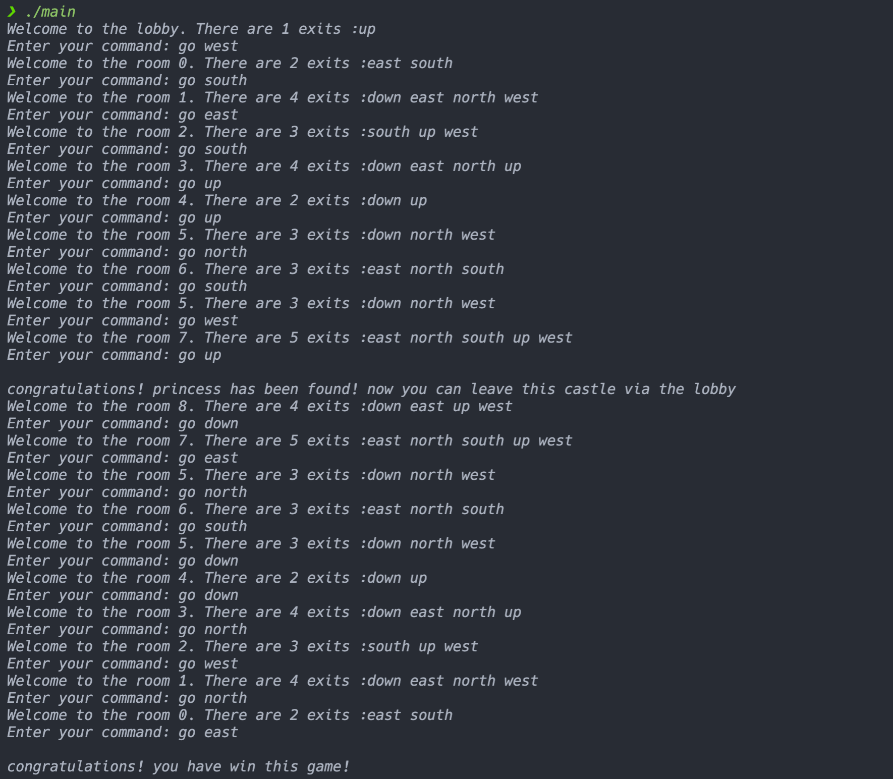

# oop hw3 adventure

3200105872 庄毅非

## 使用方法

​	进入本目录，执行cmake .; make，之后运行./adventure即可

## 运行截图




## 程序实现方式
   程序中定义了几个关键类:
    1. `Room`类，定义通用的房间类型
    2. `MonsterRoom`类，定义野兽房间，继承Room
    3. `LobbyRoom`类，定义初始大厅房间，继承Room
    4. `PrincessRoom`类，定义公主房间，继承Room
       5. `game`类，游戏类，起到游戏运行的驱动作用。

  程序运行中首先初始化LobbyRoom之后进入一个死循环，每次输出当前所处的房间的信息，并接受用户的一个方向输入，并将人物进行移动。如果移向的房间是没去过的（程序中表示为nullptr),那么在0\~15之间生成一个随机数，如果这个随机数为9，那么玩家遇到一个野兽，游戏结束；如果随机数为6或7或8，那么玩家遇到公主，玩家可以原路返回到lobby取得游戏的胜利。

  程序中使用**多态**实现房间信息的输出（通过在xxxRoom.cpp中重新实现父类Room中的虚函数printInfo实现）。

```c++
enum TYPE
{
    NOTHING,
    LOBBY,
    PRINCESS,
    MONSTER
};
std::string exitNames[] = {"up", "down", "south", "north", "east", "west"};
// Room类定义
class Room
{
public:
    Room();
    Room(std::string name);
    virtual ~Room() = default;
    Room *MOVE(std::string input);
    virtual void printInfo();
    void printExits();
    inline int getExitNumber();
    inline TYPE getTYPE();
    inline void AddNeighbor(std::string direction, Room *room);
    static inline size_t howManyRooms();

protected:
    std::string name;
    std::vector<int> isIn;
    std::unordered_map<std::string, Room *> neighbors;
    TYPE type; // 房间类型

private:
    static size_t count; // 作为类内计数器，存储已经实例化的Room，PrincessRoom等的个数，用于命名房间
};

// PrincessRoom类

class PrincessRoom : public Room
{
public:
    PrincessRoom();
    ~PrincessRoom() = default;
    void printInfo() final{};
};

// MonsterRoom类

class MonsterRoom : public Room
{
public:
    MonsterRoom();
    ~MonsterRoom() = default;
    void printInfo() final{};
};

// LobbyRoom类

class LobbyRoom : public Room
{
public:
    LobbyRoom();
    ~LobbyRoom() = default;
    void printInfo() final{};
};
```


